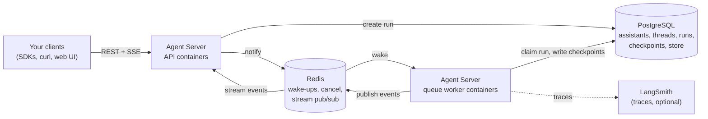

# 00. Orientation: what the Agent Server is and the two ways to run it

## Why this matters

Everything else in this guide builds on two ideas: what an Agent Server actually is, and the fact that a self-hosted team has exactly two sensible ways to run one. If you read only one module before a design meeting, read this one. It defines the vocabulary, shows the moving parts, and gives you a decision table for choosing between LangSmith Deployments and the standalone Agent Server.

## The Agent Server in one paragraph

The **Agent Server** is a long-running HTTP service, shipped by LangChain as a container image, that hosts your agent code and exposes it through a standard REST API. You give it one or more **graphs** (your agent logic, usually written with LangGraph, but any framework can live inside a graph node). It gives back **assistants** (named configurations of a graph), **threads** (durable conversations with saved state), **runs** (individual executions, streamed or in the background), **cron jobs** (runs on a schedule), and a long-term **store** (memory that survives across threads). Under the hood it keeps all of that in PostgreSQL, uses Redis to coordinate work, and executes runs through a durable task queue so that a crash mid-run resumes from the last checkpoint instead of starting over. The product name for the managed side of this is **LangSmith Deployment**; the runtime itself is the Agent Server ([Agent Server overview](https://docs.langchain.com/langsmith/agent-server)).

Two consequences follow immediately. First, you never write the HTTP layer, the queue, the persistence, or the streaming plumbing; you write a graph and a small JSON file. Second, because the server owns persistence and queueing, it needs real infrastructure behind it: a PostgreSQL database and a Redis instance, and, in production, separate pools of API containers and worker containers built from the same image.



The diagram is the whole system. Module [01](./01-concepts.md) explains each box; module [06](./06-runtime-and-tuning.md) explains how the API and worker boxes are wired and scaled.

### This includes Deep Agents

LangGraph is the *packaging format* the server understands, not a constraint on what you build. Anything that compiles to a LangGraph graph deploys the same way, and that explicitly includes **Deep Agents**: an agent created with `create_deep_agent(...)` from the `deepagents` package is a compiled graph, so it is registered in `langgraph.json` like any other (the docs' own production guide for deep agents uses `"agent": "./agent.py:agent"`; [Deep Agents: going to production](https://docs.langchain.com/oss/python/deepagents/going-to-production)). Everything in this guide, from `langgraph.json` through the Helm chart, applies unchanged to a deep agent. Two things are specific to them and are covered where they matter: a deep agent's asynchronous subagents run as additional runs on the same server and therefore consume worker slots ([module 06](./06-runtime-and-tuning.md#deep-agents-and-subagents-occupy-slots)), and its subagent graphs can be co-deployed in the same `langgraph.json` ([module 03](./03-existing-project.md#deep-agents-already-a-graph)). LangChain also offers **Managed Deep Agents**, a hosted runtime that was in private preview at the time of writing; that is a LangChain-hosted product and not one of the two self-hosted paths here.

## What you deploy

When you "deploy an agent" you are deploying three things, described in the docs as the parts of a deployment ([Agent Server: parts of a deployment](https://docs.langchain.com/langsmith/agent-server#parts-of-a-deployment)):

| Part | What it is | Where it comes from |
| --- | --- | --- |
| Graphs | The blueprint for an assistant. A compiled LangGraph graph, or a factory function that returns one. | Your code, registered in `langgraph.json` |
| Persistence | Core resource data, checkpoints (short-term memory), and the store (long-term memory). | PostgreSQL you provide (self-hosted) |
| Task queue | Runs are enqueued by the API and executed by queue workers. Redis carries the signalling and the streaming. | Redis you provide |

The unit of packaging is a **Docker image**. The LangGraph command line interface (CLI) reads `langgraph.json` and either builds the image for you (`langgraph build`) or emits a Dockerfile you build in your own pipeline (`langgraph dockerfile`). The image is a LangChain base image with your code installed on top. Both deployment paths below consume that same image.

## Two paths for a self-hosted team

A self-hosted team has two ways to run Agent Servers. They use the same image, the same API, and the same runtime; they differ in **who provisions and reconciles the Kubernetes resources**.

**Path 1: LangSmith Deployments.** Your self-hosted LangSmith instance is extended with a **control plane** (a UI and API for creating deployments and revisions) and a **data plane** (a listener that polls the control plane, plus a Kubernetes operator that turns each deployment into pods, services, databases and autoscalers in your cluster). Application teams push an image to a registry, then click "New Deployment" in the LangSmith UI, paste the image URL, pick a namespace and environment variables, and the platform does the rest. Updates are revisions. Logs and metrics appear in the UI ([Deploy with control plane](https://docs.langchain.com/langsmith/deploy-with-control-plane), [Enable LangSmith Deployment](https://docs.langchain.com/langsmith/deploy-self-hosted-full-platform#enable-langsmith-deployment)).

**Path 2: Standalone Agent Server.** You run the Agent Server containers yourself with the `langgraph-cloud` Helm chart, point them at a PostgreSQL and a Redis you operate, and roll them out through whatever pipeline you already have. There is no control plane and no deployment UI. Tracing to your LangSmith is optional and is enabled with two environment variables. The docs describe this as "the lightest option" and "production-ready" ([Self-host standalone servers](https://docs.langchain.com/langsmith/deploy-standalone-server), [Deploy to self-hosted: topologies](https://docs.langchain.com/langsmith/deploy-to-self-hosted-overview#topologies)).

For completeness: LangChain also hosts the whole thing for you as LangSmith Deployment on Cloud, which is not applicable to a self-hosted team and is not covered further in this guide.

### Decision table

| Question | LangSmith Deployments (control plane) | Standalone Agent Server (Helm chart) |
| --- | --- | --- |
| Who creates pods, services, HPAs, databases? | The LangSmith operator, driven by the control plane and reconciled by the listener | You, via `helm upgrade` in your pipeline |
| Where do environment variables and secrets live? | In the deployment definition in the LangSmith UI or control plane API | In your Helm values files and Kubernetes Secrets |
| How is scale configured? | Per deployment in the UI; resources are fully customizable on self-hosted | `apiServer.*`, `queue.*`, autoscaling and KEDA values in the chart |
| How do you ship a new version? | Push image, create a new **revision** | Push image, `helm upgrade` with the new tag |
| How do you roll back? | Select a previous revision | `helm rollback` or redeploy the previous tag |
| Where are logs and metrics? | Deployment page in LangSmith (build logs, server logs, CPU/memory, replicas, API metrics) | Your cluster tooling; Prometheus `/metrics` on each pod |
| Extra platform prerequisites | LangSmith Deployment enabled on your instance, KEDA installed, an ingress with a hostname, egress to beacon.langchain.com | Kubernetes, Helm, a PostgreSQL 14+ and a Redis, a license key, egress to beacon.langchain.com |
| Multi-team ergonomics | Self-service for application teams inside the LangSmith UI; per-deployment Postgres and Redis provisioned automatically or pointed at yours | Each deployment is a Helm release the platform team owns |
| Best fit | Many application teams that want self-service deploys, revisions and logs in one place | A platform team that already owns rollout through a container pipeline and wants the fewest moving parts |

Module [07](./07-standalone-helm-deploy.md) walks through the standalone path hands-on and module [08](./08-langsmith-deployments-self-hosted.md) walks through the control plane path. Both start from the same image built in module [02](./02-new-project.md).

## Who manages what

Self-hosting shifts operational ownership to your team. The docs summarize it this way ([Deploy to self-hosted: who manages what](https://docs.langchain.com/langsmith/deploy-to-self-hosted-overview#who-manages-what)):

| Component | Who manages it | Where it runs |
| --- | --- | --- |
| LangSmith platform (UI, APIs, datastores) | You | Your infrastructure |
| Agent Server runtime | You | Your infrastructure |
| PostgreSQL and Redis | You | Your infrastructure |
| CI/CD for your apps | You | Your CI environment |
| Upgrades, scaling, and backups | You | Your infrastructure |

In return you can bring your own PostgreSQL and Redis, size CPU, memory and replicas for your workload, and keep everything inside your network and observability stack.

## Prerequisites and licensing

Before the deployment modules you will need the following. None of it is needed to work through modules 01 to 05 on a laptop.

**An Enterprise plan and a license key.** Self-hosted deployments require an Enterprise plan and the LangSmith license key delivered with it ([Deploy to self-hosted](https://docs.langchain.com/langsmith/deploy-to-self-hosted-overview)). The Agent Server container reads it from `LANGGRAPH_CLOUD_LICENSE_KEY` and verifies it once at startup ([standalone prerequisites](https://docs.langchain.com/langsmith/deploy-standalone-server#prerequisites)). This is not optional in practice. During the validation for this guide, the built image was started without any key: it applied all 63 database migrations and then exited with `ValueError: License verification failed`, printing "No enterprise license key or LangSmith API key found". The in-memory development server (`langgraph dev`) has no such check and logged "No license key or control plane API key set, skipping metadata loop" and kept running.

**A LangSmith API key, and for self-hosted tracing an endpoint.** `LANGSMITH_API_KEY` is used for tracing and, in development, can stand in for a license. `LANGSMITH_ENDPOINT` points tracing at your self-hosted LangSmith; the docs warn not to add a trailing slash because it causes authentication errors ([standalone prerequisites](https://docs.langchain.com/langsmith/deploy-standalone-server#prerequisites)).

**Egress to `https://beacon.langchain.com`.** Required for license verification and usage reporting unless you hold an offline (air-gapped) license. Billing telemetry cannot be disabled; operational and usage telemetry can ([Egress for billing and operational telemetry](https://docs.langchain.com/langsmith/self-host-egress)).

**PostgreSQL 14 or newer and Redis.** Each deployment needs its own database name (Postgres) and its own database number (Redis). Instances can be shared across deployments, databases cannot ([standalone prerequisites](https://docs.langchain.com/langsmith/deploy-standalone-server#prerequisites), [chart README](https://github.com/langchain-ai/helm/blob/main/charts/langgraph-cloud/README.md)).

**Kubernetes and Helm 3** for production. The docs are explicit that Kubernetes with the maintained Helm chart is the tested production path, that Docker and Docker Compose are for development and small workloads, and that standalone servers must not run in serverless environments because scale-to-zero can lose tasks ([Self-host standalone servers](https://docs.langchain.com/langsmith/deploy-standalone-server)).

## How to read this guide

| Module | Who should read it | What you leave with |
| --- | --- | --- |
| [01 Concepts](./01-concepts.md) | Everyone | The vocabulary: graphs, assistants, threads, runs, checkpoints, store, queue |
| [02 New project](./02-new-project.md) | Developers | A running local server and the sample app used by every later module |
| [03 Existing project](./03-existing-project.md) | Developers with code already | How to wrap what you have so the server can host it |
| [04 langgraph.json](./04-langgraph-json.md) | Developers and platform | Every configuration key and when to use it |
| [05 API surface](./05-api-surface.md) | Developers and integrators | Every endpoint group, with real calls |
| [06 Runtime and tuning](./06-runtime-and-tuning.md) | Platform | How API and worker containers split, and which knobs matter |
| [07 Standalone Helm deploy](./07-standalone-helm-deploy.md) | Platform | A validated install from your own pipeline |
| [08 LangSmith Deployments](./08-langsmith-deployments-self-hosted.md) | Platform | The control plane path, enabled and used |
| [09 Operations](./09-operations.md) | Platform and on-call | Metrics, shutdown, troubleshooting, checklists |
| [Appendix](./appendix-glossary-and-links.md) | Everyone | Glossary and every cited link |

The sample application lives in [`../sample/`](../sample/). Every command in the guide was run against it during authoring; where output is shown, it is the output that was captured, and where behaviour is described from the documentation instead, the sentence says so and links the page.

## Hands-on

There is nothing to install yet. Confirm you can reach the documentation and the chart repository from your network, since both are cited throughout:

```bash
curl -sI https://docs.langchain.com/langsmith/agent-server | head -1
helm repo add langchain https://langchain-ai.github.io/helm
helm search repo langchain/langgraph-cloud --versions | head -3
```

Captured during authoring:

```text
NAME                     	CHART VERSION	APP VERSION	DESCRIPTION
langchain/langgraph-cloud	0.3.4        	0.2.3      	Helm chart to deploy the LangGraph Cloud applic...
langchain/langgraph-cloud	0.3.3        	0.2.3      	Helm chart to deploy the LangGraph Cloud applic...
```

The chart is still named `langgraph-cloud` for historical reasons; it deploys the standalone Agent Server.

## Checkpoint

You should now be able to explain, in your own words, what an Agent Server hosts, why it needs PostgreSQL and Redis, and which of the two paths your team is likely to take. Verify by answering: "If an application team wants to ship a new version tomorrow without talking to the platform team, which path are we on?" (Answer: LangSmith Deployments, because revisions are self-service in the UI.)

## Gotchas

The naming is layered and confusing at first. "LangSmith Deployment" is the product, "Agent Server" is the runtime, "langgraph-cloud" is the Helm chart, "langgraph-api" is the Python package and base image, and the CLI is "langgraph". They are all the same system.

A license key is required for the containerized server even in a test cluster. Budget for that before you plan a proof of concept; the in-memory `langgraph dev` server is the only key-free option.

"Self-hosted" in the LangChain docs sometimes means the whole LangSmith platform and sometimes means only the Agent Server. This guide uses "self-hosted LangSmith" for the platform and "standalone Agent Server" for the runtime-only option.

## References

- Agent Server overview: https://docs.langchain.com/langsmith/agent-server
- LangSmith Deployment overview and common setups: https://docs.langchain.com/langsmith/deployment
- Deploy to self-hosted (topologies, who manages what): https://docs.langchain.com/langsmith/deploy-to-self-hosted-overview
- Self-host standalone servers: https://docs.langchain.com/langsmith/deploy-standalone-server
- Deploy with control plane: https://docs.langchain.com/langsmith/deploy-with-control-plane
- Enable LangSmith Deployment on self-hosted: https://docs.langchain.com/langsmith/deploy-self-hosted-full-platform#enable-langsmith-deployment
- Egress for billing and operational telemetry: https://docs.langchain.com/langsmith/self-host-egress
- Standalone Agent Server Helm chart: https://github.com/langchain-ai/helm/tree/main/charts/langgraph-cloud
