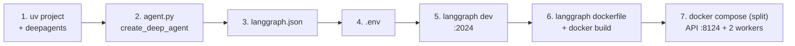

# Quickstart: a Deep Agent from an empty folder to a split API and worker stack

## Why this matters

The rest of this guide explains every part in depth. This module is the whole journey compressed
into one sitting, about twenty minutes: write a Deep Agent, describe it in `langgraph.json`, run it
on the local dev server, build the real server image, and bring that image up with Docker Compose
as an API container plus two worker containers, which is the same shape the Helm chart deploys in
production. Every command below was run while writing; output marked *captured* is real. The
finished project is in [`sample/quickstart-agent`](../sample/quickstart-agent).



## What you need

| Item | Why |
| --- | --- |
| Python 3.11 or newer and `uv` | Project, environment and dependency management. `curl -LsSf https://astral.sh/uv/install.sh \| sh` or `brew install uv`. |
| Docker with Compose v2 | Build the image and run the split stack. |
| A model provider key | Deep Agents need a tool-calling model. The example uses OpenAI; any `provider:model` works. |
| A LangSmith API key | The containerized server refuses to start without a LangSmith API key or a license key (module 07 shows the exact message). The local dev server does not need it. |

## Step 1. Create the project

```bash
uv init --package quickstart-agent --python 3.12
cd quickstart-agent
uv add "deepagents>=0.7" "langchain-openai>=1.6"      # swap langchain-openai for your provider's package
uv add --dev "langgraph-cli[inmem]>=0.4"              # the `langgraph` command and the in-memory dev server
```

`--package` gives you an installable `src/` layout, which is what `"dependencies": ["."]` in
`langgraph.json` relies on. `deepagents` 0.7 pulls in `langchain` 1.x and `langgraph` 1.x. If uv
chose the `uv_build` backend for you, the sample switches `pyproject.toml` to `hatchling` so the
package installs cleanly inside the server's base image; copy that block from
[`sample/quickstart-agent/pyproject.toml`](../sample/quickstart-agent/pyproject.toml).

## Step 2. Write the agent

`src/quickstart_agent/agent.py`, in full:

```python
import os

from deepagents import create_deep_agent

# A tiny local tool so the quickstart needs no search provider.
_FACTS = {
    "agent server": "The Agent Server is LangChain's runtime that serves graphs over a REST API with persistence and a task queue.",
    "queue worker": "A queue worker is the container role that executes runs; API containers only serve HTTP.",
    "deep agents": "Deep Agents add planning, a virtual filesystem and subagents on top of a LangChain agent.",
}


def lookup_fact(topic: str) -> str:
    """Look up a short fact about a topic in the local knowledge base."""
    return _FACTS.get(topic.lower(), f"No fact stored for '{topic}'. Known topics: {', '.join(_FACTS)}.")


INSTRUCTIONS = """You are a concise technical assistant for a platform team.
Use the lookup_fact tool before answering questions about the Agent Server, queue workers or Deep Agents.
Plan multi-step work with your todo list, and keep answers to a few sentences."""

agent = create_deep_agent(
    model=os.environ.get("MODEL", "openai:gpt-4o-mini"),
    tools=[lookup_fact],
    system_prompt=INSTRUCTIONS,
)
```

That is a complete Deep Agent. `create_deep_agent` returns a compiled LangGraph graph with
planning, a virtual filesystem and subagent delegation already wired in
([Deep Agents quickstart](https://docs.langchain.com/oss/python/deepagents/quickstart)), and a
compiled graph is exactly what the Agent Server serves. Two choices to notice: the model string
comes from an environment variable so the same image can be pointed at another provider without a
rebuild, and the model client is created at import time, which means the provider key must be
present when the server starts (Step 4).

## Step 3. Describe it in `langgraph.json`

At the project root:

```json
{
  "dependencies": ["."],
  "graphs": {
    "deep_agent": "./src/quickstart_agent/agent.py:agent"
  },
  "env": ".env",
  "python_version": "3.12",
  "image_distro": "wolfi"
}
```

`graphs` maps the name clients will use (`deep_agent`) to the module and variable that hold the
compiled graph. `dependencies: ["."]` installs this directory into the image. `env` tells the local
dev server where to load variables from. `python_version` and `image_distro` pick the base image
tag (`langchain/langgraph-api:3.12-wolfi`). Every other key is covered in
[module 04](./04-langgraph-json.md).

## Step 4. Set the environment

```bash
cat > .env <<'EOT'
LANGSMITH_API_KEY=lsv2_...
MODEL=openai:gpt-4o-mini
OPENAI_API_KEY=sk-...
OPENAI_BASE_URL=            # optional: an OpenAI-compatible gateway or proxy; leave empty for api.openai.com
EOT
```

`OPENAI_BASE_URL` is read by the OpenAI SDK underneath `langchain-openai`, so pointing it at an
internal gateway needs no code change; the Compose files in this guide pass it through to the
containers alongside the key.

Keep `.env` out of git (the sample's `.gitignore` already lists it) and, just as important, out of
the image. Add a `.dockerignore` now, before the first build; Step 6 explains why:

```bash
cat > .dockerignore <<'EOT'
.env
.env.*
!.env.example
.venv/
.git/
.langgraph_api/
.pytest_cache/
__pycache__/
*.py[cod]
Dockerfile
EOT
```

## Step 5. Run it locally

```bash
uv run langgraph dev
```

Captured start-up, with the key facts on two lines: the dev server needs no license, and the graph
loaded in a couple of seconds:

```
No license key or control plane API key set, skipping metadata loop
Application started up in 2.348s
- API:        http://127.0.0.1:2024
- Studio UI:  https://smith.langchain.com/studio/?baseUrl=http://127.0.0.1:2024
- API Docs:   http://127.0.0.1:2024/docs
```

The server created an assistant for the graph automatically, and you can already inspect the
Deep Agent's structure through the API (captured):

```
$ curl -s -X POST localhost:2024/assistants/search -H 'Content-Type: application/json' -d '{}'
[{"assistant_id": "47c35ef5-979e-5ab8-8dce-a69ded2244ab", "graph_id": "deep_agent", "name": "deep_agent", ...}]

$ curl -s localhost:2024/assistants/deep_agent/graph
nodes: ["__start__", "model", "tools", "PatchToolCallsMiddleware.before_agent", "__end__"]
```

Now talk to it. Deep Agents are message-based, so the input is a `messages` list:

```bash
curl -s -N -X POST localhost:2024/runs/stream \
  -H 'Content-Type: application/json' \
  -d '{"assistant_id":"deep_agent",
       "input":{"messages":[{"role":"user","content":"What is a queue worker?"}]},
       "stream_mode":["messages-tuple"]}'
```

With a valid provider key you will see a stream of `messages` events: the model's tool call to
`lookup_fact`, the tool result, then the assistant's answer token by token. Studio (the second URL
above) shows the same run as a graph trace, including the Deep Agent's planning steps.

<a id="wrong-key"></a>
If the provider key is wrong, the server still starts (the client is only constructed at import)
and the run fails when the model is called; see the troubleshooting note at the end of Step 7 for
the captured shape of that failure.

## Step 6. Build the server image

Stop the dev server and render the Dockerfile the pipeline will build:

```bash
uv run langgraph dockerfile Dockerfile
docker build -t quickstart-agent:dev .
```

The Dockerfile starts `FROM langchain/langgraph-api:3.12-wolfi`, copies the project into
`/deps/quickstart-agent`, installs it, and bakes the graph map into the `LANGSERVE_GRAPHS`
environment variable. Captured result with the `.dockerignore` from Step 4 in place:

```
quickstart-agent:dev  611MB
$ docker run --rm --entrypoint sh quickstart-agent:dev -c 'ls -a /deps/quickstart-agent; du -sh /deps/quickstart-agent'
. .. .dockerignore .env.example .gitignore .python-version README.md langgraph.json pyproject.toml src uv.lock
496.0K
```

Why the `.dockerignore` matters: the same build without it produced an 804MB image whose `/deps`
directory contained the `.venv` and the `.env` file, because the generated Dockerfile copies the
whole directory with `ADD .`. The CLI only writes a `.dockerignore` for you when you pass
`langgraph dockerfile --add-docker-compose`. The guide's `build.sh` refuses to build without one
([module 07](./07-standalone-helm-deploy.md#practical-build-rules)).

## Step 7. Run the split stack

This is the moment the architecture becomes visible. [`sample/docker-compose.split.yml`](../sample/docker-compose.split.yml)
starts Postgres, Redis, one API container with `N_JOBS_PER_WORKER=0` (serve HTTP, execute nothing)
and worker containers started from `/storage/queue_entrypoint.sh` inside the same image, which is
exactly what the Helm chart does in production when `queue.enabled` is true
([module 06](./06-runtime-and-tuning.md)). Compose reads `LANGSMITH_API_KEY`, `MODEL` and
`OPENAI_API_KEY` from your shell or from a `.env` in the directory you run it from:

```bash
cd ../sample                        # or wherever you keep docker-compose.split.yml
set -a; . ../quickstart-agent/.env; set +a
IMAGE_NAME=quickstart-agent:dev docker compose -f docker-compose.split.yml -p quickstart up -d --scale langgraph-queue=2
curl -s localhost:8124/ok
```

Captured:

```
$ docker compose -f docker-compose.split.yml -p quickstart ps
SERVICE              STATUS
langgraph-api        Up (healthy)
langgraph-postgres   Up (healthy)
langgraph-queue      Up (healthy)
langgraph-queue      Up (healthy)
langgraph-redis      Up (healthy)

$ curl -s localhost:8124/ok
{"ok":true}

$ curl -s -X POST localhost:8124/assistants/search -H 'Content-Type: application/json' -d '{}'
[{"graph_id": "deep_agent", "assistant_id": "47c35ef5-979e-5ab8-8dce-a69ded2244ab", ...}]
```

Same assistant ID as the dev server, because the server derives it from the graph name. Now create
a background run through the API container and watch a worker pick it up:

```bash
T=$(curl -s -X POST localhost:8124/threads -H 'Content-Type: application/json' -d '{}' | python3 -c 'import sys,json; print(json.load(sys.stdin)["thread_id"])')
curl -s -X POST localhost:8124/threads/$T/runs -H 'Content-Type: application/json' \
  -d '{"assistant_id":"deep_agent","input":{"messages":[{"role":"user","content":"What is a queue worker?"}]}}'
docker compose -f docker-compose.split.yml -p quickstart logs -f langgraph-queue
```

Captured, per container, after the run:

```
quickstart-langgraph-api-1      N_JOBS_PER_WORKER is 0. Skipping queue.
quickstart-langgraph-queue-1    Starting 10 background workers; Starting background run; ...
quickstart-langgraph-queue-2    Starting 10 background workers
```

The API container announced that it skipped the queue. One of the two workers dequeued the run and
executed the Deep Agent. That split, and the fact that you scale the two roles independently, is
the single most important operational idea in this guide.

**Troubleshooting note, captured on purpose.** The run above was executed with a placeholder
`OPENAI_API_KEY` while writing, and this is what that looks like: the run's `status` went to
`error`, and the worker log carried `Background run failed. Exception: <class
'langchain_openai.chat_models.base.OpenAIAuthenticationError'>` with `401 Unauthorized` from the
provider. The important part is *where* it failed: on the worker, after the API had accepted the
run, which proves the routing even when the model call cannot succeed. With a valid key the same
run ends in `Background run succeeded` and `GET /threads/{id}/state` holds the answer.

## Step 8. Tear down

```bash
docker compose -f docker-compose.split.yml -p quickstart down -v
```

## Checkpoint

You have a Deep Agent defined in one file, described by one `langgraph.json`, running locally on
the dev server, packaged as the real server image with nothing but source inside it, and served by
one API container plus two worker containers on your machine. To verify: `curl localhost:8124/ok`
returns `{"ok":true}`, and `docker compose ... logs langgraph-api | grep Skipping` shows the API
container is not executing runs.

## Where this goes next

| You want to | Read |
| --- | --- |
| Understand assistants, threads, runs, checkpoints and the store | [01 Core concepts](./01-concepts.md) |
| Turn an existing codebase, another framework, or a FastAPI app into this shape | [03 Existing project](./03-existing-project.md) |
| Every `langgraph.json` key, including auth, custom routes and TTLs | [04 `langgraph.json`](./04-langgraph-json.md) |
| The full API you just used a corner of | [05 API surface](./05-api-surface.md) |
| Size workers, understand slots (Deep Agent subagents consume them), tune the runtime | [06 Runtime and tuning](./06-runtime-and-tuning.md) |
| Do this on Kubernetes with the Helm chart from your own pipeline | [07 Standalone Helm deploy](./07-standalone-helm-deploy.md) |
| Do this through your self-hosted LangSmith control plane | [08 LangSmith Deployments](./08-langsmith-deployments-self-hosted.md) |

## Gotchas

- **Key at import time.** `create_deep_agent(model="openai:...")` constructs the model client when
  the module is imported, and the server imports every graph at start-up. A missing provider key
  stops the whole server, not just this graph. A wrong key starts the server and fails the run.
- **License for the container, not for `langgraph dev`.** The dev server runs with no keys at all;
  the image needs `LANGSMITH_API_KEY` (development) or `LANGGRAPH_CLOUD_LICENSE_KEY` (production)
  or it exits after running migrations.
- **`.dockerignore` before the first build.** Otherwise `.env` and `.venv` ship inside the image.
- **Two ports.** The dev server listens on 2024; the split Compose stack publishes the API on 8124
  so both can run at once.
- **Subagents cost slots.** If you add asynchronous subagents to this agent, each one runs as its
  own run on a worker slot; size `N_JOBS_PER_WORKER` accordingly ([module 06](./06-runtime-and-tuning.md#deep-agents-and-subagents-occupy-slots)).

## References

- Deep Agents quickstart: https://docs.langchain.com/oss/python/deepagents/quickstart
- Deep Agents, going to production (uses `langgraph.json`): https://docs.langchain.com/oss/python/deepagents/going-to-production
- Local development and testing: https://docs.langchain.com/langsmith/local-dev-testing
- LangGraph CLI (`dev`, `dockerfile`, `build`): https://docs.langchain.com/langsmith/cli
- Self-host standalone servers (Docker Compose section): https://docs.langchain.com/langsmith/deploy-standalone-server#docker-compose
- Agent Server runtime architecture: https://docs.langchain.com/langsmith/agent-server#container-architecture
