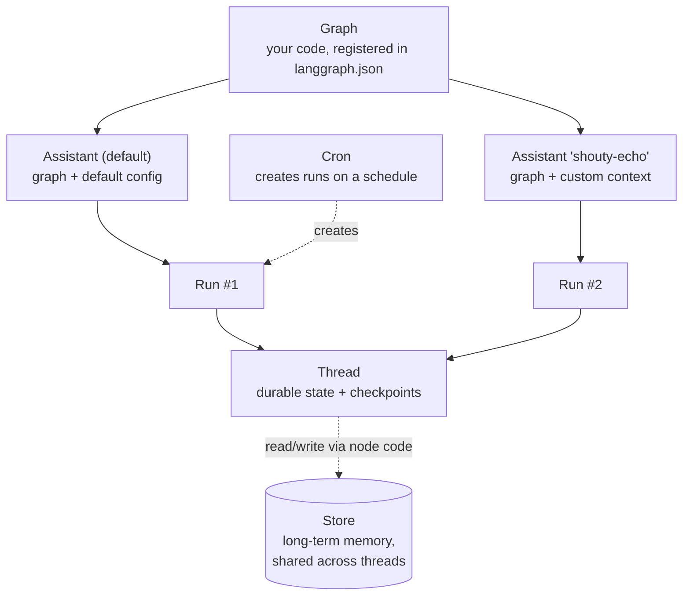

# 01. Core concepts: graphs, assistants, threads, runs, and what the server keeps for you

## Why this matters

The Agent Server API is small, but every endpoint is named after one of six nouns. Once you know what a graph, an assistant, a thread, a run, a checkpoint and the store are, and how the task queue moves work between them, the whole API surface in module [05](./05-api-surface.md) reads naturally and the runtime tuning in module [06](./06-runtime-and-tuning.md) stops being magic. This module defines those nouns using real responses from the sample server.

## The object model



### Graphs

A **graph** is your agent logic. In LangGraph terms it is a `StateGraph` with nodes and edges that has been compiled, or a function that returns one. The Agent Server does not care what runs inside a node: LangChain agents, raw model calls, another framework, or plain Python. The docs put it this way: "a graph most commonly implements an agent, but it does not have to" ([Agent Server: graphs](https://docs.langchain.com/langsmith/agent-server#graphs)).

Deep Agents are graphs in exactly this sense. `create_deep_agent(...)` from the `deepagents` package returns a compiled LangGraph graph, so a deep agent is registered, served, checkpointed and scaled the same way as the hand-built graphs below; only its subagent behaviour needs extra thought ([module 06](./06-runtime-and-tuning.md#deep-agents-and-subagents-occupy-slots)).

You tell the server which graphs exist through the `graphs` map in `langgraph.json`. The sample app registers two:

```json
"graphs": {
  "echo": "./src/my_agent/echo.py:graph",
  "agent": "./src/my_agent/agent.py:make_agent"
}
```

The key (`echo`, `agent`) is the **graph ID**. The value is a module path and either a variable holding a compiled graph or a factory function. This distinction matters:

| Registration | What the server does | When to use it |
| --- | --- | --- |
| Compiled graph (`echo.py:graph`) | Imports it once at container startup and reuses it for every run. No per-request compilation. | Default. Recommended by the docs unless you need per-run customization. |
| Factory function (`agent.py:make_agent`) | Calls your function on every invocation, passing the run configuration. | Only when the graph itself must vary per assistant or per run, for example choosing the model from configuration. Keep it lightweight. |

Source: [Graph loading and compilation](https://docs.langchain.com/langsmith/agent-server#graph-loading-and-compilation).

One rule applies to both: **do not attach a checkpointer or store in your graph code.** The server injects the ones configured for the deployment at runtime and needs to own them for thread state, history and the store API to work. The sample's `echo.py` compiles with a plain `.compile()` for exactly this reason.

A second rule was learned the hard way while building the sample. The server imports every registered graph at startup; if any import raises, the whole server refuses to start. The first version of `agent.py` created the OpenAI client at import time, and with no `OPENAI_API_KEY` set the dev server exited with `GraphLoadError: Failed to load graph 'agent'` and took the perfectly healthy `echo` graph down with it. Wrapping the agent in a factory deferred the client creation to run time. Module [03](./03-existing-project.md) returns to this when discussing import-time side effects in existing code.

### Assistants

An **assistant** is a graph plus a configuration. The docs describe assistants as a way to "manage configurations (e.g., prompts, LLM selection, tools) separately from your graph's core logic", so one graph architecture can be deployed as several specialized variants without code changes ([Assistants](https://docs.langchain.com/langsmith/assistants)). Assistants exist only in the Agent Server, not in open-source LangGraph.

When the server starts it creates one **default assistant per graph**. You can see them with a single call; this is the captured response from the sample dev server:

```bash
curl -s -X POST http://127.0.0.1:2024/assistants/search -H 'Content-Type: application/json' -d '{}'
```

```text
fe096781-5601-53d2-b2f6-0d3403f7e9ca agent agent {'created_by': 'system'}
046b5dc7-2108-582c-9c6c-31d556d138f0 echo echo {'created_by': 'system'}
```

Each line is `assistant_id graph_id name metadata`. The IDs are deterministic UUIDs derived from the graph ID, which is why you can pass either `"echo"` or the UUID as `assistant_id` on any run endpoint: a graph ID resolves to its default assistant.

Creating a second assistant over the same graph is a single POST. The sample's `echo` graph declares a context schema with two fields, `prefix` and `shout`, so an assistant can pin those:

```bash
curl -s -X POST http://127.0.0.1:2024/assistants -H 'Content-Type: application/json' \
  -d '{"graph_id":"echo","name":"shouty-echo","context":{"prefix":"SHOUTY","shout":true},"metadata":{"team":"platform"}}'
```

Captured: `70663b56-a65b-44d0-84c1-a60acd644eec shouty-echo 1 {'prefix': 'SHOUTY', 'shout': True}`. Running that assistant with the input "hi" returned `SHOUTY: HI`, while the default assistant returns `echo: hi`. Same code, different behaviour, no redeploy.

Assistants are **versioned**. Patching the assistant's context created version 2, and the versions endpoint listed both:

```text
version 2 {'prefix': 'v2'}
version 1 {'prefix': 'SHOUTY', 'shout': True}
```

You can promote any version back to latest. This is the mechanism for changing prompts, models or feature flags in production without a new image ([Assistants: versioning](https://docs.langchain.com/langsmith/assistants#versioning)).

#### Context versus configurable

There are two channels for passing settings into a graph, and you will meet both in the API and in older code:

| Channel | How the graph declares it | How a caller sets it | Notes |
| --- | --- | --- | --- |
| `context` | `StateGraph(State, context_schema=Context)`; nodes receive `runtime.context` | `"context": {...}` on a run or an assistant | Typed, appears in `/assistants/{id}/schemas` as `context_schema`. Used by the sample `echo` graph. |
| `config.configurable` | Nodes or a factory read `config["configurable"][...]` | `"config": {"configurable": {...}}` on a run or an assistant | Older convention. The sample `agent` factory reads `configurable.model` this way. |

The schemas endpoint confirms what a given assistant accepts. Captured for the sample:

```text
['graph_id', 'input_schema', 'output_schema', 'state_schema', 'config_schema', 'context_schema']
context_schema: {"properties": {"prefix": {"default": "echo", "type": "string"}, "shout": {"default": false, "type": "boolean"}}, "title": "Context", "type": "object"}
```

### Threads

A **thread** is a durable conversation. It holds the accumulated state of every run executed on it and a history of checkpoints, so the next run starts where the last one finished. Threads are how the Agent Server gives you multi-turn memory without you writing any storage code.

The captured sequence below is two runs on one thread against the sample `echo` graph. The graph's state has a `messages` list with the `add_messages` reducer, so each run appends rather than overwrites:

```text
thread_id=01a0aedd-df3f-7393-b92a-dcfc20015413
## second turn on same thread
4 messages in thread state
  human -> first turn
  ai -> echo: first turn
  human -> second turn
  ai -> echo: second turn
## GET /threads/{id}/state
messages: 4 next: [] checkpoint_id: 1f1b280c...
## GET /threads/{id}/history?limit=3
1f1b280c step 4 source loop
1f1b280c step 3 source loop
1f1b280c step 2 source input
```

Three things to notice. The state endpoint returns `values` (your state), `next` (which nodes would run next; empty means the graph finished), and the current `checkpoint`. The history endpoint returns one entry per **checkpoint**, each tagged with the step number and whether it came from an `input` or a graph `loop` step. And the thread carried `metadata` (`{"user": "demo"}`) that you can filter on with `/threads/search`, which is how you find "all conversations for this user".

Threads can also be forked (`/threads/{id}/copy`), rewound to any checkpoint, and pruned in bulk. Module [05](./05-api-surface.md) covers those endpoints.

### Runs

A **run** is one execution of an assistant, optionally on a thread. A run without a thread is a **stateless run**: it executes and returns, and nothing persists afterwards. A run on a thread reads the thread's current state, executes, and writes the new state back.

There are three ways to consume a run, and they map directly to endpoints:

| Style | Endpoint | Behaviour |
| --- | --- | --- |
| Wait | `POST .../runs/wait` | Blocks until the run finishes, returns final state |
| Stream | `POST .../runs/stream` | Returns Server-Sent Events as the run executes |
| Background | `POST .../runs` | Returns immediately with a run ID; poll, `/join`, or `/stream` it later |

A streamed run against the sample, captured with `stream_mode` set to both `updates` and `messages-tuple`:

```text
event: metadata
data: {"run_id":"01a0aedd-df4c-7b63-818a-bc8331a93f90","attempt":1}

event: messages
data: [{"content":"echo: first turn", ... "type":"ai" ...}, {"created_by":"system","user":"demo","graph_id":"echo", ... "langgraph_step":1,"langgraph_node":"respond", ...}]

event: updates
data: {"respond":{"messages":[{"content":"echo: first turn", ... "type":"ai" ...}]}}
```

The first event always carries the `run_id` and the `attempt` number (attempt 2 or 3 means the run was retried after a transient failure, see the task queue below). The stream modes are covered in module [05](./05-api-surface.md); the point here is that streaming is a property of how you observe a run, not of the run itself. Any run can be streamed, and a client that disconnects can rejoin the same run's stream later.

Two runs cannot execute on the same thread at once. The queue enforces this, and the `multitask_strategy` option on a run decides what happens when a second run arrives while the first is still going: `reject`, `interrupt`, `rollback` or `enqueue` (the default) ([Run execution lifecycle](https://docs.langchain.com/langsmith/agent-server#run-execution-lifecycle)).

### Cron jobs

A **cron** is a saved run request plus a schedule. On each tick the server creates a run with the stored input, either on a fixed thread or on a fresh thread each time. Schedules are interpreted in UTC unless a `timezone` is supplied ([Use cron jobs](https://docs.langchain.com/langsmith/cron-jobs)). The sample dev server reports `"crons": true` in `/info`, so the feature is available locally too.

### Persistence: three kinds of data

The server persists three kinds of data, and it helps to keep them separate in your head because they scale and expire differently ([Agent Server: persistence](https://docs.langchain.com/langsmith/agent-server#persistence)):

| Data | What it holds | Where it lives | Lifecycle |
| --- | --- | --- | --- |
| Core resource data | Assistants, threads, runs, crons | PostgreSQL, always | Until deleted; threads can have a TTL, and deleting a thread deletes its runs and checkpoints |
| Checkpoints (short-term memory) | A snapshot of graph state at each step of a run | PostgreSQL by default; MongoDB optional; custom possible | Per thread; frequency governed by durability mode; checkpoint TTL configurable |
| Store (long-term memory) | Key-value items in namespaces, optionally with semantic search | PostgreSQL by default; custom possible | Across threads and runs; item TTL configurable |

**Durability mode** is the knob that decides how often checkpoints are written during a run. The default `async` writes after each step asynchronously; `exit` writes only the final state; `sync` writes synchronously each step. The docs' scaling guidance is to use the minimum that meets your recovery needs, because every checkpoint is a database write ([Configure Agent Server for scale: minimize redundant checkpointing](https://docs.langchain.com/langsmith/agent-server-scale#minimize-redundant-checkpointing)). It is set per run:

```python
client.runs.create(thread_id=..., assistant_id="agent", durability="exit")
```

Checkpoints are what make runs **durable**: if a worker dies mid-run, the run resumes from the last checkpoint on another worker rather than starting over. That is the property that lets the platform team restart worker pods during a deploy without losing in-flight work, subject to the grace periods described in module [06](./06-runtime-and-tuning.md).

The **store** is separate from thread state on purpose. Thread state is "what happened in this conversation"; the store is "what we know about this user or this topic regardless of conversation". Node code reads and writes it through the injected store object, and clients can read and write it directly through the `/store` endpoints. Semantic search over the store and item expiry are configured in `langgraph.json` (module [04](./04-langgraph-json.md)).

### The task queue

Creating a run does not execute it. The API server writes a pending run to PostgreSQL and returns; a **queue worker** picks it up, takes a lease on it, loads the graph, and executes it. This is the single most important architectural fact about the Agent Server, and the docs describe the lifecycle in five steps ([Run execution lifecycle](https://docs.langchain.com/langsmith/agent-server#run-execution-lifecycle)):

1. A client sends a request to an API server, which creates a pending run in the durable task queue.
2. A queue worker picks up the run, acquires a lease, loads the graph, and begins execution. At most one run executes per thread at a time.
3. As the graph executes, the worker writes checkpoints and broadcasts streaming events over Redis pub/sub.
4. If the client opened a `/stream` connection, the API server subscribes to the channel and forwards events as Server-Sent Events.
5. On completion the worker updates the run status and frees its slot.

Redis's role is narrow and worth stating precisely because it affects how you size and secure it: it wakes workers when a run is created (a sentinel in a list, not the run itself), carries cancellation signals, and carries streaming events from worker to API server. "No user or run data is stored in Redis"; run data is always read from and written to PostgreSQL ([LangSmith data plane: Redis](https://docs.langchain.com/langsmith/data-plane#redis)). Transient PostgreSQL errors cause a run to be retried, up to three attempts by default, and the attempt counter is the one small piece of ephemeral metadata Redis keeps.

Each worker executes up to `N_JOBS_PER_WORKER` runs concurrently (default 10). Whether "worker" means a separate container or a pool inside the API container depends on the deployment mode, which is the subject of module [06](./06-runtime-and-tuning.md).

## Local development versus a real deployment

You will run the Agent Server in three different shapes during a project. They share the API but differ in what is behind it:

| Shape | Command | Persistence | Queue | Auth | Keys needed | Use for |
| --- | --- | --- | --- | --- | --- | --- |
| In-memory dev server | `langgraph dev` | In memory, lost on restart | One in-process worker | None | None (captured: starts without any key) | Daily iteration, Studio, hot reload |
| Local Docker stack | `langgraph up` or the sample `docker-compose.yml` | PostgreSQL and Redis in containers | Real queue, single-host mode | None by default | `LANGSMITH_API_KEY` or a license key (captured: exits without one) | Pre-deployment validation of the built image |
| Deployment | Helm chart or LangSmith Deployments | Your PostgreSQL and Redis | API pods and worker pods | Your choice (module [05](./05-api-surface.md)) | License key | Production |

The docs recommend this rhythm: iterate with `langgraph dev`, periodically validate with `langgraph up`, run `langgraph up --recreate` for a fresh build before deploying, then deploy ([Local development and testing: recommended workflow](https://docs.langchain.com/langsmith/local-dev-testing#recommended-workflow)). The `/info` endpoint tells you which shape you are talking to; the captured dev-server response reported `"version": "0.14.1"`, `"langgraph_py_version": "1.2.11"` and `"host": {"kind": "self-hosted", ...}`.

## Hands-on

With the sample project from module [02](./02-new-project.md) running under `langgraph dev`, reproduce the object model end to end. Each command maps to a noun above.

```bash
B=http://127.0.0.1:2024

# Graphs became default assistants
curl -s -X POST $B/assistants/search -H 'Content-Type: application/json' -d '{}' | jq '.[] | {assistant_id, graph_id, name}'

# A thread with metadata you can search on later
T=$(curl -s -X POST $B/threads -H 'Content-Type: application/json' -d '{"metadata":{"user":"demo"}}' | jq -r .thread_id)

# Two runs on the thread; the second sees the first's messages
curl -s -X POST $B/threads/$T/runs/wait -H 'Content-Type: application/json' \
  -d '{"assistant_id":"echo","input":{"messages":[{"role":"user","content":"first turn"}]}}' | jq '.messages | length'
curl -s -X POST $B/threads/$T/runs/wait -H 'Content-Type: application/json' \
  -d '{"assistant_id":"echo","input":{"messages":[{"role":"user","content":"second turn"}]}}' | jq '.messages | length'

# State and checkpoint history
curl -s $B/threads/$T/state | jq '{next, messages: (.values.messages | length)}'
curl -s "$B/threads/$T/history?limit=5" | jq '.[] | {step: .metadata.step, source: .metadata.source}'

# A stateless run: nothing is stored afterwards
curl -s -X POST $B/runs/wait -H 'Content-Type: application/json' \
  -d '{"assistant_id":"echo","input":{"messages":[{"role":"user","content":"one-off"}]}}' | jq '.messages[-1].content'
```

Expected: message counts of 2 then 4, `next` equal to `[]`, history entries with `source` values of `loop` and `input`, and the stateless run returning `"echo: one-off"`.

## Checkpoint

You can now name the six nouns, say which endpoint family each maps to, and explain why creating a run returns before the run executes. Verify with one call: `curl -s http://127.0.0.1:2024/info | jq .flags` should show `"assistants": true` and `"crons": true`.

## Gotchas

Passing a graph ID as `assistant_id` is convenient but it always means the default assistant. If you configured a custom assistant, pass its UUID or you will silently get default behaviour.

State is only as durable as the shape you are running. `langgraph dev` keeps threads in memory; restart it and they are gone. That is by design, and it is why module [02](./02-new-project.md) also shows the Docker stack.

Do not read thread history as an audit log of "messages". It is a log of **checkpoints**, one per graph step. A single user turn on a multi-node graph produces several entries.

`N_JOBS_PER_WORKER` bounds concurrent run **execution**, not concurrent API **requests**. The docs stress this distinction repeatedly and module [06](./06-runtime-and-tuning.md) is built around it.

## References

- Agent Server (parts of a deployment, persistence, task queue, run lifecycle): https://docs.langchain.com/langsmith/agent-server
- Assistants (configuration, versioning): https://docs.langchain.com/langsmith/assistants
- Rebuild graph at runtime (factory functions): https://docs.langchain.com/langsmith/graph-rebuild
- Use cron jobs: https://docs.langchain.com/langsmith/cron-jobs
- Configure checkpointer backend: https://docs.langchain.com/langsmith/configure-checkpointer
- LangGraph persistence and durability modes: https://docs.langchain.com/oss/python/langgraph/persistence#durability-modes
- LangSmith data plane (Redis and PostgreSQL roles): https://docs.langchain.com/langsmith/data-plane
- Local development and testing (dev vs up): https://docs.langchain.com/langsmith/local-dev-testing
- Configure Agent Server for scale (durability guidance): https://docs.langchain.com/langsmith/agent-server-scale
