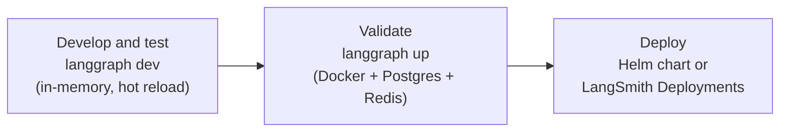

# 02. Path A: starting a new project

## Why this matters

Everything the Agent Server does, from persistence to streaming to scaling, hangs off three files you own: a Python module that exports a graph, a `langgraph.json` that tells the server where that graph is and how to build the image, and a dependency file. Get this shape right on day one and every later module in this guide (the Docker image, the Helm chart, the LangSmith control plane) works without restructuring. This module builds the sample project under [`../sample/my-agent`](../sample/my-agent) that the rest of the guide deploys.

## Tooling primer: uv and the LangGraph CLI

Two tools do all the work in this module, and they have distinct jobs. **uv** (from Astral) manages
the Python interpreter, the virtual environment and dependencies; it reads and writes
`pyproject.toml` and pins exact versions in `uv.lock`. The **LangGraph CLI** (`langgraph`)
scaffolds projects, runs a local Agent Server with hot reload, and later renders the Dockerfile or
builds the image; it reads `langgraph.json` to know which graphs to serve and what to install
([LangGraph CLI](https://docs.langchain.com/langsmith/cli), [uv documentation](https://docs.astral.sh/uv/)).
They compose cleanly: uv owns the environment, and you run the CLI inside it with `uv run langgraph ...`.

| Command | What it does |
| --- | --- |
| `uv init --package my-agent` | New installable project with a `pyproject.toml` and a `src/` layout. `--package` matters because `langgraph.json` will say `"dependencies": ["."]`, which installs the directory as a package. |
| `uv add <pkg>` / `uv add --dev <pkg>` | Add a runtime or dev-only dependency; updates `pyproject.toml` and `uv.lock`. |
| `uv sync` | Create `.venv/` if needed and install exactly what the lockfile says. |
| `uv run <cmd>` | Run a command inside the project environment, syncing first. This is how you run the CLI: `uv run langgraph dev`. |
| `uvx --from <pkg> <cmd>` | Run a tool once in a throwaway environment without touching the project; used for scaffolding. |
| `uv python install 3.12` | Install a Python version (the CLI needs 3.11 or newer). |
| `langgraph new <dir> --template <name>` | Scaffold from an official template. |
| `langgraph dev` | Local in-memory Agent Server with hot reload and Studio; no Docker, no database, no key required. Requires the `langgraph-cli[inmem]` extra. |
| `langgraph dockerfile <path>` | Render the Dockerfile from `langgraph.json` (no Docker daemon needed). Used by the pipeline in [module 07](./07-standalone-helm-deploy.md). |
| `langgraph build -t <tag>` | Build the image directly (needs Docker). |
| `langgraph up` | Run the built server locally in Docker with Postgres and Redis. |

Two distinctions people trip on: `uvx` runs a tool in an isolated environment unrelated to your
project (right for one-off scaffolding), while `uv run` runs inside your project's environment
with your dependencies (right for `langgraph dev`); and `uv tool install` is the persistent cousin
of `uvx` when you want the CLI on your PATH permanently.

**The fastest path** is to let the CLI scaffold a project from the official template, which
already contains a `pyproject.toml`, a graph module, `langgraph.json` and a `.env.example`:

```bash
uvx --from langgraph-cli@latest langgraph new ./my-agent --template new-langgraph-project-python
cd my-agent && uv sync && cp .env.example .env && uv run langgraph dev
```

Omit `--template` for an interactive menu of templates. The hands-on section below builds the
sample by hand instead, because seeing each file appear is the point of this module; the result
is the same shape as the template's.

Prerequisites: Python 3.11 or newer for the CLI (uv can install one for you), uv itself
(`curl -LsSf https://astral.sh/uv/install.sh | sh`, or `brew install uv`), and optionally a
LangSmith API key in `.env` for tracing. Three gotchas from first use: `langgraph: command not found`
means you are outside the environment, so prefix with `uv run`; an error about a missing extra
means you installed `langgraph-cli` without `[inmem]`; and Safari blocks the Studio connection to
localhost, so run `uv run langgraph dev --tunnel` there.

## The three things a project must provide

The docs describe an Agent Server application as one or more graphs, a configuration file, a dependency file, and an optional `.env` ([Application structure](https://docs.langchain.com/langsmith/application-structure)). In practice:

| Piece | File in the sample | What it is for |
|---|---|---|
| Graph(s) | `src/my_agent/echo.py`, `src/my_agent/agent.py` | The code the server runs. Each exports a compiled graph or a factory function that returns one. |
| Configuration | `langgraph.json` | Maps graph IDs to Python objects, declares dependencies, points at `.env`, and sets build options such as the Python version and base image flavor. |
| Dependencies | `pyproject.toml` (plus `uv.lock`) | What gets installed into the image. `langgraph.json` says `"dependencies": ["."]`, which means "install this directory as a package". |
| Environment | `.env` (git-ignored), `.env.example` (committed) | Secrets and per-environment settings. Read by `langgraph dev` locally; in production these become container environment variables. |

The graph ID you choose in `langgraph.json` (the key in the `graphs` map) is the name clients use as `assistant_id`. Choose it deliberately; renaming it later is a breaking API change for every caller.

## Recommended layout

```text
my-agent/
├── langgraph.json          # the server's entry point: graphs, deps, env, build options
├── pyproject.toml          # installable package (hatchling), runtime + dev dependency groups
├── uv.lock                 # exact versions; commit it
├── .env.example            # documented variables, no values
├── .env                    # real values, git-ignored
├── README.md
├── src/
│   └── my_agent/
│       ├── __init__.py
│       ├── echo.py         # deterministic graph, no model key needed
│       └── agent.py        # tool-calling agent via create_agent, behind a factory
└── tests/
    └── test_echo.py        # graph-level unit tests, no server required
```

Three choices in this layout are deliberate. The package uses a `src/` layout so that `"dependencies": ["."]` installs a real, importable package rather than relying on the working directory. The build backend is `hatchling` rather than the `uv_build` backend that `uv init` writes by default, because the generated Dockerfile installs your package with `uv pip install -e .` inside the `langchain/langgraph-api` base image, and a widely supported backend removes one variable from that step. And the CLI, SDK and `pytest` live in a `dev` dependency group so they are not installed into the production image.

## Hands-on: build the sample

### 1. Scaffold the package

```bash
cd sample
uv init --package my-agent --python 3.12
cd my-agent
uv add "langgraph>=1.0,<2.0" "langchain>=1.0,<2.0" "langchain-core>=1.0,<2.0" langchain-openai
uv add --dev "langgraph-cli[inmem]>=0.4" langgraph-sdk pytest
```

Then edit `pyproject.toml` so the build section reads:

```toml
[build-system]
requires = ["hatchling"]
build-backend = "hatchling.build"

[tool.hatch.build.targets.wheel]
packages = ["src/my_agent"]
```

The full file is at [`../sample/my-agent/pyproject.toml`](../sample/my-agent/pyproject.toml). The LangGraph CLI needs Python 3.11 or newer; the sample pins 3.12 and the `python_version` in `langgraph.json` matches it, which selects the `3.12` base image tag at build time ([CLI configuration file reference](https://docs.langchain.com/langsmith/cli#configuration-file)).

### 2. The first graph: deterministic, chat-shaped, no model

[`src/my_agent/echo.py`](../sample/my-agent/src/my_agent/echo.py) is the graph every deployment module smoke-tests with, because it never calls a model and therefore needs no provider key:

```python
from dataclasses import dataclass
from typing import Annotated, TypedDict

from langchain_core.messages import AIMessage, AnyMessage
from langgraph.graph import END, START, StateGraph
from langgraph.graph.message import add_messages
from langgraph.runtime import Runtime


class State(TypedDict):
    # add_messages is a reducer: new messages are appended, not overwritten.
    messages: Annotated[list[AnyMessage], add_messages]


@dataclass
class Context:
    """Static per-run / per-assistant settings. Populated from ``context`` on the API."""
    prefix: str = "echo"
    shout: bool = False


def respond(state: State, runtime: Runtime[Context]) -> State:
    last = state["messages"][-1]
    text = last.content if isinstance(last.content, str) else str(last.content)
    ctx = runtime.context or Context()
    reply = f"{ctx.prefix}: {text}"
    if ctx.shout:
        reply = reply.upper()
    return {"messages": [AIMessage(content=reply)]}


graph = (
    StateGraph(State, context_schema=Context)
    .add_node("respond", respond)
    .add_edge(START, "respond")
    .add_edge("respond", END)
    .compile()
)
```

Two design points carry through the whole guide. First, the state is a `messages` list with the `add_messages` reducer, so the graph speaks the same shape as a real chat agent and works with the SDKs, Studio and the React `useStream` hook without changes. Second, the graph declares a `context_schema`. The server exposes that schema on the API (you will see it under `/assistants/{id}/schemas` below), and an assistant can carry a saved `context` so the same graph behaves differently per assistant. Module [01](./01-concepts.md) explains assistants; module [05](./05-api-surface.md) uses this graph to demonstrate them.

### 3. The second graph: a real agent behind a factory

[`src/my_agent/agent.py`](../sample/my-agent/src/my_agent/agent.py) uses LangChain's `create_agent`, which returns a compiled LangGraph graph:

```python
import os

from langchain.agents import create_agent
from langchain_core.runnables import RunnableConfig


def get_weather(city: str) -> str:
    """Return the current weather for a city."""
    return f"It is always sunny in {city}."


def add(a: float, b: float) -> float:
    """Add two numbers."""
    return a + b


def make_agent(config: RunnableConfig):
    """Build the agent for one run. Called by the server on every invocation."""
    configurable = config.get("configurable", {})
    model = configurable.get("model") or os.environ.get("MODEL", "openai:gpt-4o-mini")
    return create_agent(
        model=model,
        tools=[get_weather, add],
        system_prompt="You are a concise assistant. Use tools when they help.",
    )
```

Notice that this file exports a function, not a graph. The docs recommend exporting a compiled graph unless you need per-run customization, because a compiled graph is loaded once at container startup while a factory runs on every invocation ([Graph loading and compilation](https://docs.langchain.com/langsmith/agent-server#graph-loading-and-compilation)). The sample uses a factory anyway, and the reason was learned the hard way while building it.

The first version of `agent.py` called `create_agent(...)` at module import time, exactly like `echo.py` builds its graph. With no `OPENAI_API_KEY` in the environment, `uv run langgraph dev` refused to start at all:

```text
openai.OpenAIError: Missing credentials. Please pass an `api_key`, `workload_identity`,
`admin_api_key`, or set the `OPENAI_API_KEY` or `OPENAI_ADMIN_KEY` environment variable.
...
langgraph_api.utils.errors.GraphLoadError: Failed to load graph 'agent' from
./src/my_agent/agent.py: Missing credentials. ...
[error] Application startup failed. Exiting.
```

The server imports every graph listed in `langgraph.json` during startup. If any one of them raises on import, the whole server exits, including graphs that would have been fine. `echo` was healthy and still went down with it. The same failure would show up in production as a pod that never passes its startup probe.

Moving `create_agent` into `make_agent(config)` fixes this because the model client is constructed only when a run actually asks for it. It also buys the documented reason to use a factory: the model can be chosen per assistant through `config["configurable"]["model"]`, so one image can serve several model configurations. The trade-off is the per-invocation cost the docs warn about; `create_agent` is cheap, so it is acceptable here. The general lesson for your own code: keep import-time side effects out of graph modules, and if a client must be created eagerly, create it lazily or make the graph a factory.

### 4. `langgraph.json`

[`../sample/my-agent/langgraph.json`](../sample/my-agent/langgraph.json):

```json
{
  "dependencies": ["."],
  "graphs": {
    "echo": "./src/my_agent/echo.py:graph",
    "agent": "./src/my_agent/agent.py:make_agent"
  },
  "env": ".env",
  "python_version": "3.12",
  "image_distro": "wolfi"
}
```

The two `graphs` entries show both registration styles: `echo` points at a compiled graph object, `agent` points at a factory function. `image_distro: "wolfi"` selects the smaller Wolfi-based base image (`langchain/langgraph-api:3.12-wolfi`) instead of the Debian default. Every key in this file, including the ones the sample does not use, is covered in module [04](./04-langgraph-json.md).

### 5. Environment file

Commit [`.env.example`](../sample/my-agent/.env.example) with names and comments only, and keep the real `.env` out of git (the sample's `.gitignore` lists it):

```dotenv
# Copy to .env and fill in. .env is git-ignored; never commit real keys.
LANGSMITH_API_KEY=
# Optional: point tracing at your self-hosted LangSmith (no trailing slash)
# LANGSMITH_ENDPOINT=https://langsmith.example.internal
# Model used by the "agent" graph, provider:model form
MODEL=openai:gpt-4o-mini
OPENAI_API_KEY=
```

Locally, `langgraph dev` loads this file because `langgraph.json` says `"env": ".env"`. In a deployment nothing reads `.env`; the same variables arrive as container environment (Helm `extraEnv` or `envFrom` in module [07](./07-standalone-helm-deploy.md), the deployment form in module [08](./08-langsmith-deployments-self-hosted.md)). Keep the two in sync by treating `.env.example` as the contract.

### 6. Unit-test the graph without a server

[`tests/test_echo.py`](../sample/my-agent/tests/test_echo.py) invokes the compiled graph directly:

```python
from my_agent.echo import Context, graph


def test_echo_replies():
    out = graph.invoke({"messages": [{"role": "user", "content": "hi"}]})
    assert out["messages"][-1].content == "echo: hi"


def test_echo_uses_context():
    out = graph.invoke(
        {"messages": [{"role": "user", "content": "hi"}]},
        context=Context(prefix="bot", shout=True),
    )
    assert out["messages"][-1].content == "BOT: HI"
```

```bash
uv sync
cp .env.example .env
uv run pytest -q
```

Captured output:

```text
..                                                                       [100%]
2 passed in 0.55s
```

Graph-level tests like these run in your continuous integration (CI) pipeline in under a second and catch most logic regressions before an image is ever built.

### 7. Run the local Agent Server

```bash
uv run langgraph dev --no-browser
```

`langgraph dev` starts the in-memory variant of the Agent Server on port 2024. It needs no Docker, no Postgres and no Redis, and it started with no keys set at all. The startup log recorded:

```text
No license key or control plane API key set, skipping metadata loop
Importing graph profiling ... graph_id=echo
Importing graph profiling ... graph_id=agent
Application started up in 0.368s
Starting 1 background workers
```

Both graphs imported cleanly this time because `agent` is now a factory. Note the last line: the dev server runs the API and a single background worker in one process. Module [06](./06-runtime-and-tuning.md) explains why production separates those roles.

Two dev-server facts to know now. It is an in-memory, no-authentication server; never expose it beyond your machine. And the `[inmem]` extra of `langgraph-cli` is what provides it, which is why the sample adds `langgraph-cli[inmem]` rather than plain `langgraph-cli`.

### 8. Talk to it

Every Agent Server, local or deployed, exposes the same HTTP API. Captured from the running dev server:

```bash
curl -s http://127.0.0.1:2024/ok
```
```json
{"ok":true}
```

```bash
curl -s http://127.0.0.1:2024/info
```
```json
{
    "version": "0.14.1",
    "langgraph_py_version": "1.2.11",
    "flags": {
        "assistants": true,
        "crons": true,
        "langsmith": false,
        "langsmith_tracing_replicas": true,
        "langsmith_tracing_session_on_runs": true
    },
    "host": {
        "kind": "self-hosted",
        "project_id": null,
        "host_revision_id": null,
        "revision_id": null,
        "tenant_id": null
    }
}
```

`version` is the Agent Server (`langgraph-api`) version, `0.14.1` here, and `langgraph_py_version` is the LangGraph library your code runs on. Both are worth logging in your pipeline.

The server created one assistant per graph at startup:

```bash
curl -s -X POST http://127.0.0.1:2024/assistants/search \
  -H 'Content-Type: application/json' -d '{}'
```
```text
fe096781-5601-53d2-b2f6-0d3403f7e9ca agent agent {'created_by': 'system'}
046b5dc7-2108-582c-9c6c-31d556d138f0 echo echo {'created_by': 'system'}
```

Each row is `assistant_id`, `graph_id`, `name`, `metadata`. These default assistants are why you can pass the graph name (`"echo"`) as `assistant_id` in a request: the server resolves it to the system-created assistant for that graph.

A stateless run, waited to completion:

```bash
curl -s -X POST http://127.0.0.1:2024/runs/wait \
  -H 'Content-Type: application/json' \
  -d '{"assistant_id":"echo","input":{"messages":[{"role":"user","content":"hello from curl"}]}}'
```
```json
{
    "messages": [
        {
            "content": "hello from curl",
            "type": "human",
            "id": "22d5ba24-9d3b-4fba-8cf8-0875ad74fe2a",
            "additional_kwargs": {},
            "response_metadata": {},
            "name": null
        },
        {
            "content": "echo: hello from curl",
            "type": "ai",
            "id": "dc04fd6a-f7d6-4b0d-a186-23bc4e55a763",
            "additional_kwargs": {},
            "response_metadata": {},
            "name": null,
            "tool_calls": [],
            "invalid_tool_calls": [],
            "usage_metadata": null
        }
    ]
}
```

The same call with a `context` object, which the server hands to the graph as `runtime.context`:

```bash
curl -s -X POST http://127.0.0.1:2024/runs/wait \
  -H 'Content-Type: application/json' \
  -d '{"assistant_id":"echo","input":{"messages":[{"role":"user","content":"hello"}]},
       "context":{"prefix":"bot","shout":true}}'
```
```text
BOT: HELLO
```

The SDK clients in [`../sample/clients/python_client.py`](../sample/clients/python_client.py) and [`../sample/clients/js_client.mjs`](../sample/clients/js_client.mjs) do the same things through the Python and JavaScript SDKs, plus threads and streaming; module [05](./05-api-surface.md) walks through them.

### 9. Studio

With the dev server running, the LangGraph Studio user interface connects to it from your browser. The CLI prints the link on startup in the form `https://smith.langchain.com/studio/?baseUrl=http://127.0.0.1:2024`; for a self-hosted LangSmith, replace the host with your own instance. Studio lets you pick a graph, run it, inspect each node's input and output, and edit state between steps. On Safari, or when the browser cannot reach `127.0.0.1`, start the server with `langgraph dev --tunnel`. Studio itself is documented at [LangGraph Studio](https://docs.langchain.com/langsmith/studio).

## Local development stages

The docs describe a three-stage workflow ([Local development and testing](https://docs.langchain.com/langsmith/local-dev-testing)):



`langgraph dev` runs your code directly in your virtual environment with hot reload. `langgraph up` builds the real image and runs it with Postgres and Redis in Docker, which is the closest thing to production you can run on a laptop; the sample's [`docker-compose.yml`](../sample/docker-compose.yml) is the equivalent for teams that prefer plain Compose. Both `langgraph up` and the built image enforce licensing: they need either `LANGSMITH_API_KEY` or `LANGGRAPH_CLOUD_LICENSE_KEY`, whereas `langgraph dev` started without either. Module [07](./07-standalone-helm-deploy.md) shows the exact error and how to supply the key.

## Pre-deployment checklist

The docs' checklist, to run with `langgraph up` or the Compose file before an image leaves your machine ([Pre-deployment checklist](https://docs.langchain.com/langsmith/local-dev-testing#pre-deployment-checklist)):

1. All dependencies install correctly in the container.
2. The application starts without errors.
3. Each graph executes successfully.
4. All environment variables work correctly.
5. Authentication and authorization behave as expected.

Add two of your own, both learned in this module: no graph module has import-time side effects that depend on secrets, and `.env.example` lists every variable the container will need.

## Checkpoint

You can now scaffold an installable project, register two graphs of different kinds in `langgraph.json`, unit-test a graph without a server, and drive the local Agent Server with `curl`. Verify:

```bash
cd sample/my-agent && uv run pytest -q && uv run langgraph dev --no-browser &
sleep 5 && curl -s http://127.0.0.1:2024/ok && curl -s -X POST http://127.0.0.1:2024/assistants/search \
  -H 'Content-Type: application/json' -d '{}' | python3 -c "import sys,json; print([a['graph_id'] for a in json.load(sys.stdin)])"
```

Expected: `2 passed`, `{"ok":true}`, and `['agent', 'echo']` (order may vary).

## Gotchas

**One failing graph import stops the whole server.** Startup imports every entry in `graphs`. Keep provider clients, database connections and network calls out of module scope, or export a factory.

**`langgraph: command not found`** means the CLI is installed in the project's virtual environment but you are outside it. Prefix with `uv run`.

**`langgraph dev` needs the `inmem` extra.** Install `langgraph-cli[inmem]`, not `langgraph-cli`.

**The graph ID is your public API.** Clients pass it as `assistant_id`; renaming it breaks them.

**Do not configure a checkpointer or store in code.** The server injects both at runtime and needs to own them ([Graph loading and compilation](https://docs.langchain.com/langsmith/agent-server#graph-loading-and-compilation)). Passing your own to `compile()` or `create_agent()` will conflict with the server's persistence.

**`.env` is for local runs only.** Nothing in a container reads it. Provide the same variables as container environment.

## References

- Application structure: https://docs.langchain.com/langsmith/application-structure
- LangGraph CLI and `langgraph.json` reference: https://docs.langchain.com/langsmith/cli
- Local development and testing (`langgraph dev` vs `langgraph up`, pre-deployment checklist): https://docs.langchain.com/langsmith/local-dev-testing
- Agent Server: graph loading and compilation: https://docs.langchain.com/langsmith/agent-server#graph-loading-and-compilation
- Rebuild graph at runtime (factory functions): https://docs.langchain.com/langsmith/graph-rebuild
- LangGraph Studio: https://docs.langchain.com/langsmith/studio
- uv documentation: https://docs.astral.sh/uv/
- Sample project: [`../sample/my-agent`](../sample/my-agent)
