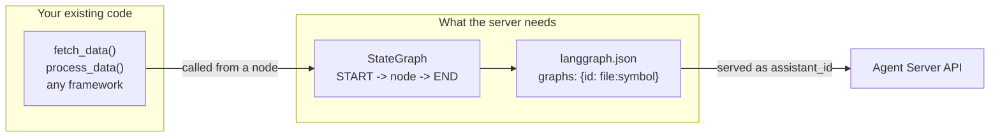

# 03. Path B: turning an existing project into an Agent Server application

## Why this matters

Most teams do not start from an empty folder. They have a service that already calls a model, a framework they chose a year ago, a shared library in a monorepo, or a FastAPI application with its own routes. The Agent Server does not require you to throw any of that away. Its contract with your code is narrow: expose a compiled LangGraph graph (or a function that returns one) from a Python module, and describe it in `langgraph.json`. Everything inside the graph's nodes is ordinary Python. This module shows the four common starting points and how each one meets that contract, then closes with a migration checklist.

Read module [02](./02-new-project.md) first if the terms graph, `langgraph.json` or `create_agent` are new; this module assumes them.

## The minimum contract

The docs state it directly: LangSmith Deployment "requires applications to be structured as a LangGraph graph, [but] individual nodes within that graph can contain arbitrary code" ([Use any framework with LangSmith Deployment](https://docs.langchain.com/langsmith/application-structure#use-any-framework-with-langsmith-deployment)). Concretely you need:

| Requirement | What satisfies it |
|---|---|
| A graph structure | A `StateGraph` with at least one node and edges from `START` to `END`, or a `create_agent(...)` result, or a Functional API `@entrypoint`. |
| An exported symbol | A module-level compiled graph (`graph = builder.compile()`) or a factory function taking a `RunnableConfig`. |
| A `langgraph.json` | Maps a graph ID to `./path/to/module.py:symbol`, lists `dependencies`, points at `.env`. |
| An installable dependency file | `pyproject.toml`, `setup.py` or `requirements.txt` in a directory named in `dependencies`. |

Nothing requires your business logic to use LangChain at all. The graph is a deployment interface: it is how the server knows what to run, how to checkpoint it, and how to stream from it.



## Starting point 1: plain Python logic, no agent framework

This is the simplest case and the docs' canonical example. Wrap what you have in a one-node graph ([Application structure, Python tab](https://docs.langchain.com/langsmith/application-structure#use-any-framework-with-langsmith-deployment)):

```python
from typing import TypedDict

from langgraph.graph import END, START, StateGraph

# Your existing application logic using any framework
from app_logic import fetch_data, process_data


class State(TypedDict):
    input: str
    result: str


def my_app_node(state: State) -> State:
    """Node containing arbitrary framework code."""
    raw_data = fetch_data(state["input"])
    processed = process_data(raw_data)
    return {"result": processed}


graph = StateGraph(State)
graph.add_node("process", my_app_node)
graph.add_edge(START, "process")
graph.add_edge("process", END)

app = graph.compile()
```

Register it with `"graphs": {"my_app": "./src/app/graph.py:app"}`. Clients then send `{"input": "..."}` and read `result` back from the final state. As your needs grow you split the single node into several, add conditional edges, or replace the hand-built graph with `create_agent` when you want a tool-calling loop; the `langgraph.json` entry and the callers do not change as long as the state keys stay compatible.

One thing to check before wrapping: the node above is synchronous. If `fetch_data` does blocking network I/O, read the section on synchronous code below before you deploy.

## Deep Agents: already a graph

If your existing agent is a Deep Agent, there is nothing to wrap. `create_deep_agent(...)` returns a compiled LangGraph graph, so you export it and point `langgraph.json` at it, exactly as the docs do ([AG-UI with deep agents: serve the agent](https://docs.langchain.com/oss/python/deepagents/ag-ui#serve-the-agent), [Going to production](https://docs.langchain.com/oss/python/deepagents/going-to-production)):

```json
{
  "dependencies": ["."],
  "graphs": {
    "deep_agent": "./agent.py:agent"
  },
  "env": ".env"
}
```

Add `deepagents` to your project's dependencies so it is installed into the image. If the agent uses **asynchronous subagents**, register each subagent graph in the same `langgraph.json` for a co-deployed setup; a subagent with no `url` runs in-process on the same server, and one with a `url` is called over HTTP on another Agent Server ([Async subagents](https://docs.langchain.com/oss/python/deepagents/async-subagents)):

```json
{
  "graphs": {
    "supervisor": "./src/supervisor.py:graph",
    "researcher": "./src/researcher.py:graph",
    "coder": "./src/coder.py:graph"
  }
}
```

Each running subagent is a run of its own and occupies a worker slot, which changes how you size the server; [module 06](./06-runtime-and-tuning.md#deep-agents-and-subagents-occupy-slots) covers that. Everything else in this module (custom routes, monorepos, system packages, the synchronous-code warning) applies to a deep agent unchanged.

## Starting point 2: an agent built with another framework

The docs support deploying agents written with the Claude Agent SDK, Strands, CrewAI and AutoGen by wrapping them with LangGraph's Functional API ([Deploy other frameworks](https://docs.langchain.com/langsmith/deploy-other-frameworks)), and Google ADK agents through the `deployments-wrap-sdk` package ([Deploy Google ADK agents](https://docs.langchain.com/langsmith/deploy-google-adk)).

### The Functional API pattern

The general pattern from the docs is the same for every framework: define the agent exactly as you would outside LangSmith, expose it through an `@entrypoint`-decorated function named `agent`, do the framework call inside a `@task`, and return `entrypoint.final(value=..., save=...)` so conversation history persists across turns on the same thread. The Strands tab from the docs, verbatim:

```python
import operator

from langgraph.func import entrypoint, task
from strands import Agent
from strands.types.content import Message

strands_agent = Agent(
    system_prompt="You are a helpful assistant.",
    model="us.anthropic.claude-sonnet-4-20250514-v1:0",
)


@task
def invoke_strands(messages: list[Message]):
    result = strands_agent(messages)
    return [result.message]


@entrypoint()
def agent(messages: list[Message], previous: list[Message] | None = None):
    messages = operator.add(previous or [], messages)
    response = invoke_strands(messages).result()
    return entrypoint.final(value=response, save=operator.add(messages, response))
```

The `previous` argument is what the server hands back from the last checkpoint on the thread, and `save=` is what it will store for next time. That is how a framework with its own session concept gets thread persistence for free. The docs show equivalent snippets for the Claude Agent SDK (async, using `ClaudeSDKClient`), CrewAI (`crew.kickoff`) and AutoGen (`assistant.run`), plus how to forward each framework's native traces to LangSmith. The corresponding `langgraph.json` entry is ordinary:

```json
{
  "dependencies": ["."],
  "graphs": {
    "strands_agent": "./agent.py:agent"
  },
  "env": ".env"
}
```

The docs add one operational note that matters for self-hosting: Strands' OpenTelemetry tracing contains synchronous code, so you may need `BG_JOB_ISOLATED_LOOPS=true` on the Agent Server. See the synchronous code section below for what that flag does and does not fix.

### Google ADK through `deployments-wrap-sdk`

For Google's Agent Development Kit (ADK), `deployments-wrap-sdk` wraps a configured ADK `Runner` into a LangGraph-compatible graph so you do not write the Functional API glue yourself. It bridges ADK sessions to the server's checkpoints, forwards ADK token events into `stream_mode="messages"`, and enables LangSmith tracing when `LANGSMITH_TRACING` is set. Two things are mandatory according to the docs: pass `LangsmithSessionService()` as the runner's `session_service` (the wrapper raises `TypeError` otherwise) and export the wrapped object as a module-level `agent`. Install with `pip install "deployments-wrap-sdk[google-adk]"` and follow the quickstart on the page; it includes an echo-style agent that needs no model key, useful for a first deployment. The exact import path shown on the docs page at the time of writing is `from saf_sdk.adk import LangsmithSessionService, wrap`; check the page for the current name before copying.

## Starting point 3: an existing FastAPI or Starlette service

If you already run a web service, you can ship it inside the Agent Server rather than beside it. The `http.app` key in `langgraph.json` points at your own Starlette-compatible application object (FastAPI included). The server mounts your routes alongside its built-in ones, so one container serves both ([How to add custom routes](https://docs.langchain.com/langsmith/custom-routes)).

```python
# ./src/my_agent/webapp.py
from fastapi import FastAPI

app = FastAPI()


@app.get("/hello")
def read_root():
    return {"Hello": "World"}
```

```json
{
  "dependencies": ["."],
  "graphs": {
    "agent": "./src/my_agent/graph.py:graph"
  },
  "env": ".env",
  "http": {
    "app": "./src/my_agent/webapp.py:app"
  }
}
```

Run `langgraph dev --no-browser` and `http://localhost:2024/hello` answers from your app while `/runs`, `/threads` and the rest still answer from the server. The docs note that your routes take priority over the built-in ones, so you can shadow a default endpoint on purpose; be careful not to do it by accident (for example, a catch-all route on `/`).

The same mechanism carries your middleware. The docs' example adds a header to every response, including responses from the built-in endpoints ([How to add custom middleware](https://docs.langchain.com/langsmith/custom-middleware)):

```python
# ./src/my_agent/webapp.py
from fastapi import FastAPI, Request
from starlette.middleware.base import BaseHTTPMiddleware

app = FastAPI()


class CustomHeaderMiddleware(BaseHTTPMiddleware):
    async def dispatch(self, request: Request, call_next):
        response = await call_next(request)
        response.headers["X-Custom-Header"] = "Hello from middleware!"
        return response


app.add_middleware(CustomHeaderMiddleware)
```

Custom middleware is Python-only and requires `langgraph-api>=0.0.26`; the sample image is far newer (0.14.1).

Two `http` flags decide how your app interacts with the server's authentication ([CLI configuration file reference](https://docs.langchain.com/langsmith/cli#configuration-file)):

| Flag | Values | Effect |
|---|---|---|
| `middleware_order` | `"middleware_first"` (default), `"auth_first"` | Whether your middleware runs before or after the server's authentication hooks. Choose `auth_first` when your middleware needs the authenticated user. |
| `enable_custom_route_auth` | boolean | Whether the server's authentication applies to routes mounted through `http.app`. Without it your custom routes are open even when the built-in API is protected. |

If you move an existing service in this way, audit its startup code the same way you audit graph modules: anything that runs at import time now runs inside the Agent Server's startup and can stop it. Long-lived resources (connection pools, clients) belong in a lifespan hook, which the server also supports through the same `http.app` object ([How to add custom lifespan events](https://docs.langchain.com/langsmith/custom-lifespan)).

## Starting point 4: a monorepo with shared packages

When the agent depends on a package elsewhere in the repository, keep `langgraph.json` in the agent's directory (not the repo root) and list the shared package as a relative path in `dependencies` ([Monorepo support](https://docs.langchain.com/langsmith/monorepo-support)):

```text
my-monorepo/
├── shared-utils/           # Shared Python package
│   ├── __init__.py
│   ├── common.py
│   └── pyproject.toml
├── agents/
│   └── customer-support/   # Agent directory
│       ├── agent/
│       │   ├── __init__.py
│       │   └── graph.py
│       ├── langgraph.json  # Config file in agent directory
│       ├── .env
│       └── pyproject.toml
└── other-service/
```

```json
{
  "dependencies": [
    ".",
    "../../shared-utils"
  ],
  "graphs": {
    "customer_support": "./agent/graph.py:graph"
  },
  "env": ".env"
}
```

The docs describe what the Python build does with this: it detects relative paths starting with `.`, adds the parent directories to the Docker build context as needed, and supports both real packages (with `pyproject.toml` or `setup.py`) and plain module directories. You build from the agent directory with no special flags:

```bash
cd agents/customer-support
langgraph build -t my-customer-support-agent
```

The docs' stated reason for keeping one `langgraph.json` per agent directory is that it lets several agents live in the same monorepo without forcing them into the same deployment. Module [07](./07-standalone-helm-deploy.md) shows how the generated Dockerfile changes when `dependencies` has more than one entry.

## System packages: `dockerfile_lines`

If your existing code needs operating-system libraries (image codecs, database client libraries, a CLI), add them through the `dockerfile_lines` key. The lines are appended to the generated Dockerfile immediately after the `FROM` line for the base image ([How to customize the Dockerfile](https://docs.langchain.com/langsmith/custom-docker)):

```json
{
  "dependencies": ["."],
  "graphs": {
    "openai_agent": "./openai_agent.py:agent"
  },
  "env": "./.env",
  "dockerfile_lines": [
    "RUN apt-get update && apt-get install -y libjpeg-dev zlib1g-dev libpng-dev",
    "RUN pip install Pillow"
  ]
}
```

Two cautions when you adopt this. The docs' example uses `apt-get`, which is right for the default Debian base image; the sample in this guide uses `image_distro: "wolfi"`, whose package manager is `apk`, so match the commands to your chosen distro. And the generated Dockerfile removes `pip`, `setuptools` and `wheel` at the end of the build by default; if a later step of yours needs them, set `keep_pkg_tools` (module [04](./04-langgraph-json.md)).

## Synchronous code: the migration risk that bites in production

This is the single most common problem when existing code is moved onto the Agent Server, so it gets its own section.

The server is an asynchronous Python application. Your graph nodes run on its event loop. A node that blocks, for example with `requests.get(...)`, `time.sleep(...)`, a synchronous database driver or a CPU-heavy loop, blocks that loop for everyone. The docs describe the consequences: longer request and run times, timeouts, and in the worst case an API that stops answering health checks and is restarted by the orchestrator in a loop ([Avoid synchronous blocking operations](https://docs.langchain.com/langsmith/agent-server-scale#avoid-synchronous-blocking-operations); [`BG_JOB_ISOLATED_LOOPS`](https://docs.langchain.com/langsmith/env-var-self-hosted#bg_job_isolated_loops)).

The right fix is to make the code asynchronous. The docs' recommendation, in order of preference:

1. Use native async libraries: `httpx` or `aiohttp` for HTTP (and cache the client object rather than recreating it per call), `asyncpg` or `psycopg[async]` for Postgres, and the async variants of model SDKs. Declare the node `async def`.
2. For a library that has no async form, wrap the specific call: `await asyncio.to_thread(blocking_fn, ...)` or `loop.run_in_executor(...)`.

The docs' own before-and-after for the smallest possible case:

```python
# before
import time

def my_function():
    time.sleep(1)

# after
import asyncio

async def my_function():
    await asyncio.sleep(1)
```

There is an environment variable, `BG_JOB_ISOLATED_LOOPS=True`, that moves background run execution onto an event loop separate from the one serving the API. The docs are explicit that this is a stopgap, not a fix: health checks stop failing, but the blocking code still degrades throughput, tail latency and scaling. It also changes how database connections are pooled. With isolated loops each background worker gets its own Postgres pool sized `LANGGRAPH_POSTGRES_POOL_MAX_SIZE // N_JOBS_PER_WORKER`; with the defaults of 150 and 10 that is 15 connections per worker, but a team that lowered the pool size to 20 with 15 jobs per worker would leave each worker one connection. Use the flag to stabilize a migration, then remove the blocking code and turn it off. Module [06](./06-runtime-and-tuning.md) covers both variables in the context of the worker runtime.

A practical way to find blocking calls during migration: run the graph under `langgraph dev`, send a few concurrent requests, and watch whether `/ok` still answers promptly. In the dev server the API and the single worker share one loop, so blocking shows up immediately.

## What you do not migrate

The server owns three things you may have built yourself in the old service, and you should remove your versions rather than port them:

The **checkpointer and store**. The server injects both at runtime and the docs say not to configure them in graph code ([Graph loading and compilation](https://docs.langchain.com/langsmith/agent-server#graph-loading-and-compilation)). If your old code passed a `MemorySaver` or a Postgres saver to `compile()`, drop it.

**Job queuing and retries.** Creating a run enqueues it; workers execute it with leases and retries (`BG_JOB_MAX_RETRIES`, default 3). A custom Celery or RQ layer in front of the model call is redundant.

**Conversation storage.** Threads and checkpoints already persist state per conversation. Keep your own database for business data, not for chat history.

## Migration checklist

1. Identify the entry point: what does a single request into your existing service look like, and what does it return? Those become the graph's input and output state keys.
2. Wrap it: one-node `StateGraph`, `create_agent`, or a Functional API `@entrypoint`, whichever matches what you have. Export a compiled graph, or a factory if you need per-run configuration or must avoid import-time side effects (see module [02](./02-new-project.md) for the failure that motivates this).
3. Write `langgraph.json` next to the code with `dependencies`, `graphs`, `env`, and `python_version`. Add `http.app` if you are bringing routes or middleware, `dockerfile_lines` for system packages, and relative `dependencies` entries for monorepo packages.
4. Make the project installable (`pyproject.toml` with a build backend) so `"dependencies": ["."]` works.
5. Delete any checkpointer, store, queue or conversation-persistence code that duplicates the server.
6. Audit for import-time side effects and synchronous blocking calls; convert to async or `asyncio.to_thread`.
7. Move secrets to `.env.example` (names) and `.env` (values, git-ignored); confirm nothing reads config files the container will not have.
8. Run `uv run pytest` against the graph directly, then `uv run langgraph dev` and hit `/ok`, `/assistants/search` and `/runs/wait`.
9. Build the image and run the pre-deployment checklist with `langgraph up` or the Compose file from module [02](./02-new-project.md).

## Checkpoint

You can now take an existing codebase and expose it as a graph the Agent Server can serve, decide between a compiled graph, a factory and a Functional API entrypoint, mount existing HTTP routes and middleware, handle monorepo dependencies and system packages, and recognize synchronous code before it reaches production. Verify with the smallest possible wrapper around your own logic:

```bash
uv run langgraph dev --no-browser &
sleep 5
curl -s -X POST http://127.0.0.1:2024/runs/wait \
  -H 'Content-Type: application/json' \
  -d '{"assistant_id":"<your graph id>","input":{<your input keys>}}'
```

Expected: the final state of your graph as JSON, with your existing logic's result in it.

## Gotchas

**Routes you mount can shadow built-in endpoints.** Your `http.app` routes win. Avoid catch-all routes.

**Custom routes are unauthenticated unless you say otherwise.** Set `enable_custom_route_auth: true` when the built-in API is protected.

**`dockerfile_lines` run on the base image you chose.** `apt-get` for Debian variants, `apk` for `wolfi`.

**Monorepo `langgraph.json` lives with the agent, not at the root.** Relative `dependencies` paths are resolved from there.

**`BG_JOB_ISOLATED_LOOPS` hides the symptom, not the cause.** Budget the async conversion; do not ship the flag as the fix.

**Do not bring your own checkpointer or store.** The server injects them; a second one conflicts.

## References

- Use any framework with LangSmith Deployment: https://docs.langchain.com/langsmith/application-structure#use-any-framework-with-langsmith-deployment
- Deploy other frameworks (Claude Agent SDK, Strands, CrewAI, AutoGen): https://docs.langchain.com/langsmith/deploy-other-frameworks
- Deploy Google ADK agents (`deployments-wrap-sdk`): https://docs.langchain.com/langsmith/deploy-google-adk
- How to add custom routes: https://docs.langchain.com/langsmith/custom-routes
- How to add custom middleware: https://docs.langchain.com/langsmith/custom-middleware
- How to add custom lifespan events: https://docs.langchain.com/langsmith/custom-lifespan
- CLI configuration file reference (`http`, `dockerfile_lines`, `keep_pkg_tools`): https://docs.langchain.com/langsmith/cli#configuration-file
- Monorepo support: https://docs.langchain.com/langsmith/monorepo-support
- How to customize the Dockerfile: https://docs.langchain.com/langsmith/custom-docker
- Avoid synchronous blocking operations: https://docs.langchain.com/langsmith/agent-server-scale#avoid-synchronous-blocking-operations
- `BG_JOB_ISOLATED_LOOPS` and `LANGGRAPH_POSTGRES_POOL_MAX_SIZE`: https://docs.langchain.com/langsmith/env-var-self-hosted
- Agent Server: graph loading and compilation: https://docs.langchain.com/langsmith/agent-server#graph-loading-and-compilation
