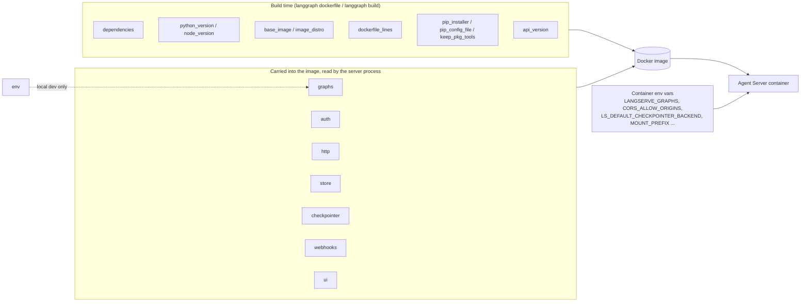

# 04. `langgraph.json` deep dive: every key, grouped by what it changes

## Why this matters

`langgraph.json` is the single contract between your code and the Agent Server. The LangGraph
command line interface (CLI) reads it to run the local dev server, to render the Dockerfile,
and to build the image. The server reads the parts that survive into the image to decide which
graphs to serve, how to authenticate requests, where checkpoints live, and which HTTP routes
exist. If you understand this one file, you understand what a deployment *is*. Everything else
in modules 06 through 08 is about *where* the resulting container runs.

The file is validated against a published JSON schema. Put `"$schema": "https://langgra.ph/schema.json"`
at the top and most editors will autocomplete and flag typos.

Source of truth for this module is the CLI configuration reference:
https://docs.langchain.com/langsmith/cli#configuration-file. Where this module states a default,
it is quoting that page. Where the docs do not state a default, this module says so.

## The one idea: build-time keys versus runtime keys

Some keys only matter while the CLI turns your project into a Docker image. Once the image
exists they have already done their job and changing them means rebuilding. Other keys are
carried into the image (the CLI serializes them into environment variables: `graphs` becomes
`LANGSERVE_GRAPHS`, and `http`, `auth`, `store` and `checkpointer` become `LANGGRAPH_HTTP`,
`LANGGRAPH_AUTH`, `LANGGRAPH_STORE` and `LANGGRAPH_CHECKPOINTER`; verified by rendering a
Dockerfile from a config that set all of them) and shape the server *process*. The `env` key is
the exception: an inline `env` mapping was **not** written into the Dockerfile in that test, so
secrets in `env` stay local and runtime configuration must be supplied by the deployment. A few keys have an
environment-variable twin you can set on the container instead, which is how platform teams
tune a deployment without asking developers for a rebuild.



## The sample's file, line by line

This is the exact file in [`../sample/my-agent/langgraph.json`](../sample/my-agent/langgraph.json):

```json
{
  "dependencies": ["."],
  "graphs": {
    "echo": "./src/my_agent/echo.py:graph",
    "agent": "./src/my_agent/agent.py:make_agent"
  },
  "env": ".env",
  "python_version": "3.12",
  "image_distro": "wolfi"
}
```

| Line | What it does | Kind |
| --- | --- | --- |
| `dependencies: ["."]` | Install the current directory as a Python package (it has a `pyproject.toml`). | build |
| `graphs.echo` | Serve a compiled graph exported as the module variable `graph`. Its graph ID is `echo`. | runtime |
| `graphs.agent` | Serve a *factory function* `make_agent(config)` that builds the agent per run. | runtime |
| `env: ".env"` | Load this file into the environment for `langgraph dev` and `langgraph up`. Not used by Kubernetes. | local dev |
| `python_version: "3.12"` | Pick the `3.12` base image tag. | build |
| `image_distro: "wolfi"` | Pick the Wolfi variant of the base image (smaller, fewer CVEs). | build |

## How build-time keys change the generated Dockerfile

The file below is the real output of `uv run langgraph dockerfile ../Dockerfile` for the sample,
captured in this session and checked in as [`../sample/Dockerfile`](../sample/Dockerfile). Read it
once; every build-time key maps to a visible line.

```dockerfile
FROM langchain/langgraph-api:3.12-wolfi

# -- Adding local package . --
ADD . /deps/my-agent
# -- End of local package . --

# -- Installing all local dependencies --
RUN for dep in /deps/*; do echo "Installing $dep"; if [ -d "$dep" ]; then echo "Installing $dep"; (cd "$dep" && PYTHONDONTWRITEBYTECODE=1 uv pip install --system --no-cache-dir -c /api/constraints.txt -e .); fi; done
# -- End of local dependencies install --
ENV LANGSERVE_GRAPHS='{"echo": "/deps/my-agent/src/my_agent/echo.py:graph", "agent": "/deps/my-agent/src/my_agent/agent.py:make_agent"}'

# -- Ensure user deps didn't inadvertently overwrite langgraph-api
RUN mkdir -p /api/langgraph_api /api/langgraph_runtime /api/langgraph_license && touch /api/langgraph_api/__init__.py /api/langgraph_runtime/__init__.py /api/langgraph_license/__init__.py
RUN PYTHONDONTWRITEBYTECODE=1 uv pip install --system --no-cache-dir --no-deps -e /api
# -- End of ensuring user deps didn't inadvertently overwrite langgraph-api --
# -- Removing build deps from the final image ~<:===~~~ --
RUN pip uninstall -y pip setuptools wheel
RUN rm -rf /usr/local/lib/python*/site-packages/pip* ... && find /usr/local/bin -name "pip*" -delete || true
RUN rm -rf /usr/lib/python*/site-packages/pip* ... && find /usr/bin -name "pip*" -delete || true
RUN uv pip uninstall --system pip setuptools wheel && rm /usr/bin/uv /usr/bin/uvx

WORKDIR /deps/my-agent
```

| Dockerfile line | Controlled by | What changes if you edit the key |
| --- | --- | --- |
| `FROM langchain/langgraph-api:3.12-wolfi` | `python_version` + `image_distro`, or `base_image` | `python_version: "3.11"` gives `:3.11-wolfi`; dropping `image_distro` gives `:3.12` (Debian). `base_image` replaces the repository *and* supplies a version prefix; the CLI then appends `-py<version>-<distro>`. See the composition table below. |
| `ADD . /deps/my-agent` and the install loop | `dependencies` | Each local path entry becomes an `ADD` into `/deps/<name>` and is pip-installed. PyPI names become a `pip install` line instead. |
| `-c /api/constraints.txt` | fixed | The base image pins the versions of `langgraph`, `langgraph-api` and friends. Your `pyproject.toml` cannot upgrade them past the server's constraints; the last two `RUN` lines re-install the server package to guarantee that. |
| `uv pip install` vs `pip install` | `pip_installer` | `"pip"` switches the loop to plain pip. Default is uv (docs: "From version 0.3 onward the default strategy is to run `uv pip`"). |
| `ENV LANGSERVE_GRAPHS=...` | `graphs` | Paths are rewritten from `./src/...` to `/deps/my-agent/src/...`. This is the only place the graph map lives inside the image. |
| The four "Removing build deps" lines | `keep_pkg_tools` | `true` skips them all; `["pip"]` keeps pip only. Default removes pip, setuptools and wheel. |
| (absent) lines after `FROM` | `dockerfile_lines` | Each string is inserted verbatim after the `FROM` line, before your package is added. |
| (absent) `COPY pip.conf` | `pip_config_file` | Adds your pip configuration (private index, extra-index-url, trusted hosts) to the build. |

Two facts you can verify on the built image (captured with `docker image inspect my-agent:dev`):
the image's own `ENV` already contains `PORT=8000` and `N_JOBS_PER_WORKER=10`, and its
`ENTRYPOINT` is `/storage/entrypoint.sh`. Module 06 explains why the Helm chart overrides
`N_JOBS_PER_WORKER` and swaps the entrypoint for queue pods.

## Key reference

Types and defaults below are quoted from the CLI reference unless marked otherwise.

### Build-time keys

| Key | Type | Default | Purpose and example |
| --- | --- | --- | --- |
| `dependencies` | array of strings | required | What to install. `"."` means the local package in the current directory; `"./sub"` means a directory containing `pyproject.toml`, `setup.py` or `requirements.txt` (never name the file itself); any other string is a PyPI package name. Example: `["langchain_openai", "./your_package"]`. |
| `python_version` | `"3.11"`, `"3.12"` or `"3.13"` | `3.11` | Selects the base image tag. The sample uses `3.12`. |
| `node_version` | `20` | none | Presence switches the build to LangGraph.js and the `langgraphjs-api` base image. |
| `base_image` | string, `repository:server-version` | `langchain/langgraph-api` (or `langchain/langgraphjs-api`) | Pin the server release and/or point at a mirror, for example `"langchain/langgraph-server:0.2"`. The CLI appends `-py<python_version>-<image_distro>` to whatever you give it, so include the version after the colon and do not combine it with `api_version`. Added in `langgraph-cli==0.2.8`. Tags: https://hub.docker.com/r/langchain/langgraph-server/tags |
| `image_distro` | `"debian"`, `"wolfi"`, `"bookworm"`, `"bullseye"` | `"debian"` | Linux distribution of the base image. Wolfi is recommended by the docs as smaller and more secure. Needs `langgraph-cli>=0.2.11`. |
| `dockerfile_lines` | array of strings | none | Raw lines appended after `FROM`. Use for system packages: `["RUN apt-get update && apt-get install -y libjpeg-dev", "RUN pip install Pillow"]`. On Wolfi images use `apk`, not `apt-get`. |
| `pip_config_file` | path | none | pip configuration copied into the build (private indexes, certificates). |
| `pip_installer` | `"auto"`, `"pip"`, `"uv"` | uv behavior | Fall back to `"pip"` only if uv cannot resolve your dependency graph. Added in v0.3. |
| `keep_pkg_tools` | `true`, `false`, or list of `"pip"`, `"setuptools"`, `"wheel"` | `false` (uninstall all three) | Keep packaging tools in the final image if something needs them at runtime. Added in v0.3.4. |
| `api_version` | string such as `"0.3"` | latest | Pin the semantic version of the Agent Server used for the build. Check the changelog before pinning: https://docs.langchain.com/langsmith/agent-server-changelog. Added in v0.3.7. |

`api_version` versus `base_image`, as actually rendered by `langgraph dockerfile` (CLI 0.4.18) for a
`python_version: "3.12"`, `image_distro: "wolfi"` project, with the resulting tag checked against Docker Hub:

| Keys set | `FROM` line produced | Tag exists on Docker Hub? |
| --- | --- | --- |
| neither | `langchain/langgraph-api:3.12-wolfi` | yes (this is what the sample uses) |
| `api_version: "0.2"` only | `langchain/langgraph-api:0.2-py3.12-wolfi` | no (also 404 for 0.3, 0.4, 0.14) |
| `base_image: "langchain/langgraph-server:0.2"` only | `langchain/langgraph-server:0.2-py3.12-wolfi` | yes (0.3, 0.4, 0.14 and exact versions such as 0.13.5 also exist) |
| `base_image: "langchain/langgraph-server"` (no version) | `langchain/langgraph-server-py3.12-wolfi` | no; the reference is malformed |
| both `base_image: "...:0.2"` and `api_version: "0.2"` | `langchain/langgraph-server:0.2:0.2-py3.12-wolfi` | no; the reference is malformed |

The docs describe `api_version` in the context of Cloud builds ("builds in Cloud deployments use the
latest stable version of the server"). For an image you build yourself, pin the server with
`base_image` set to `langchain/langgraph-server:<version>`, and for an internal mirror keep the same
shape: `registry.example.internal/mirror/langchain/langgraph-server:0.14`, mirroring the
`0.14-py3.12-wolfi` tag family. If your pipeline prefers to own the `FROM` line outright, that is
also fine: `langgraph dockerfile` output is a plain Dockerfile you may edit before building.
### Runtime wiring keys

| Key | Type | Default | Purpose and example |
| --- | --- | --- | --- |
| `graphs` | object: graph ID to `path:symbol` | required | `"./pkg/file.py:variable"` where the variable is a `CompiledStateGraph`, or `"./pkg/file.py:make_graph"` where the function takes a `RunnableConfig` and returns a `StateGraph` or compiled graph. The graph ID is what clients pass as `assistant_id`, and the server auto-creates one assistant per graph ID at startup. |
| `env` | path or object | none | Path to a `.env` file, or an inline map. Used by `langgraph dev` and `langgraph up`. In Kubernetes, environment comes from the pod spec, not from this key. Never put real secrets inline; the file is committed. |
| `auth` | object with `path`, optional `openapi`, optional `disable_studio_auth` | none | `"path": "./auth.py:auth"` where `auth` is a `langgraph_sdk.Auth` instance. `openapi` documents your scheme so `/docs` shows the right header. Added in v0.0.11. |
| `http` | object | none | HTTP server shape; see the dedicated section below. |
| `webhooks` | object with `env_prefix`, `headers`, `url` | `env_prefix` defaults to `LG_WEBHOOK_` | Outbound webhook policy: static headers with `${{ env.VAR }}` templates (the variable must start with the prefix), and URL rules `allowed_domains`, `allowed_ports`, `require_https`, `disable_loopback`, `max_url_length`. Added in v0.5.36. |
| `ui` | object: component name to JS/TS file | none | Generative UI component bundles served under `/ui`. Added in `langgraph-cli==0.1.84`. Guide: https://docs.langchain.com/langsmith/generative-ui-react |

#### `graphs`: compiled graph or factory

The sample deliberately uses both forms. `echo` is a compiled graph: the server imports it once
at startup and reuses it. `agent` is a factory: the server calls `make_agent(config)` on every
run, which lets the model be chosen from `config["configurable"]["model"]` per assistant. The
Agent Server documentation recommends a compiled graph unless you need per-run customization,
because a factory adds work on every invocation
(https://docs.langchain.com/langsmith/agent-server#graph-loading-and-compilation).

There is a second, less obvious reason the sample's `agent` is a factory, and it was observed
in this session: with `create_agent(...)` at module level and no `OPENAI_API_KEY` set, the dev
server failed at startup with `GraphLoadError: Failed to load graph 'agent' ... Missing
credentials`, and because every graph is imported at startup, the perfectly healthy `echo`
graph went down with it. Keep import-time side effects out of graph modules, or wrap them in a
factory. In both forms, do not attach a checkpointer or store in code; the server injects the
configured ones (same page).

#### `http`: shaping the HTTP server

All of these live under one `http` object. The route toggles are the ones a security review
will ask about.

| Field | Values | Effect |
| --- | --- | --- |
| `app` | `"./src/agent/webapp.py:app"` | Mount your own Starlette or FastAPI app alongside the built-in routes (custom routes, lifespan, middleware). See module 03 and https://docs.langchain.com/langsmith/custom-routes |
| `cors` | `allow_origins`, `allow_methods`, `allow_headers`, `allow_credentials`, `allow_origin_regex`, `expose_headers`, `max_age` | Full CORS policy. The docs note this overrides the `CORS_ALLOW_ORIGINS` environment variable, whose own default is `*`. |
| `configurable_headers` | `{ "includes": [...], "excludes": [...] }` | Which request headers are copied into `config["configurable"]` for the graph. Patterns support `*` only; exclusions run before inclusions. https://docs.langchain.com/langsmith/configurable-headers |
| `logging_headers` | same shape | Which headers appear in server logs. Headers are omitted from logs by default. https://docs.langchain.com/langsmith/configurable-logs |
| `middleware_order` | `"middleware_first"` (default) or `"auth_first"` | Whether your middleware runs before or after the auth hooks. |
| `enable_custom_route_auth` | boolean | Apply your `auth` handlers to the routes mounted through `app`. The docs do not state the default; set it explicitly. |
| `mount_prefix` | string such as `"/my-deployment/api"` | Serve everything under a path prefix. Environment twin: `MOUNT_PREFIX`. |
| `disable_meta` | boolean | Removes `/`, `/info`, `/metrics`, `/docs`, `/openapi.json`. `/ok` stays, so Kubernetes probes keep working. |
| `disable_assistants`, `disable_runs`, `disable_threads`, `disable_store`, `disable_ui` | boolean | Remove the corresponding route group. |
| `disable_mcp`, `disable_a2a` | boolean | Remove the `/mcp` endpoint and the `/a2a/*` endpoint respectively. |
| `disable_webhooks` | boolean | Stops webhook delivery on run completion. Not a route toggle. Available since `langgraph-api>=0.2.78`. |

Note that `disable_meta` also removes `/metrics`. If Prometheus scrapes your pods (module 09),
leave it on and restrict the routes at the ingress instead.

### Data keys

| Key | Type | Default | Purpose |
| --- | --- | --- | --- |
| `store` | object with `index` and/or `ttl` | none | Long-term memory store settings. `index` turns on semantic search: `embed` (a `provider:model` string such as `"openai:text-embedding-3-small"` or a path to a function `"./embeddings.py:embed_texts"`), `dims` (must match the model, 1536 for text-embedding-3-small), optional `fields` (JSON paths; `["$"]` embeds the whole document). `ttl`: `refresh_on_read` (default `true`), `default_ttl` in **minutes** (new items only; no expiry by default), `sweep_interval_minutes` (no sweeping unless set). |
| `checkpointer` | object with `backend`, `path`, `ttl`, `serde` | `backend: "default"` (PostgreSQL) | `backend` is `"default"`, `"mongo"` or `"custom"`; `path` points at a factory when custom. `ttl` has `strategy` (for example `"delete"`), `sweep_interval_minutes`, `default_ttl` in minutes, `sweep_limit` (server v0.8+). `serde` has `allowed_json_modules` (allow list of `[module, path, Symbol]` sequences for custom objects in JSON checkpoints; `true` disables the allow list, which the docs call unsafe) and `pickle_fallback`. |

Environment twins: `LS_DEFAULT_CHECKPOINTER_BACKEND` sets the backend for images that do not
set `checkpointer.backend`, and `LS_MONGODB_URI` supplies the Mongo connection when the backend
is `mongo`. A value in `langgraph.json` wins over the environment variable
(https://docs.langchain.com/langsmith/env-var-self-hosted#ls_default_checkpointer_backend). The
standalone Helm chart uses exactly these two variables when `mongo.enabled` is true (module 07).

Two examples straight from the reference. Semantic search over the whole document:

```json
"store": {
  "index": { "embed": "openai:text-embedding-3-small", "dims": 1536, "fields": ["$"] }
}
```

Checkpoints deleted after 30 days, swept every 10 minutes:

```json
"checkpointer": {
  "ttl": { "strategy": "delete", "sweep_interval_minutes": 10, "default_ttl": 43200 }
}
```

### JavaScript projects

The JS table in the reference has the same keys minus the Python-only build controls. It has no
`dependencies`, `python_version`, `pip_*`, `keep_pkg_tools` or `auth` rows; `node_version: 20`
selects the JS runtime and `graphs` points at `./src/graph.ts:graph` or `./src/graph.ts:makeGraph`.
`http`, `store`, `checkpointer`, `webhooks`, `api_version`, `dockerfile_lines` and `env` behave
the same. Custom routes use a Hono app instead of FastAPI (module 03).

## Extension points

Each of these is enabled by one key in `langgraph.json` plus a small Python module. They are
how teams add organization-specific behavior without forking the server.

| Need | Key | What you write | Guide |
| --- | --- | --- | --- |
| Authenticate every request, scope resources to users | `auth.path` | `Auth()` instance with `@auth.authenticate` and `@auth.on.*` handlers | https://docs.langchain.com/langsmith/auth and https://docs.langchain.com/langsmith/custom-auth |
| Extra HTTP routes (`/healthz` for your load balancer, `/login`, a small UI) | `http.app` | A FastAPI or Starlette app | https://docs.langchain.com/langsmith/custom-routes |
| Startup and shutdown hooks (open a connection pool, warm a cache) | `http.app` | Starlette `lifespan` on that app | https://docs.langchain.com/langsmith/custom-lifespan |
| Cross-cutting request handling (metrics, header checks) | `http.app` | Starlette middleware on that app; ordering via `http.middleware_order` | https://docs.langchain.com/langsmith/custom-middleware |
| Pass headers into graph config | `http.configurable_headers` | nothing else; read `config["configurable"]["x-organization-id"]` in nodes | https://docs.langchain.com/langsmith/configurable-headers |
| Replace the Postgres long-term store | `store` is not used; the docs use a factory module | A `BaseStore` implementation and factory | https://docs.langchain.com/langsmith/custom-store |
| Replace the Postgres checkpointer | `checkpointer.backend: "custom"` + `checkpointer.path` | A `BaseCheckpointSaver` factory | https://docs.langchain.com/langsmith/custom-checkpointer |
| Mongo checkpoints, Postgres for everything else | `checkpointer.backend: "mongo"` or `LS_DEFAULT_CHECKPOINTER_BACKEND=mongo` | nothing; supply `LS_MONGODB_URI` | https://docs.langchain.com/langsmith/configure-checkpointer |
| Encrypt checkpoints at rest | `dependencies: [".", "pycryptodome"]` plus env `LANGGRAPH_AES_KEY` (16, 24 or 32 bytes) and optional `LANGGRAPH_AES_JSON_KEYS` | nothing for basic; handlers for custom (server 0.6.22+) | https://docs.langchain.com/langsmith/encryption |
| Semantic search in the store | `store.index` | optional custom embed function | https://docs.langchain.com/langsmith/semantic-search |
| Outbound webhook policy | `webhooks` | nothing; set `LG_WEBHOOK_*` env vars | https://docs.langchain.com/langsmith/use-webhooks |

## A production baseline for this team

This is a starting point, not a mandate. Every key has a one-line reason.

```json
{
  "$schema": "https://langgra.ph/schema.json",
  "dependencies": ["."],
  "graphs": {
    "agent": "./src/my_agent/agent.py:make_agent"
  },
  "env": ".env",
  "python_version": "3.12",
  "image_distro": "wolfi",
  "base_image": "registry.example.internal/mirror/langchain/langgraph-server:0.14",
  "keep_pkg_tools": false,
  "auth": {
    "path": "./src/my_agent/auth.py:auth",
    "openapi": {
      "securitySchemes": { "bearerAuth": { "type": "http", "scheme": "bearer" } },
      "security": [{ "bearerAuth": [] }]
    }
  },
  "http": {
    "cors": { "allow_origins": ["https://app.example.internal"] },
    "configurable_headers": { "includes": ["x-request-id", "x-tenant-id"], "excludes": ["authorization", "x-api-key"] },
    "logging_headers": { "includes": ["x-request-id"] },
    "middleware_order": "auth_first",
    "enable_custom_route_auth": true,
    "disable_ui": true,
    "disable_mcp": true,
    "disable_a2a": true
  },
  "checkpointer": {
    "ttl": { "strategy": "delete", "sweep_interval_minutes": 60, "default_ttl": 43200 }
  },
  "store": {
    "ttl": { "refresh_on_read": true, "sweep_interval_minutes": 60, "default_ttl": 129600 }
  },
  "webhooks": {
    "url": { "allowed_domains": ["*.example.internal"], "require_https": true }
  }
}
```

| Key | Why |
| --- | --- |
| `$schema` | Editor validation; catches a misspelled key before the CLI does. |
| `dependencies: ["."]` | One installable package with a lockfile; the image install is reproducible. |
| `graphs` | Only the graphs you intend to expose. The `echo` graph is a training aid and is left out of production. |
| `env: ".env"` | Kept for local dev; the file is git-ignored and never reaches the image. |
| `python_version`, `image_distro` | Current Python, Wolfi base as the docs recommend. |
| `base_image` | Point at your internal mirror so builds do not need Docker Hub egress, and pin the server release. The CLI appends `-py3.12-wolfi`, so mirror `langchain/langgraph-server:0.14-py3.12-wolfi` and reference it as shown. |
| `keep_pkg_tools: false` | The default, written out so nobody wonders. Smaller attack surface. |
| `auth` | Self-hosted servers have no authentication by default (https://docs.langchain.com/langsmith/auth#self-hosted). Do not ship without it or without an ingress-level equivalent. |
| `http.cors` | Explicit browser origins instead of the `*` default. |
| `configurable_headers` / `logging_headers` | Pass a tenant and request ID to the graph and to logs; keep credentials out of both. |
| `middleware_order: "auth_first"` | Unauthenticated requests never reach your middleware. |
| `enable_custom_route_auth: true` | Any route you mount is protected too. |
| `disable_ui`, `disable_mcp`, `disable_a2a` | Turn off surfaces you are not using. Turn them back on deliberately when a use case appears. `disable_meta` is left off so `/metrics` keeps working. |
| `checkpointer.ttl` | Thirty-day checkpoint retention; bounded Postgres growth. Module 06 covers why this matters for read load. |
| `store.ttl` | Ninety-day memory retention with refresh on read. |
| `webhooks.url` | Only internal HTTPS targets can receive run-completion callbacks. |

## Hands-on

Run these in `sample/my-agent`.

1. Render the Dockerfile and diff it against the committed one:

```bash
uv run langgraph dockerfile /tmp/Dockerfile.check
diff /tmp/Dockerfile.check ../Dockerfile && echo "Dockerfile is current"
```

2. Change one build-time key and watch the effect. Set `"python_version": "3.11"` temporarily,
   re-render, and look at the `FROM` line; then revert.

3. Add a runtime key and confirm the server honors it without a rebuild being needed for local
   dev. Add `"http": { "disable_meta": true }`, restart `uv run langgraph dev --no-browser`, then:

```bash
curl -s -o /dev/null -w '%{http_code}\n' http://127.0.0.1:2024/ok     # 200
curl -s -o /dev/null -w '%{http_code}\n' http://127.0.0.1:2024/info   # no longer served
```

   Revert the change afterwards; module 05 uses `/info` and `/docs`.

4. Confirm the graph map baked into the image matches the file:

```bash
docker image inspect my-agent:dev --format '{{json .Config.Env}}' | tr ',' '\n' | grep LANGSERVE_GRAPHS
```

## Checkpoint

You should now be able to look at any `langgraph.json` and say, for each key, whether changing
it requires a new image, and which environment variable (if any) a platform team could set
instead. You should be able to explain why the sample's `agent` graph is a factory and why the
baseline turns on `auth` and turns off unused route groups.

## Gotchas

- `dependencies` takes a directory, never a filename. `"./requirements.txt"` is wrong; `"./"` is right.
- The base image constrains library versions through `/api/constraints.txt`. If `uv sync`
  resolves a newer `langgraph` locally than the server allows, the image build will pin it back
  or fail. Keep `langgraph` at `>=1.0,<2.0` and let the server choose.
- One graph failing to import stops the whole server (observed in this session). Module-level
  model clients, network calls, and file reads belong in a factory or a lifespan hook.
- `env` is for local runs. In Kubernetes, secrets come from `extraEnv`, `envFrom` or the chart's
  managed Secret (module 07). The license and LangSmith keys must never be set through `env` or
  `extraEnv` (chart README).
- `http.cors` replaces `CORS_ALLOW_ORIGINS` entirely. Do not set both and expect a merge.
- `disable_meta` also removes `/metrics` and `/docs`. `/ok` survives.
- Re-run `langgraph dockerfile` whenever this file changes; the Dockerfile does not update itself.
- `store.ttl.default_ttl` and `checkpointer.ttl.default_ttl` are in minutes, not seconds or days.
- On Wolfi images, `dockerfile_lines` that call `apt-get` will fail; use `apk add`.

## References

- CLI configuration file reference: https://docs.langchain.com/langsmith/cli#configuration-file
- JSON schema: https://raw.githubusercontent.com/langchain-ai/langgraph/refs/heads/main/libs/cli/schemas/schema.json
- Application structure: https://docs.langchain.com/langsmith/application-structure
- Graph loading and compilation: https://docs.langchain.com/langsmith/agent-server#graph-loading-and-compilation
- Rebuild a graph at runtime: https://docs.langchain.com/langsmith/graph-rebuild
- Customize the Dockerfile: https://docs.langchain.com/langsmith/custom-docker
- Configure checkpointer backend: https://docs.langchain.com/langsmith/configure-checkpointer
- Custom checkpointer: https://docs.langchain.com/langsmith/custom-checkpointer
- Custom store: https://docs.langchain.com/langsmith/custom-store
- Semantic search: https://docs.langchain.com/langsmith/semantic-search
- Configure TTL: https://docs.langchain.com/langsmith/configure-ttl
- Authentication and access control: https://docs.langchain.com/langsmith/auth
- Add custom authentication: https://docs.langchain.com/langsmith/custom-auth
- Custom routes: https://docs.langchain.com/langsmith/custom-routes
- Custom lifespan: https://docs.langchain.com/langsmith/custom-lifespan
- Custom middleware: https://docs.langchain.com/langsmith/custom-middleware
- Configurable headers: https://docs.langchain.com/langsmith/configurable-headers
- Header logging: https://docs.langchain.com/langsmith/configurable-logs
- Encryption at rest: https://docs.langchain.com/langsmith/encryption
- Webhooks: https://docs.langchain.com/langsmith/use-webhooks
- Disable MCP: https://docs.langchain.com/langsmith/server-mcp#disable-mcp
- Disable A2A: https://docs.langchain.com/langsmith/server-a2a#disable-a2a
- Self-hosted environment variables: https://docs.langchain.com/langsmith/env-var-self-hosted
- Agent Server changelog (for `api_version`): https://docs.langchain.com/langsmith/agent-server-changelog
