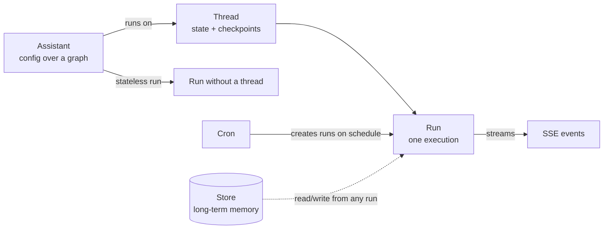

# 05. The API surface: what a running Agent Server exposes

## Why this matters

Once your image is running, every client, UI, cron and integration talks to the same REST
(representational state transfer) API. The server is the same binary whether it runs under
`langgraph dev`, the standalone Helm chart or a LangSmith Deployment, so the surface you learn
here on your laptop is exactly what you will secure and expose in the cluster. This module walks
the full surface with real requests against the sample, and shows each call three ways: raw
`curl`, the Python SDK (software development kit) and the JavaScript SDK.

Every example below marked **captured** was run in this session against `langgraph dev` serving
[`../sample/my-agent`](../sample/my-agent) (Agent Server 0.14.1, LangGraph 1.2.11). Everything else
is quoted from the documentation and linked.

## The map: 63 operations in 10 groups

The server publishes its own OpenAPI document. Fetching `http://127.0.0.1:2024/openapi.json` and
grouping operations by tag gave this list (captured):

| Group | Ops | Paths |
| --- | --- | --- |
| Assistants | 12 | `POST /assistants`, `POST /assistants/count`, `POST /assistants/search`, `GET/PATCH/DELETE /assistants/{id}`, `GET .../graph`, `GET .../schemas`, `GET .../subgraphs`, `GET .../subgraphs/{namespace}`, `POST .../versions`, `POST .../latest` |
| Threads | 15 | `POST /threads`, `POST /threads/count`, `POST /threads/search`, `POST /threads/prune`, `GET/PATCH/DELETE /threads/{id}`, `POST .../copy`, `GET .../state`, `POST .../state`, `GET .../state/{checkpoint_id}`, `POST .../state/checkpoint`, `GET .../history`, `POST .../history`, `GET .../stream` |
| Streaming | 2 | `POST /threads/{id}/stream/events`, `POST /threads/{id}/commands` (protocol v2) |
| Thread Runs | 10 | `GET/POST /threads/{id}/runs`, `POST .../runs/stream`, `POST .../runs/wait`, `GET/DELETE .../runs/{run_id}`, `GET .../runs/{run_id}/join`, `GET .../runs/{run_id}/stream`, `POST .../runs/{run_id}/cancel`, `POST /runs/cancel` |
| Stateless Runs | 4 | `POST /runs`, `POST /runs/stream`, `POST /runs/wait`, `POST /runs/batch` |
| Crons | 7 | `POST /runs/crons`, `POST /runs/crons/search`, `POST /runs/crons/count`, `GET/PATCH/DELETE /runs/crons/{id}`, `POST /threads/{id}/runs/crons` |
| Store | 5 | `PUT/GET/DELETE /store/items`, `POST /store/items/search`, `POST /store/namespaces` |
| A2A | 1 | `POST /a2a/{assistant_id}` |
| MCP | 3 | `GET/POST/DELETE /mcp/` |
| System | 4 | `GET /ok`, `GET /info`, `GET /metrics`, `GET /docs` |

The interactive version of this table is served by every deployment at `/docs`
(captured: `GET /docs` returned `HTTP 200 text/html`). The published reference is at
https://docs.langchain.com/langsmith/server-api-ref.



## Connecting: the three clients

Base URL for local work is `http://127.0.0.1:2024`. Deployed servers are reached through your
ingress hostname (module 07) or the deployment URL shown in the LangSmith UI (module 08).

```bash
# curl: nothing to install
B=http://127.0.0.1:2024
curl -s $B/ok
```

```python
# Python: uv add langgraph-sdk
from langgraph_sdk import get_sync_client   # get_client for asyncio
client = get_sync_client(url="http://127.0.0.1:2024", api_key=None)
```

```javascript
// JavaScript/TypeScript: npm install @langchain/langgraph-sdk
import { Client } from "@langchain/langgraph-sdk";
const client = new Client({ apiUrl: "http://127.0.0.1:2024" });
```

Both SDKs are thin wrappers over the routes below: `client.assistants.*`, `client.threads.*`,
`client.runs.*`, `client.crons.*`, `client.store.*`. The complete runnable versions of the
snippets in this module are [`../sample/clients/python_client.py`](../sample/clients/python_client.py)
and [`../sample/clients/js_client.mjs`](../sample/clients/js_client.mjs); both were run in this
session and produced the outputs shown in the Threads section.

## System: `/ok`, `/info`, `/metrics`, `/docs`

`/ok` is the liveness and readiness endpoint. It stays available even when `http.disable_meta`
removes the other three (module 04). Captured:

```text
GET /ok   -> {"ok":true}
GET /info -> {
  "version": "0.14.1",
  "langgraph_py_version": "1.2.11",
  "flags": {"assistants": true, "crons": true, "langsmith": false, ...},
  "host": {"kind": "self-hosted", "project_id": null, "revision_id": null, "tenant_id": null}
}
```

`/info` is the fastest way to confirm which server version a pod runs and whether tracing to
LangSmith is wired (`flags.langsmith` was `false` here because no `LANGSMITH_API_KEY` was set).
`/metrics` is a Prometheus text endpoint; the first lines captured were Python garbage collection
counters, and the Agent Server specific series (`lg_api_*`) are listed in module 09.

## Assistants

An **assistant** is a named configuration applied to a graph: a graph ID plus optional
`context`, `config`, `metadata` and a name. The server creates one assistant per graph ID at
startup, so you can pass the graph ID (`"echo"`) anywhere an `assistant_id` is expected.
Assistants are versioned; every update creates a new version and you can pin a previous one.
Concept page: https://docs.langchain.com/langsmith/assistants.

Captured, the system-created assistants right after startup:

```bash
curl -s -X POST $B/assistants/search -H 'Content-Type: application/json' -d '{}'
# fe096781-5601-53d2-b2f6-0d3403f7e9ca  graph_id=agent  name=agent  metadata={'created_by': 'system'}
# 046b5dc7-2108-582c-9c6c-31d556d138f0  graph_id=echo   name=echo   metadata={'created_by': 'system'}
```

A current checkout of the sample lists a third system assistant, `perf`, added later by [module 10](./10-performance-deep-dive.md); the output above was captured before it existed.

Create an assistant that bakes in a `context` for the `echo` graph (captured):

```bash
curl -s -X POST $B/assistants -H 'Content-Type: application/json' -d '{
  "graph_id": "echo",
  "name": "shouty-echo",
  "context": {"prefix": "SHOUTY", "shout": true},
  "metadata": {"team": "platform"}
}'
# 70663b56-a65b-44d0-84c1-a60acd644eec shouty-echo version=1 context={'prefix': 'SHOUTY', 'shout': True}

curl -s -X POST $B/runs/wait -H 'Content-Type: application/json' \
  -d '{"assistant_id":"70663b56-a65b-44d0-84c1-a60acd644eec","input":{"messages":[{"role":"user","content":"hi"}]}}'
# last message: "SHOUTY: HI"
```

```python
a = client.assistants.create(graph_id="echo", name="shouty-echo",
                             context={"prefix": "SHOUTY", "shout": True},
                             metadata={"team": "platform"})
```

```javascript
const a = await client.assistants.create({ graphId: "echo", name: "shouty-echo",
  context: { prefix: "SHOUTY", shout: true }, metadata: { team: "platform" } });
```

Introspection endpoints tell a client what a graph accepts (captured):

```bash
curl -s $B/assistants/$AID/schemas | jq 'keys'
# ["config_schema","context_schema","graph_id","input_schema","output_schema","state_schema"]
# context_schema: {"title":"Context","properties":{"prefix":{"type":"string","default":"echo"},
#                  "shout":{"type":"boolean","default":false}}}

curl -s $B/assistants/$AID/graph
# nodes: ['__start__', 'respond', '__end__']   edges: [('__start__','respond'), ('respond','__end__')]
```

Versioning (captured): a `PATCH` produced version 2, and `POST /assistants/{id}/versions`
listed both.

```bash
curl -s -X PATCH $B/assistants/$AID -H 'Content-Type: application/json' -d '{"context":{"prefix":"v2"}}'
# version 2  context={'prefix': 'v2'}
curl -s -X POST $B/assistants/$AID/versions -H 'Content-Type: application/json' -d '{}'
# version 2 {'prefix': 'v2'}
# version 1 {'prefix': 'SHOUTY', 'shout': True}
```

`POST /assistants/{id}/latest` with `{"version": 1}` rolls back. `search` and `count` accept
`graph_id` and `metadata` filters; pagination is `limit`/`offset`.

Why teams care: an assistant is how you ship prompt or model changes without a rebuild. The
sample's `agent` graph reads `config["configurable"]["model"]`, so an assistant created with
`config={"configurable": {"model": "anthropic:claude-sonnet-4-5"}}` selects a different model
per assistant.

## Threads

A **thread** is a container for state. Runs on the same thread see the accumulated state; runs
without a thread do not persist anything after they finish. Each step of a run writes a
**checkpoint** to the thread, which is what makes history, time travel and resume possible.
Guide: https://docs.langchain.com/langsmith/use-threads.

Captured sequence:

```bash
T=$(curl -s -X POST $B/threads -H 'Content-Type: application/json' -d '{"metadata":{"user":"demo"}}' | jq -r .thread_id)
# thread_id=01a0aedd-df3f-7393-b92a-dcfc20015413

# first turn, streamed (see Streaming below for the events)
# second turn on the same thread:
curl -s -X POST $B/threads/$T/runs/wait -H 'Content-Type: application/json' \
  -d '{"assistant_id":"echo","input":{"messages":[{"role":"user","content":"second turn"}]}}'
# 4 messages in thread state:
#   human -> first turn
#   ai    -> echo: first turn
#   human -> second turn
#   ai    -> echo: second turn

curl -s $B/threads/$T/state
# values.messages: 4   next: []   checkpoint.checkpoint_id: 1f1b280c...

curl -s "$B/threads/$T/history?limit=3"
# 1f1b280c step 4 source loop
# 1f1b280c step 3 source loop
# 1f1b280c step 2 source input

curl -s -X POST $B/threads/search -H 'Content-Type: application/json' -d '{"metadata":{"user":"demo"},"limit":5}'
# 01a0aedd idle {'user': 'demo', 'graph_id': 'echo', 'assistant_id': '046b5dc7-...'}
```

Three things to notice. The messages list grew because the graph's state uses the
`add_messages` reducer (module 02); a plain field would have been overwritten. `next: []` means
the thread is idle with nothing pending; a thread paused at an interrupt lists the node that
will run next. Search matched on metadata you set at creation, and the server added
`graph_id` and `assistant_id` to the metadata for you.

The same sequence from the SDKs, as run from the sample clients (captured output):

```python
thread = client.threads.create(metadata={"user": "demo"})
for chunk in client.runs.stream(thread["thread_id"], "echo",
        input={"messages": [{"role": "user", "content": "hello from the python sdk"}]},
        stream_mode=["updates"]):
    print(chunk.event, chunk.data)
# metadata {'run_id': '01a0aede-90cd-...', 'attempt': 1}
# updates  {'respond': {'messages': [{'content': 'echo: hello from the python sdk', 'type': 'ai', ...}]}}
final = client.runs.wait(thread["thread_id"], "echo",
        input={"messages": [{"role": "user", "content": "second turn"}]},
        context={"prefix": "bot", "shout": True})
# messages in thread: 4    last reply: BOT: SECOND TURN
```

```javascript
const thread = await client.threads.create({ metadata: { user: "demo-js" } });
for await (const chunk of client.runs.stream(thread.thread_id, "echo", {
  input: { messages: [{ role: "user", content: "hello from the js sdk" }] }, streamMode: ["updates"] })) {
  console.log(chunk.event, JSON.stringify(chunk.data));
}
// metadata {"run_id":"01a0aede-9b8d-...","attempt":1}
// updates  {"respond":{"messages":[{"content":"echo: hello from the js sdk","type":"ai",...}]}}
```

Other thread operations worth knowing: `POST /threads/{id}/state` updates state as if a node
had written it (used for human edits), `GET .../state/{checkpoint_id}` reads a past checkpoint,
`POST .../copy` forks a thread including its history, `PATCH` edits metadata, `POST /threads/prune`
bulk-deletes by filter, and `GET /threads/{id}/stream` opens a long-lived stream of every run on
the thread (see Streaming). Deleting a thread deletes its runs and checkpoints.

## Runs

A **run** is one execution of an assistant, on a thread or without one. Three ways to create a
run on a thread, differing only in how you receive the result:

| Endpoint | Returns | Use when |
| --- | --- | --- |
| `POST /threads/{id}/runs/wait` | Final state, when the run completes | Simple request/response callers |
| `POST /threads/{id}/runs/stream` | Server-sent events (SSE) as the run progresses | Chat UIs, progress display |
| `POST /threads/{id}/runs` | The run record immediately, status `pending` | Background work; poll or `join` later |

Stateless variants at `/runs/wait`, `/runs/stream`, `/runs` and `/runs/batch` create a
temporary thread; `on_completion` (default `delete`, or `keep`) decides whether it survives
(reference: https://docs.langchain.com/langsmith/agent-server-api/stateless-runs). Captured
stateless call:

```bash
curl -s -X POST $B/runs/wait -H 'Content-Type: application/json' \
  -d '{"assistant_id":"echo","input":{"messages":[{"role":"user","content":"hello from curl"}]}}'
# {"messages":[{"content":"hello from curl","type":"human",...},
#              {"content":"echo: hello from curl","type":"ai","tool_calls":[],...}]}

# same call with context (the typed per-run settings the graph declares):
... -d '{"assistant_id":"echo","input":{...},"context":{"prefix":"bot","shout":true}}'
# "BOT: HELLO"
```

Background run and join (captured):

```bash
R=$(curl -s -X POST $B/threads/$T/runs -H 'Content-Type: application/json' \
  -d '{"assistant_id":"echo","input":{"messages":[{"role":"user","content":"bg"}]}}')
# {'run_id': '01a0aee5-6d00-...', 'status': 'pending', 'multitask_strategy': 'enqueue'}
curl -s $B/threads/$T/runs/$RID/join        # blocks until done, returns final state
# last message: "echo: bg"
curl -s $B/threads/$T/runs/$RID              # {'status': 'success', 'multitask_strategy': 'enqueue'}
curl -s $B/threads/$T/runs                   # 1 run
```

Use `join` (or `join_stream`) instead of polling `GET .../runs/{run_id}`; the scaling guide
calls polling out as avoidable read load (https://docs.langchain.com/langsmith/agent-server-scale#avoid-polling-use-join-to-monitor-a-run).
Background runs: https://docs.langchain.com/langsmith/background-run.

Fields accepted on every run-creating call, from the API reference: `input`, `context`,
`config` (`tags`, `recursion_limit`, `configurable`), `metadata`, `stream_mode`,
`stream_subgraphs`, `stream_resumable`, `interrupt_before`, `interrupt_after`,
`multitask_strategy`, `webhook`, `durability` (`sync`, `async` default, `exit`),
`after_seconds` (delay the start), `checkpoint_during`, and `on_completion` for stateless runs.

`durability` matters for cost: `async` (default) writes a checkpoint after each step; `exit`
writes only the final state, which module 06 recommends when you do not need mid-run resume.

Cancel with `POST /threads/{id}/runs/{run_id}/cancel` (body `action: interrupt` or `rollback`)
or many at once with `POST /runs/cancel`.

### Double texting: `multitask_strategy`

If a second run is created on a thread that is already running, the server applies the
thread's **multitask strategy** (the docs call this "double texting"):
https://docs.langchain.com/langsmith/double-texting.

| Strategy | Behavior (quoted from the docs) |
| --- | --- |
| `enqueue` (default) | The current run finishes first; new input is queued and executed afterwards. |
| `reject` | The second request is refused while a run is in progress. |
| `interrupt` | Halts the current run, keeps its progress, inserts the new input and continues. Your graph must tolerate half-finished tool calls. |
| `rollback` | Halts the current run, reverts all of its progress including the original input, then runs the new input fresh. |

Captured with `reject`: a second run posted while the first was still `pending` returned
`HTTP 409` with `{"detail":"Thread is already running a task. Wait for it to finish or choose a
different multitask strategy."}`. The queue enforces at most one running run per thread
regardless of strategy (module 06).

### Webhooks

Add `"webhook": "https://hooks.example.internal/agent-done"` to any run-creating call
(`/runs`, `/runs/stream`, `/runs/wait`, the thread variants, and both cron endpoints) and the
server POSTs the run record there on completion. Outbound headers and allowed destinations are
policy in `langgraph.json` (`webhooks.headers`, `webhooks.url`, module 04); `http.disable_webhooks`
turns delivery off. Guide: https://docs.langchain.com/langsmith/use-webhooks.

## Streaming

`stream_mode` selects what the SSE stream carries and may be a list. From the streaming guide
(https://docs.langchain.com/langsmith/streaming#supported-stream-modes):

| Mode | Carries |
| --- | --- |
| `values` | Full graph state after each step |
| `updates` | Only the state delta each node produced, one event per node |
| `messages-tuple` | LLM tokens plus metadata from the node that called the model (chat UIs) |
| `custom` | Data your nodes emit with the stream writer |
| `debug` | Everything the server can tell you about execution |
| `events` | All internal events; mainly for migrating older LCEL apps |

Two more appear in the API reference and in the captured event names below: `checkpoints`
(a checkpoint was written) and `tasks` (a node task started or finished).

Captured, first turn with `stream_mode: ["updates", "messages-tuple"]`:

```text
event: metadata
data: {"run_id":"01a0aedd-df4c-7b63-818a-bc8331a93f90","attempt":1}

event: messages
data: [{"content":"echo: first turn","type":"ai",...}, {"langgraph_node":"respond","langgraph_step":1,"thread_id":"01a0aedd-...","run_id":"01a0aedd-df4c-...",...}]

event: updates
data: {"respond":{"messages":[{"content":"echo: first turn","type":"ai",...}]}}
```

Captured event counts when asking for many modes at once
(`["debug","values","updates","messages-tuple","custom","checkpoints","tasks"]`) on the
single-node echo graph: `metadata` 1, `values` 2, `updates` 1, `messages` 1, `debug` 2,
`tasks` 2, and no `custom` event because the graph emits none. With `stream_mode: "values"`
alone the stream was `metadata, values, values` (the input state, then the final state).

Every stream starts with a `metadata` event carrying the `run_id`. Keep it: it is what you
need to `join` or cancel the run later.

Resumability: set `stream_resumable: true` on the run to have the server buffer events so a
client that disconnects can re-attach with `GET /threads/{id}/runs/{run_id}/stream`
(`client.runs.join_stream`). Thread-level streaming (`GET /threads/{id}/stream`,
`client.threads.join_stream`) stays open across runs and supports `Last-Event-ID` to resume
without gaps; pass `"-"` to replay from the beginning
(https://docs.langchain.com/langsmith/streaming#stream-a-thread). The two "Streaming" tag
endpoints, `POST /threads/{id}/stream/events` and `POST /threads/{id}/commands`, are the newer
protocol v2 where the client passes the last `seq` it saw as `since` in the body
(https://docs.langchain.com/langsmith/agent-server-api/streaming/protocol-v2-event-stream-sse).

## Human in the loop: interrupt and resume

A graph pauses by calling `interrupt(...)` inside a node. The run completes with an
`__interrupt__` entry in its output instead of a final answer, the thread's `next` shows the
paused node, and the caller resumes by creating a *new run on the same thread* with a
`command` instead of `input`. From the guide
(https://docs.langchain.com/langsmith/add-human-in-the-loop):

```python
from langgraph_sdk.schema import Command
result = client.runs.wait(thread_id, "agent", input={"some_text": "original text"})
print(result["__interrupt__"])
# [{'value': {'text_to_revise': 'original text'}, 'resumable': True, 'ns': ['human_node:...'], 'when': 'during'}]
client.runs.wait(thread_id, "agent", command=Command(resume="Edited text"))
```

```bash
curl -s -X POST $B/threads/$T/runs/wait -H 'Content-Type: application/json' \
  -d '{"assistant_id":"agent","command":{"resume":"Edited text"}}'
```

Static breakpoints (`interrupt_before` / `interrupt_after` node lists on the run) exist for
debugging; the docs recommend dynamic `interrupt()` for real approval flows. The sample's
`echo` graph has no interrupt, so this section is not captured.

## Crons

A **cron** schedules runs of an assistant. Two flavors: `POST /runs/crons` creates a new thread
for each firing; `POST /threads/{id}/runs/crons` reuses one thread. Schedules are standard cron
expressions and are interpreted in **UTC** unless the request sets `timezone` (an IANA name such
as `America/New_York`, from the API reference). Guide: https://docs.langchain.com/langsmith/cron-jobs.

Captured:

```bash
curl -s -X POST $B/runs/crons -H 'Content-Type: application/json' \
  -d '{"assistant_id":"echo","schedule":"0 8 * * *","input":{"messages":[{"role":"user","content":"daily"}]}}'
# {'cron_id': '01a0aee5-679e-...', 'schedule': '0 8 * * *', 'next_run_date': '2026-09-18T08:00:00+00:00', 'enabled': True, 'thread_id': None}
curl -s -X POST $B/runs/crons/search -H 'Content-Type: application/json' -d '{}'   # 1 cron
curl -s -X DELETE $B/runs/crons/$CID                                                # HTTP 204
```

`PATCH /runs/crons/{id}` can set `enabled: false` to pause without deleting. Stateless crons
create a thread per firing; set `on_completion: "keep"` if you need to read results later, and
put a TTL on threads so they do not accumulate (module 06).

## Store: long-term memory

The **store** is a key-value space that outlives threads, addressed by a namespace path plus a
key. Graph code reads and writes it through the injected `BaseStore`; the API exposes the same
data for tooling and admin. Captured:

```bash
curl -s -X PUT $B/store/items -H 'Content-Type: application/json' \
  -d '{"namespace":["users","demo"],"key":"prefs","value":{"theme":"dark","lang":"en"}}'   # HTTP 204
curl -s -X POST $B/store/items/search -H 'Content-Type: application/json' -d '{"namespace_prefix":["users"],"limit":5}'
# ['users', 'demo'] prefs {'theme': 'dark', 'lang': 'en'}
curl -s -X POST $B/store/namespaces -H 'Content-Type: application/json' -d '{"prefix":["users"]}'
# {"namespaces": [["users","demo"]]}
```

`PUT` also accepts `index` (fields to embed, or `false`) and `ttl` in minutes per item; search
accepts a `query` string when semantic search is configured through `store.index` in
`langgraph.json` (module 04). Reference: https://docs.langchain.com/langsmith/agent-server-api/store.

## MCP and A2A

Two protocol endpoints exist on every server and are worth knowing about even if you disable
them.

**MCP** (Model Context Protocol) at `/mcp/` exposes each assistant as an MCP tool over the
Streamable HTTP transport, so an MCP-capable client (an IDE assistant, another agent) can call
your deployment as a tool. Requires `langgraph-api >= 0.2.3`. Disable with
`"http": {"disable_mcp": true}`. Guide: https://docs.langchain.com/langsmith/server-mcp.

**A2A** (Agent2Agent) at `POST /a2a/{assistant_id}` is Google's agent-to-agent JSON-RPC
protocol; each assistant also publishes an agent card at
`GET /.well-known/agent-card.json?assistant_id=...`. Requires `langgraph-api >= 0.4.21`.
Disable with `"http": {"disable_a2a": true}`. Guide: https://docs.langchain.com/langsmith/server-a2a.

## Authentication on a deployed server

Locally there is none, and that is the self-hosted default too. From the auth concept page
(https://docs.langchain.com/langsmith/auth#default-security-models): self-hosted servers have
"No default authentication" and "Complete flexibility to implement your security model". You
have three options, and they compose with network controls at your ingress.

| Option | How it is enabled | What a client sends |
| --- | --- | --- |
| Nothing at the server, restrict at the network | Default | Whatever your ingress or service mesh requires |
| Custom auth handler | `auth.path` in `langgraph.json` pointing at a `langgraph_sdk.Auth` instance with `@auth.authenticate` (and optional `@auth.on.*` authorization rules) | The header your handler reads, typically `Authorization: Bearer <jwt>` or `x-api-key` |
| LangSmith-managed keys | `LANGGRAPH_AUTH_TYPE=langsmith` plus `LANGSMITH_AUTH_ENDPOINT` and `LANGSMITH_TENANT_ID`; the standalone chart sets these when `config.auth.enabled` is true (module 07); LangSmith Deployments set them for you (module 08) | `X-Api-Key: <LangSmith API key>` and `X-Auth-Scheme: langsmith-api-key` |

With a custom handler, whatever `@auth.authenticate` returns (at minimum an `identity`) is
available to the graph as `config["configurable"]["langgraph_auth_user"]`, and `@auth.on`
handlers can scope every resource (threads, assistants, runs, crons, store) to that identity
(https://docs.langchain.com/langsmith/custom-auth). In the SDKs, pass `api_key=` /
`apiKey:` for key schemes or `headers=` / `defaultHeaders:` for bearer tokens.

## Hands-on

With `uv run langgraph dev --no-browser` running in `sample/my-agent`:

1. Open `http://127.0.0.1:2024/docs` in a browser and find the ten groups from the map.
2. Run the sample clients and compare their output with the captured output above:

```bash
cd sample/my-agent && uv run python ../clients/python_client.py
cd sample/clients && npm install && node js_client.mjs
```

3. Reproduce the double-texting rejection: create a thread, post one run with `POST
   /threads/{id}/runs`, then immediately post a second with `"multitask_strategy": "reject"`.
   Expect `409`.
4. Create a cron for one minute from now, watch `POST /runs/crons/search` show `next_run_date`,
   then delete it.
5. Fetch `/openapi.json` and count operations yourself:

```bash
curl -s http://127.0.0.1:2024/openapi.json | python3 -c "import sys,json; s=json.load(sys.stdin); print(sum(1 for p in s['paths'].values() for m in p if m in ('get','post','put','patch','delete')))"
```

## Checkpoint

You can name the four resource types (assistants, threads, runs, crons) plus the store, choose
between `wait`, `stream` and background `join` for a given caller, explain what `multitask_strategy`
does when a user sends two messages, read a `metadata` event to recover a `run_id`, and state
what a self-hosted server does about authentication by default (nothing).

## Gotchas

- `assistant_id` accepts a graph ID or an assistant UUID. If you create your own assistant for
  a graph, runs that still pass the graph ID use the system assistant, not yours.
- `runs/wait` returns the whole final state, not just the last message. Client code that only
  needs the reply should read `messages[-1]`.
- The default `multitask_strategy` is `enqueue`. A chat UI that lets users send while a reply is
  streaming will silently queue unless you pick `interrupt` or `rollback`.
- Stateless runs delete their temporary thread on completion by default; nothing is left to
  inspect. Use a thread, or `on_completion: "keep"`, when you need history.
- Cron schedules are UTC unless `timezone` is set. Cron runs also create threads; add TTLs.
- `/metrics` and `/docs` go away with `http.disable_meta`; `/ok` does not.
- Deleting a thread deletes its runs and checkpoints (scaling guide). There is no undo.
- Never put a deployment API key in a browser bundle; front-end code should call your own
  backend, which calls the Agent Server (see below).

## Frontend note

For browser and mobile clients the LangChain `useStream` React hook (also available for Vue,
Svelte and Angular) and the prebuilt Agent Chat UI wrap the thread and streaming calls above.
Both expect a messages-based graph such as the sample's `echo` and `agent`; they render
`stream.messages`, so a graph whose state has no `messages` key has nothing for them to show.

The quickest way to see a UI is the prebuilt chat app: run `npx create-agent-chat-app`, start it,
and enter the graph ID (`echo`) and the server URL (`http://localhost:2024`). To build your own,
the hook manages thread creation, run submission, streaming and message state:

```tsx
import { useStream } from "@langchain/langgraph-sdk/react";

function Chat() {
  const stream = useStream({ apiUrl: "http://localhost:2024", assistantId: "echo" });
  return (
    <div>
      {stream.messages.map((m) => <div key={m.id}>{String(m.content)}</div>)}
      <button onClick={() => stream.submit({ messages: [{ type: "human", content: "hi" }] })}>
        Send
      </button>
    </div>
  );
}
```

Never ship a LangSmith or deployment API key to the browser. For a deployed server, route requests
through your own backend (the hook accepts a custom `fetch`) and keep the key server-side, or
put custom authentication in front of the server ([module 04](./04-langgraph-json.md)).
References: [Frontend SDKs overview](https://docs.langchain.com/oss/javascript/langchain/frontend/overview),
[`useStream` reference](https://reference.langchain.com/javascript/langchain-react/index/useStream),
[Agent Chat UI](https://github.com/langchain-ai/agent-chat-ui),
[Generative UI in React](https://docs.langchain.com/langsmith/generative-ui-react).

## References

- Agent Server API reference: https://docs.langchain.com/langsmith/server-api-ref
- API groups: https://docs.langchain.com/langsmith/agent-server-api/assistants, .../threads, .../thread-runs, .../stateless-runs, .../crons, .../store, .../a2a, .../mcp, .../system
- Assistants concept: https://docs.langchain.com/langsmith/assistants
- Threads: https://docs.langchain.com/langsmith/use-threads
- Background runs: https://docs.langchain.com/langsmith/background-run
- Streaming API: https://docs.langchain.com/langsmith/streaming
- Protocol v2 streaming: https://docs.langchain.com/langsmith/agent-server-api/streaming/protocol-v2-event-stream-sse
- Double texting: https://docs.langchain.com/langsmith/double-texting
- Human in the loop via the API: https://docs.langchain.com/langsmith/add-human-in-the-loop
- Cron jobs: https://docs.langchain.com/langsmith/cron-jobs
- Webhooks: https://docs.langchain.com/langsmith/use-webhooks
- MCP endpoint: https://docs.langchain.com/langsmith/server-mcp
- A2A endpoint: https://docs.langchain.com/langsmith/server-a2a
- Authentication and access control: https://docs.langchain.com/langsmith/auth
- Custom authentication: https://docs.langchain.com/langsmith/custom-auth
- Scaling guidance on polling and TTLs: https://docs.langchain.com/langsmith/agent-server-scale#read-load
- Python SDK: https://docs.langchain.com/langsmith/langgraph-python-sdk
- JS/TS SDK: https://docs.langchain.com/langsmith/langgraph-js-ts-sdk
