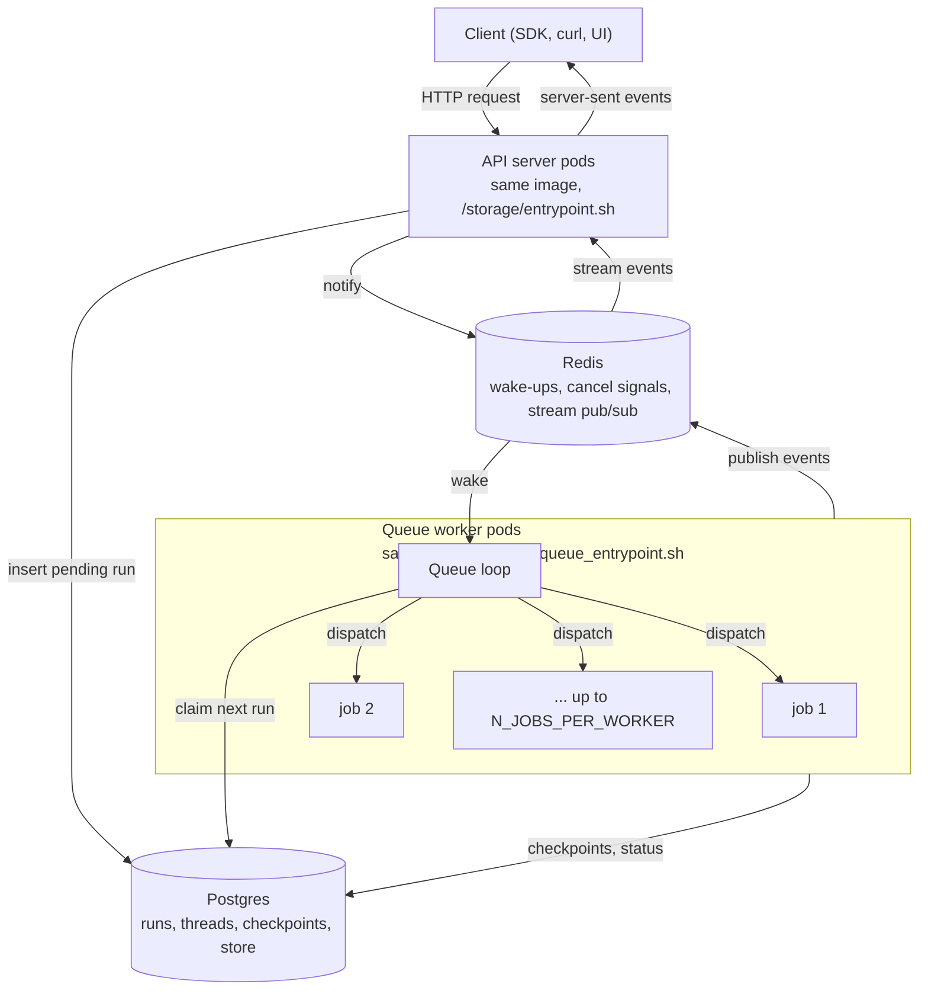

# 06. Runtime: API servers, queue workers, and what to tune

## Why this matters

Every Agent Server deployment, whether you install it with the Helm chart ([module 07](./07-standalone-helm-deploy.md)) or let self-hosted LangSmith Deployments provision it ([module 08](./08-langsmith-deployments-self-hosted.md)), runs the same two kinds of process from the same container image: **API servers** that answer HTTP requests, and **queue workers** that actually execute your graph. Most production problems trace back to confusing the two: sizing the API tier when the runs are slow, or setting a worker knob on the API pods. This module explains the split from the container level up, shows exactly how the Helm chart wires it (verified on a kind cluster during this guide's preparation), and ends with a short list of what to focus on.

If you only remember one sentence from this module: **request capacity and run capacity are two different dials, and `N_JOBS_PER_WORKER` only moves the second one.**

## The two roles

The [Agent Server runtime page](https://docs.langchain.com/langsmith/agent-server#container-architecture) describes a typical deployment as two pools of long-running containers, both built from one Docker image (the LangGraph base image with your project installed on top):

- **API servers** handle client requests: creating runs, reading thread state, streaming results. They do not execute agent code themselves.
- **Queue workers** are the execution engine. They listen to the durable task queue in Postgres, execute your graph code, and write checkpoints.

Containers are stateless but persistent. At least one queue worker must be listening at all times so that no run is orphaned. API servers and queue workers are separate pools and scale independently.



Two supporting services complete the picture. **Postgres** stores everything durable: assistants, threads, runs, cron jobs, checkpoints and the long-term store, plus the task queue itself with exactly-once semantics. **Redis** carries only ephemeral traffic: waking workers, cancelling runs, and relaying streaming output from a worker to whichever API pod holds the client's open connection. No user or run data persists in Redis ([task queue](https://docs.langchain.com/langsmith/agent-server#task-queue)).

### The run lifecycle in five steps

Quoting the [run execution lifecycle](https://docs.langchain.com/langsmith/agent-server#run-execution-lifecycle):

1. A client sends a request to an API server, which creates a pending run in the durable task queue.
2. A queue worker picks up the run, acquires a lease on it, loads the appropriate graph, and begins execution. The queue enforces that at most one run executes for a given thread at a time.
3. As the graph executes, the worker writes checkpoints to the persistence layer (frequency depends on the durability mode) and broadcasts streaming events over the pub/sub provider.
4. If the client opened a `/stream` connection, the API server subscribes to the pub/sub channel and forwards events to the client as server-sent events.
5. When execution completes, the worker updates the run status and releases its slot for the next run.

Step 1 is why creating a run is cheap and returns fast even when workers are saturated: the API pod only inserts a row. Step 2 is where `N_JOBS_PER_WORKER` applies: each worker executes up to that many runs concurrently (default 10).

## The three deployment modes

The docs define [three runtime configurations](https://docs.langchain.com/langsmith/agent-server#deployment-modes):

| Mode | What runs where | When to use |
| --- | --- | --- |
| **Single host** | The API server process also runs the queue loop and executes runs. Default for self-hosted. | Development, low traffic, first install. |
| **Split API and queue** | Dedicated queue worker pods execute runs; API pods only serve HTTP. Enabled with `queue.enabled: true`. Each tier scales independently. | Anything with real write load, long runs, or a need to scale the two tiers separately. |
| **Distributed runtime** | API and queue still separate, but orchestration and execution of a graph run in different processes. | Very large deployments with high concurrency. Mentioned here only; the chart used in this guide does not configure it. |

The rest of this module covers single host and split, which is what the `langgraph-cloud` Helm chart implements.

## How the chart wires the split

This is the part that is easy to get wrong, so it is worth seeing the actual Kubernetes objects rather than a diagram. The facts below come from two sources: the chart templates (`templates/api-server/deployment.yaml` and `templates/queue/deployment.yaml` in [charts/langgraph-cloud](https://github.com/langchain-ai/helm/tree/main/charts/langgraph-cloud)), and a real install of chart 0.3.4 on a kind cluster while writing this guide, first with [`values-dev.yaml`](../sample/helm/values-dev.yaml) and then upgraded with [`values-split.yaml`](../sample/helm/values-split.yaml).

### Single host: one Deployment, jobs on the API pod

With `queue.enabled: false` (the default), the chart renders one API server Deployment and sets `N_JOBS_PER_WORKER` on it from `config.numberOfJobsPerWorker`. Captured from the running pod:

```text
$ kubectl -n agent-server get pod <api-server-pod> -o jsonpath='{.spec.containers[0].env}'
PORT=8000
POSTGRES_URI            <- secret agent-server-langgraph-cloud-postgres / postgres_connection_url
REDIS_URI               <- secret agent-server-langgraph-cloud-redis    / redis_connection_url
LANGGRAPH_CLOUD_LICENSE_KEY <- secret agent-server-langgraph-cloud-secrets / langgraph_cloud_license_key
LANGSMITH_API_KEY       <- secret agent-server-langgraph-cloud-secrets / api_key
N_JOBS_PER_WORKER=10
MODEL=openai:gpt-4o-mini        (from apiServer.deployment.extraEnv)
LOG_JSON=true                   (from apiServer.deployment.extraEnv)
command: (none, so the image ENTRYPOINT /storage/entrypoint.sh runs)
```

The API pod is therefore also the worker: it executes up to 10 runs at a time in the same process that serves HTTP.

### Split: flip one value, get two Deployments

Setting `queue.enabled: true` changes three things in the rendered manifests:

1. A second Deployment named `<release>-queue` appears, built from the **same** `images.apiServerImage`, but with an explicit container `command` of `/storage/queue_entrypoint.sh`.
2. The API server Deployment gets `N_JOBS_PER_WORKER=0`. Zero jobs means the API process never claims runs from the queue.
3. The queue Deployment gets `N_JOBS_PER_WORKER=<config.numberOfJobsPerWorker>`.

Captured after `helm upgrade` with `values-split.yaml`:

```text
$ kubectl -n agent-server get pods
NAME                                                       STATUS
agent-server-langgraph-cloud-api-server-59755f768d-j2shh   Running
agent-server-langgraph-cloud-api-server-7fc44bf98b-6ddhk   Running
agent-server-langgraph-cloud-postgres-0                    Running
agent-server-langgraph-cloud-queue-9b6d954c9-br6d9         Running
agent-server-langgraph-cloud-queue-9b6d954c9-fft4c         Running
agent-server-langgraph-cloud-redis-77dc8f549-5hpwq         Running

## api-server pod
  command:                        (none -> /storage/entrypoint.sh)
  N_JOBS_PER_WORKER:              0
  LANGSMITH_API_KEY from secret:  agent-server-keys
  readiness probe:                exec python /api/healthcheck.py
  terminationGracePeriodSeconds:  30

## queue pod
  command:                        ["/storage/queue_entrypoint.sh"]
  N_JOBS_PER_WORKER:              10
  LANGSMITH_API_KEY from secret:  agent-server-keys
  readiness probe:                httpGet /ok on port 8000
  terminationGracePeriodSeconds:  200   (set in values-split.yaml)
```

Note the two different health checks. The API pod is probed by running `python /api/healthcheck.py` inside the container. The queue pod exposes a small HTTP server on port 8000 for `/ok` only; it does not serve the Agent Server API, and the chart creates no Service for it. Both probes default to `failureThreshold: 6`, `periodSeconds: 10`, `timeoutSeconds: 1`.

The queue pod's log confirms which process started and what it connected to (captured, trimmed):

```text
Starting Go Core API gRPC server on localhost:50051
{"level":"INFO","_msg":"Starting Core Server with config", ...}
{"level":"INFO","_msg":"Connecting to Postgres","uri":"postgres://REDACTED@agent-server-langgraph-cloud-postgres.agent-server.svc.cluster.local:5432/postgres?sslmode=disable"}
{"level":"INFO","_msg":"Postgres checkpointer started with batching"}
{"level":"INFO","_msg":"Connecting to Redis"}
{"level":"INFO","_msg":"Connected to Redis"}
{"level":"INFO","_msg":"Using Redis pub/sub for Core API"}
{"level":"INFO","_msg":"Using Redis Queue"}
{"level":"INFO","_msg":"Starting thread TTL sweeper","sweep_interval_minutes":5,"batch_size":50,"sweep_limit":10000}
...
{"event":"No enterprise license key or LangSmith API key found. To use LangGraph for development, please configure a valid LANGSMITH_API_KEY ..."}
{"event":"Queue entrypoint task failed", "level":"error", "langgraph_api_version":"0.14.1"}
```

On the first pass the kind cluster used for this guide had no license key or LangSmith API key, so both pod types started, ran migrations, connected to Postgres and Redis, and then exited at license verification. That is expected and is covered in [module 09](./09-operations.md#license-verification-failed). Everything above the license line is what a healthy start looks like.

After a LangSmith API key was added to the Secret and the Deployments restarted ([module 07](./07-standalone-helm-deploy.md#the-same-steps-with-a-key)), the split became observable. The queue pod's log continued past the license line into the worker loop, and every run created through the API showed up there and nowhere else:

```
{"event":"No enterprise license key found, running in lite mode with LangSmith API key. For production use, set LANGGRAPH_CLOUD_LICENSE_KEY in environment."}
{"event":"Worker stats","active":0,"available":10,"max":10}
{"event":"Starting queue with shared loop"}
{"event":"Starting 10 background workers"}
{"event":"Dequeued run for background worker","run_id":"01a0aefa-861e-...","thread_id":"01a0aefa-85e7-..."}
{"event":"Starting background run","run_id":"01a0aefa-861e-...","graph_id":"echo","run_attempt":1}
{"event":"Background run succeeded","run_id":"01a0aefa-861e-...","graph_id":"echo","run_attempt":1}
```

Across a smoke test, the Python SDK client and a streamed run, the two API pods logged zero `Starting background run` events and the two queue pods logged all of them. The metrics endpoints tell the same story: a queue pod reports `lg_api_workers_max 10.0` and `lg_api_workers_available 10.0`, and an API pod running with `N_JOBS_PER_WORKER=0` reports no `lg_api_workers_*` series at all, only `lg_api_num_pending_runs` and `lg_api_num_running_runs`. One observation to file away for the knob table below: both pod types reported `lg_api_pg_pool_max 200.0`, whereas the docs give the `LANGGRAPH_POSTGRES_POOL_MAX_SIZE` default as 150; read the gauge on your own version rather than assuming the documented default.

### What the two entrypoints do

The image ships both scripts under `/storage`. Inspected from the image built in [module 07](./07-standalone-helm-deploy.md) (`docker run --rm --entrypoint sh my-agent:dev -c 'cat /storage/queue_entrypoint.sh'`):

- `/storage/entrypoint.sh` (image `ENTRYPOINT`, used by API pods): reads `LANGGRAPH_SERVER_HOST` (empty means both IPv4 and IPv6), honours `LANGGRAPH_SERVER_PORT` as an override for `PORT`, starts a Go process called `core-api-grpc` in the background on `localhost:50051` (unless `CORE_API_GRPC_SIDECAR=1` says it runs as a sidecar), then starts the uvicorn API server.
- `/storage/queue_entrypoint.sh` (queue pods): starts the same `core-api-grpc` process, then runs `python -m langgraph_api.queue_entrypoint`.

Both scripts have the same three-way branch for tracing: if `DD_API_KEY` is set the process is wrapped in Datadog's `ddtrace-run`; else if `LS_APM_OTEL_ENABLED=true` and an `OTEL_EXPORTER_OTLP_*ENDPOINT` is set the process is wrapped in `opentelemetry-instrument`; else it runs plain. See [module 09](./09-operations.md) for those options. The practical consequence: **anything your graph needs at run time (model keys, `MODEL`, custom settings) must be present on the queue pods**, because that is where graphs execute. The API pods only need what request handling needs. `values-split.yaml` repeats `MODEL` under `queue.deployment.extraEnv` for exactly this reason.

## Request concurrency versus run concurrency

The [scaling guide](https://docs.langchain.com/langsmith/agent-server-scale#request-vs-run-concurrency) separates two independent kinds of concurrency:

- **Request concurrency** is how many API requests the deployment serves at once. API servers handle requests asynchronously, and request concurrency scales horizontally with the number of API replicas.
- **Run concurrency** is how many runs execute at once. It is capped at `number_of_queue_workers × N_JOBS_PER_WORKER`.

Raising `N_JOBS_PER_WORKER` or adding queue workers increases run throughput. It does not change how many requests the deployment can serve. Conversely, adding API replicas does nothing for a backlog of pending runs.

The sizing formulas from the same page:

```text
available_jobs           = number_of_queue_workers * N_JOBS_PER_WORKER
throughput_per_second    = available_jobs / average_run_execution_time_seconds
number_of_queue_workers  = throughput_per_second * average_run_execution_time_seconds / N_JOBS_PER_WORKER
```

Worked example: you expect a steady 20 new runs per second and a run averages 4 seconds. You need 80 concurrent jobs. At the default 10 jobs per worker that is 8 queue workers; at 20 jobs per worker (an I/O-bound agent that mostly waits on a model) it is 4. Bursty traffic gets autoscaling on top, sized to the peak using the same arithmetic.

### Choosing `N_JOBS_PER_WORKER`

Guidance from [Tune N_JOBS_PER_WORKER](https://docs.langchain.com/langsmith/agent-server-scale#tune-n_jobs_per_worker-based-on-assistant-characteristics):

| Assistant profile | Direction | Why |
| --- | --- | --- |
| CPU bound | Keep 10, or lower it | More jobs on one pod only add contention; watch CPU and run latency. |
| Memory bound | Lower it | Each concurrent run holds its own state, messages and model responses. |
| I/O bound (waiting on models, HTTP, databases) | Raise it | Idle jobs cost little; more of them keep the pod busy. |

There is no upper limit, but workers are greedy: a worker claims as many runs as it has free jobs. A very high value with bursty traffic gives uneven worker utilisation, longer run times and high memory on the pods that got there first.

### Deep Agents and subagents occupy slots

A Deep Agent that uses asynchronous subagents does not execute them inside its own run. Each launched subagent becomes a separate run on the same Agent Server (or on a remote one when the subagent has a `url`), and every active run holds one job slot. The docs give the arithmetic directly: "A supervisor with 3 concurrent subagent tasks requires 4 slots (1 supervisor + 3 subagents). Under-provisioning causes launches to queue" ([Async subagents: size the worker pool](https://docs.langchain.com/oss/python/deepagents/async-subagents#size-the-worker-pool-for-local-development)). The symptom of running out is that subagent launches hang or queue rather than fail.

That changes the sizing formula in one place. `available_jobs = number_of_queue_workers × N_JOBS_PER_WORKER` still holds, but the demand side is no longer one slot per user request: budget `1 + (max concurrent subagents)` slots per supervisor run, and count remote subagents against the *other* server's slots instead. Because subagent runs are typically I/O bound (waiting on a model), a deep-agent deployment is a natural case for raising `N_JOBS_PER_WORKER` rather than only adding workers. Locally, the same limit applies to `langgraph dev`, which the docs address with `langgraph dev --n-jobs-per-worker 10`. Co-deployed subagent graphs are registered in the same `langgraph.json` ([module 03](./03-existing-project.md#deep-agents-already-a-graph)).

### Keep graph code asynchronous

The Agent Server runs your graph on an asyncio event loop. A synchronous blocking call (`time.sleep`, `requests.get`, a synchronous database driver) blocks that loop. In single-host mode it blocks the loop that also answers health checks, and the docs name the symptom: "continuous application restarts due to failing health checks" ([BG_JOB_ISOLATED_LOOPS](https://docs.langchain.com/langsmith/env-var-self-hosted#bg_job_isolated_loops)). In split mode it still degrades throughput on the worker.

The fix is in the code, not the deployment: async HTTP clients, async database drivers, async model SDKs, and `asyncio.to_thread(...)` for the unavoidable synchronous library. `BG_JOB_ISOLATED_LOOPS=true` exists as a stopgap and is discussed in the knob table below, together with the connection pool side effect it has.

## The knob table

Every variable below is documented on [Self-hosted Agent Server environment variables](https://docs.langchain.com/langsmith/env-var-self-hosted). Defaults are quoted from that page. The "Pods" column says where a value must be present in split mode: `both` means set it under both `apiServer.deployment.extraEnv` and `queue.deployment.extraEnv` in the chart. In single-host mode there is only one pod type, so everything goes on the API server.

### Run execution

| Variable | Default | What it controls | When to touch it | Pods |
| --- | --- | --- | --- | --- |
| `N_JOBS_PER_WORKER` | `10` | Max runs one worker executes concurrently. The chart sets it from `config.numberOfJobsPerWorker`; do not also put it in `extraEnv`. | Size by assistant profile and the formulas above. | queue (API in single host) |
| `BG_JOB_ISOLATED_LOOPS` | `False` | Runs background jobs on a separate event loop and thread from the serving loop. | Only as a stopgap when synchronous graph code is failing health checks. The docs warn it does not fix throughput and that each worker thread then gets its own Postgres pool of size `LANGGRAPH_POSTGRES_POOL_MAX_SIZE // N_JOBS_PER_WORKER`; raise the pool size if you enable it. | both |
| `BG_JOB_MAX_RETRIES` | `3` | How many times a run is retried after a retriable failure (transient database error, shutdown cancellation). Resumes from the last checkpoint; beyond the limit the run is marked failed. | Raise cautiously for long runs on flaky infrastructure. | queue |
| `BG_JOB_TIMEOUT_SECS` | `86400` | Maximum wall time for a background run. | Lower it to bound runaway agents. Clients must reconnect with `/join` or `/stream` for runs longer than your ingress idle timeout. | queue |
| `BG_JOB_SHUTDOWN_GRACE_PERIOD_SECS` | `180` (max `3600`) | How long a worker waits for in-flight runs after receiving a shutdown signal before forcing termination. Added in `langgraph-api==0.2.16`. | Set to cover your longest common run, then set the pod's `terminationGracePeriodSeconds` higher than it (see below). | queue |

### Data stores and pools

| Variable | Default | What it controls | When to touch it | Pods |
| --- | --- | --- | --- | --- |
| `DATABASE_URI` / `POSTGRES_URI` | none | Postgres connection. The chart injects `POSTGRES_URI` from its secret; the docs' Docker examples use `DATABASE_URI`. Both names are read. | Never set by hand in the chart; use `postgres.external.*`. | both |
| `REDIS_URI` | none | Redis connection for wake-ups, cancellation and streaming pub/sub. Injected by the chart from its secret. | Use `redis.external.*` in the chart. | both |
| `POSTGRES_URI_CUSTOM` | none | Custom Postgres for a **LangSmith Deployments** (control plane) deployment. Postgres 15.8+, database must already exist. Once set it must stay set for the life of the deployment; the control plane will not delete the external database. | Module 08 only. Not used with the standalone chart. | both |
| `REDIS_URI_CUSTOM` | none | Custom Redis for a LangSmith Deployments deployment. | Module 08 only. | both |
| `LANGGRAPH_POSTGRES_POOL_MAX_SIZE` | `150` | Max Postgres connections **per replica** (since `langgraph-api` 0.2.12). 10 replicas at 150 is up to 1500 connections. | Lower it when Postgres `max_connections` is the constraint; raise it under `BG_JOB_ISOLATED_LOOPS`. Watch `lg_api_pg_pool_requests_queued_total`. | both |
| `REDIS_MAX_CONNECTIONS` | `2000` | Max Redis connections per replica. | Rarely; lower for managed Redis tiers with connection caps. | both |
| `REDIS_KEY_PREFIX` | `''` | Prefix for every Redis key (API server 0.1.9+). Lets multiple deployments share one Redis logical database. | When you cannot give each deployment its own Redis database number. | both |
| `REDIS_CLUSTER` | `False` | Connect in Redis Cluster mode. Alpha. | Only with a Redis Cluster deployment. | both |
| `AGENT_POSTGRES_IAM_AUTH_PROVIDER` / `AGENT_REDIS_IAM_AUTH_PROVIDER` | none | `aws`, `azure` or `gcp`: replace the password in the URI with a short-lived cloud identity token (`langgraph-api>=0.12.0`). | Managed cloud databases with workload identity. Needs matching `serviceAccount` settings on both Deployments; see [Configure IAM authentication](https://docs.langchain.com/langsmith/configure-iam-auth). | both |
| `LS_DEFAULT_CHECKPOINTER_BACKEND` | `default` | `default` (Postgres), `mongo` or `custom` for checkpoints when `langgraph.json` does not set `checkpointer.backend`. The chart injects `mongo` automatically when `mongo.enabled: true`. | Only when moving checkpoints to MongoDB; see [module 04](./04-langgraph-json.md). | both |
| `LS_MONGODB_URI` | none | MongoDB URI for the Mongo checkpointer. Must include the database name and point at a replica set member or `mongos`. | With `LS_DEFAULT_CHECKPOINTER_BACKEND=mongo`. | both |
| `LS_CHECKPOINT_DELETE` | disabled | JSON config for deferred checkpoint deletion (`langgraph-api>=0.8.1`, Postgres backend only): thread delete and prune enqueue checkpoints for a background drain instead of deleting inline. Fields `enabled`, `enabledWorkerOnly`, `pollIntervalMs` (5000), `batchSize` (25), `batchSleepMs` (500). | When thread deletes or TTL sweeps cause request latency spikes. | both |
| `RESUMABLE_STREAM_TTL_SECONDS` | `120` | How long resumable stream chunks stay in Redis when a run is created with `stream_resumable=true`. | Keep low; high values with many concurrent streams inflate Redis memory. | both |

### Serving, networking and logging

| Variable | Default | What it controls | When to touch it | Pods |
| --- | --- | --- | --- | --- |
| `PORT` / `LANGGRAPH_SERVER_PORT` | `8000` | Listening port. The chart sets `PORT` from `apiServer.containerPort`; `LANGGRAPH_SERVER_PORT` overrides it where `PORT` is reserved. | Rarely. | API |
| `LANGGRAPH_SERVER_HOST` | empty (both IPv4 and IPv6, since 0.14.0) | Address family. `0.0.0.0` for IPv4 only, `::` for IPv6 only. Before 0.14.0 the default was `0.0.0.0`. | Single-stack clusters that reject dual-stack binds. | API |
| `MOUNT_PREFIX` | none | Serve the API under a path prefix such as `/langgraph` behind a proxy. The chart's gateway and Istio modes strip `basePath` before forwarding, so you usually do not need both. | Path-based routing on a shared hostname. | API |
| `CORS_ALLOW_ORIGINS` | `*` | Allowed browser origins, comma separated. The `http.cors` block in `langgraph.json` is the richer alternative. | Any deployment a browser talks to directly. | API |
| `HTTP_MAX_REQUEST_BODY_BYTES` | `314572800` (300 MB) | Maximum request body; larger requests get HTTP 413. The chart exposes it as `config.httpMaxRequestBodyBytes`. | Tighten when clients never upload large payloads. | API |
| `LOG_LEVEL` | `INFO` | Python log level. | `DEBUG` while troubleshooting. | both |
| `LOG_JSON` | `false` | Structured JSON logs. | `true` in any cluster with a log pipeline. | both |
| `LOG_COLOR` | `true` | ANSI colour in console logs; mostly for `langgraph dev`. | `false` in containers. | both |

### LangSmith and licensing

| Variable | Default | What it controls | When to touch it | Pods |
| --- | --- | --- | --- | --- |
| `LANGGRAPH_CLOUD_LICENSE_KEY` | none | Enterprise license, verified once at start-up. The chart mounts it from the secret key `langgraph_cloud_license_key`; never put it in `extraEnv` (the chart README says doing so breaks verification). | Always in production. | both |
| `LANGSMITH_API_KEY` | none | API key for tracing, and accepted instead of a license key for development. Mounted by the chart from secret key `api_key`. | Always, unless tracing is disabled. | both |
| `LANGSMITH_ENDPOINT` | LangSmith Cloud | Hostname of your self-hosted LangSmith, no trailing slash. | Every self-hosted deployment that traces. | both |
| `LANGSMITH_TRACING` | `true` | Set `false` to disable tracing entirely. | Air-gapped or cost-sensitive environments. | both |
| `LS_APM_OTEL_ENABLED` | unset | With an `OTEL_EXPORTER_OTLP_TRACES_ENDPOINT` or `OTEL_EXPORTER_OTLP_ENDPOINT`, wraps the process in OpenTelemetry auto-instrumentation (server 0.5.32+, Alpha). | APM tracing to New Relic, Tempo and similar. | both |
| `DD_API_KEY` and `DD_*` | unset | Wraps the process in Datadog `ddtrace-run`; overrides OTel instrumentation. | Only when Datadog is your primary APM. | both |

## Autoscaling

Autoscaling is off by default. The chart offers two mechanisms per tier, selected by `<tier>.autoscaling.enabled` and `<tier>.autoscaling.keda.enabled`:

- **HorizontalPodAutoscaler** (`keda.enabled: false`): `templates/*/hpa.yaml` renders an `autoscaling/v2` HPA with CPU utilisation (`targetCPUUtilizationPercentage`, default 80) and, if set, memory utilisation (`targetMemoryUtilizationPercentage`).
- **KEDA ScaledObject** (`keda.enabled: true`, requires [KEDA](https://keda.sh/) in the cluster): `templates/*/scaled-object.yaml` renders the same CPU and memory triggers plus a **`postgresql` trigger** that reads the pending-run count directly from the queue table:

```yaml
- type: postgresql
  metadata:
    connectionFromEnv: "POSTGRES_URI"
    query: "SELECT COUNT(*) FROM run WHERE status = 'pending'"
    targetQueryValue: "<config.numberOfJobsPerWorker>"
    activationTargetQueryValue: "<config.numberOfJobsPerWorker>"
```

That trigger is what makes queue autoscaling meaningful: KEDA adds a worker for roughly every `N_JOBS_PER_WORKER` pending runs, which is the same arithmetic as the sizing formulas. The API server ScaledObject includes this trigger **only when `queue.enabled` is false** (single host, where the API pod is the worker); in split mode the API tier scales on CPU and memory alone. Both ScaledObjects default to `pollingInterval: 30`, `cooldownPeriod: 300` and a 300-second scale-down stabilisation window, and accept `keda.additionalTriggers`.

[`values-prod.yaml`](../sample/helm/values-prod.yaml) enables the HPA on the API tier and KEDA on the queue tier. The [scaling guide's autoscaling example](https://docs.langchain.com/langsmith/agent-server-scale#autoscaling) uses `minReplicas: 15, maxReplicas: 25` for API and `10` to `20` for queue at the high-reads-high-writes load level.

## Reference configurations, in this chart's vocabulary

The scaling guide publishes [example configurations](https://docs.langchain.com/langsmith/agent-server-scale#example-configurations) for five load patterns, assuming a 1-second average run and moderate CPU and memory. Its YAML uses the key `api:`, which is the naming used by LangSmith Deployments (module 08). In the standalone chart the same settings live under `apiServer:`, `queue:`, `config.numberOfJobsPerWorker`, and the bundled `postgres.statefulSet.resources` / `redis.deployment.resources`. Translated:

| Load (reads/s, writes/s) | `apiServer.deployment.replicaCount` | `queue.enabled` / `replicaCount` | `config.numberOfJobsPerWorker` | Postgres requests |
| --- | --- | --- | --- | --- |
| Low / low (5 / 5) | 1 | off, 1 (default) | 10 | 2 CPU, 8 Gi (chart default) |
| Low / high (500 / 5) | 6 | on, 10 | 50 | 4 CPU, 16 Gi |
| High / low (5 / 500) | 10 | on, 1 | 10 | 4 CPU, 16 Gi, plus read replicas |
| Medium / medium (50 / 50) | 3 | on, 5 | 10 | 4 CPU, 16 Gi |
| High / high (500 / 500) | 15 | on, 10 | 50 | 8 CPU, 32 Gi |

Every row uses 1 CPU / 2 Gi requests and 2 CPU / 4 Gi limits per API and queue pod, and 2 Gi for Redis. The chart's own defaults are 1 CPU / 2 Gi requests and 2 CPU / 4 Gi limits for both pod types, so the table only changes replica counts and jobs per worker until the top row. Two notes: "read replicas" in the high-reads column is a property of your external Postgres, not something this chart provisions; and the standalone chart's bundled Postgres is a single StatefulSet suited to development, so anything past the first row should use `postgres.external`.

`values-prod.yaml` is the medium/medium row with autoscaling and disruption budgets added.

## Reducing load before adding pods

Three settings from the [read load](https://docs.langchain.com/langsmith/agent-server-scale#read-load) and [write load](https://docs.langchain.com/langsmith/agent-server-scale#write-load) sections cost nothing and often remove the need to scale:

- **Durability mode.** The default `"async"` writes a checkpoint after every step. If a run only needs its final state persisted, create it with `durability="exit"`; the [module 05](./05-api-surface.md) examples show the parameter. Fewer checkpoints means fewer Postgres writes per run.
- **Thread TTLs.** Configure a TTL on threads ([Configure TTL](https://docs.langchain.com/langsmith/configure-ttl)) so old threads, and with them their runs and checkpoints, are deleted automatically. The queue pod log above shows the sweeper running every 5 minutes with a batch of 50.
- **Do not poll.** Use `GET /threads/{thread_id}/runs/{run_id}/join` to block until a run finishes, or `/stream` to watch it, instead of polling `GET .../runs/{run_id}`. Use the search endpoints' filters and pagination rather than fetching whole collections.

## Graceful shutdown

A rolling deploy or a scale-down sends SIGTERM to a worker that may be mid-run. Two timers must agree:

1. `BG_JOB_SHUTDOWN_GRACE_PERIOD_SECS` (default 180) is how long the worker itself waits for in-flight runs before forcing termination.
2. `terminationGracePeriodSeconds` on the pod (chart default 30) is how long Kubernetes waits before SIGKILL.

If the pod value is lower, Kubernetes kills the worker while it is still draining, the lease expires, and the run is retried from its last checkpoint on another worker, consuming one of `BG_JOB_MAX_RETRIES`. Set `queue.deployment.terminationGracePeriodSeconds` above the grace period; `values-split.yaml` uses 200 over 180, `values-prod.yaml` uses 300 over 240. Keep at least one worker replica available during rollouts (`queue.pdb.enabled: true`), and never let the worker tier scale to zero: the standalone server docs [warn](https://docs.langchain.com/langsmith/deploy-standalone-server) that scale-to-zero may cause task loss.

## What to focus on

Most of the knob table can stay at its default. Work through this sequence, in order, and stop when the deployment meets its targets:

1. **Start single host.** One API replica, bundled or external Postgres and Redis, defaults everywhere. Measure average run time and request rate; the formulas need both.
2. **Make the code asynchronous before touching any knob.** Synchronous nodes distort every later measurement and are the root cause behind the two most common tickets (health-check restarts, pool exhaustion).
3. **Switch to split mode** (`queue.enabled: true`) as soon as either is true: runs take more than a few seconds, or you need to scale requests and runs separately. Move all application environment variables to the queue pods when you do.
4. **Size run capacity** with `workers × N_JOBS_PER_WORKER` from the throughput formula; pick the jobs value from the assistant profile table. Size request capacity separately by API replica count.
5. **Fit the database.** Check `pool_max × (api + queue replicas)` against Postgres `max_connections`; lower `LANGGRAPH_POSTGRES_POOL_MAX_SIZE` before adding a pooler.
6. **Make shutdown safe.** Set `BG_JOB_SHUTDOWN_GRACE_PERIOD_SECS`, a larger `terminationGracePeriodSeconds` on the queue tier, and a disruption budget of at least one worker.
7. **Add autoscaling last**, with KEDA's pending-runs trigger on the queue tier and CPU on the API tier, bounded by the same arithmetic at peak.
8. **Reduce load** with `durability="exit"` where final state is enough, thread TTLs, and `/join` instead of polling.

Everything else in the table (Redis prefixes, IAM auth, MongoDB checkpoints, OTel, `MOUNT_PREFIX`) is situational and should be driven by a specific requirement, not tuned pre-emptively.

## Hands-on

Against the kind cluster from module 07, confirm the wiring yourself:

```bash
NS=agent-server
# Which pods play which role
kubectl -n $NS get pods -L app.kubernetes.io/component

# Jobs per pod type
for c in api-server queue; do
  P=$(kubectl -n $NS get pod -l app.kubernetes.io/component=agent-server-langgraph-cloud-$c -o jsonpath='{.items[0].metadata.name}')
  echo "$c: $(kubectl -n $NS get pod $P -o jsonpath='{.spec.containers[0].command} N_JOBS_PER_WORKER={.spec.containers[0].env[?(@.name=="N_JOBS_PER_WORKER")].value}')"
done

# See the rendered difference without touching the cluster
helm template agent-server langchain/langgraph-cloud --version 0.3.4 \
  -f ../sample/helm/values-dev.yaml -f ../sample/helm/values-split.yaml \
  | grep -E 'kind: Deployment|name: N_JOBS_PER_WORKER|queue_entrypoint' -A1
```

Then watch the split in action, as captured above: create a run with `POST /threads/{id}/runs` (background, no stream) and tail the queue pod's logs for `Dequeued run for background worker`, `Starting background run` and `Background run succeeded`; the API pod logs show only the HTTP request.

## Checkpoint

You should now be able to answer, for your own deployment:

- Which Deployment executes graphs, and what its `N_JOBS_PER_WORKER` is.
- How many concurrent runs the deployment can execute (`workers × jobs`) and how many API replicas serve requests.
- Where a new application environment variable has to be set (queue pods in split mode).
- What happens to an in-flight run when a worker pod is terminated, and which two timers govern it.

## Gotchas

- Putting `MODEL` or a provider key only on the API pods after enabling `queue.enabled` makes every run fail on the workers while `/ok` stays green on the API.
- `N_JOBS_PER_WORKER` set through `extraEnv` conflicts with the value the chart injects from `config.numberOfJobsPerWorker`. Use the chart value.
- `BG_JOB_ISOLATED_LOOPS` hides a health-check symptom while shrinking each worker's Postgres pool to `pool_max // jobs`. Fix the synchronous code instead.
- Adding API replicas does not drain a queue backlog; adding queue replicas does not fix slow `/threads/search`.
- The docs' scaling YAML uses `api:`; the standalone chart uses `apiServer:`. A copied block under the wrong key is silently ignored by Helm.
- Scale-to-zero, serverless runtimes and a `terminationGracePeriodSeconds` shorter than the shutdown grace period all lose or retry in-flight runs.

## References

- Agent Server runtime architecture, deployment modes and run lifecycle: https://docs.langchain.com/langsmith/agent-server
- Configure Agent Server for scale (concurrency, sizing formulas, example configurations, autoscaling): https://docs.langchain.com/langsmith/agent-server-scale
- Self-hosted Agent Server environment variables: https://docs.langchain.com/langsmith/env-var-self-hosted
- Scalability and resilience (queue semantics, retries): https://docs.langchain.com/langsmith/scalability-and-resilience
- Configure IAM authentication for data stores: https://docs.langchain.com/langsmith/configure-iam-auth
- Configure TTL for threads: https://docs.langchain.com/langsmith/configure-ttl
- Standalone server guide (scale-to-zero warning, shared instances): https://docs.langchain.com/langsmith/deploy-standalone-server
- Helm chart source used for the wiring facts: https://github.com/langchain-ai/helm/tree/main/charts/langgraph-cloud (templates `api-server/deployment.yaml`, `queue/deployment.yaml`, `*/hpa.yaml`, `*/scaled-object.yaml`)
- Sample values used in this module: [values-dev.yaml](../sample/helm/values-dev.yaml), [values-split.yaml](../sample/helm/values-split.yaml), [values-prod.yaml](../sample/helm/values-prod.yaml)
