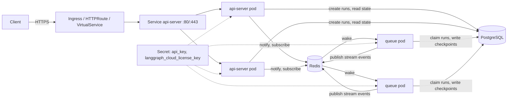

# 07. Deploy the standalone Agent Server with the Helm chart

This module takes the image you build from `langgraph.json` and runs it as a production-shaped
Agent Server on Kubernetes using the `langgraph-cloud` Helm chart, with no LangSmith control plane
involved. Everything in the hands-on sections was executed on a local `kind` cluster while writing
this guide; where the output is shown, it is the real output. The install was done in two passes
on purpose. The first pass ran without any key, which is the most common first-day failure: the
server refuses to start without a LangSmith API key or a license key, and this module shows exactly
what that looks like. The second pass added a LangSmith API key to the Secret and completed end to
end, including the smoke test and SDK traffic; that output is in
[The same steps with a key](#the-same-steps-with-a-key).

Reading path: [06 Runtime and tuning](./06-runtime-and-tuning.md) explains *why* the chart has an
API tier and a queue tier. This module explains *how to operate* the chart. The companion path,
deploying the same image through self-hosted LangSmith Deployments, is
[08](./08-langsmith-deployments-self-hosted.md).

## Why this matters

The standalone server is the lightest way to run agents in your own cluster: two Deployments built
from one image, plus PostgreSQL and Redis that you already know how to run. The docs are explicit
that Kubernetes with this chart is the production path LangChain tests, and that other orchestrators
leave you to implement queue autoscaling, graceful draining and split-mode wiring yourself
([Self-host standalone servers](https://docs.langchain.com/langsmith/deploy-standalone-server)).
Most platform teams also already own a container pipeline. So the shape this module teaches is:
your pipeline builds and pushes the image, and `helm upgrade` rolls it out.

## What the chart installs

Chart `langchain/langgraph-cloud` version `0.3.4` (appVersion `0.2.3`), from the Helm repository
`https://langchain-ai.github.io/helm`. Its templates, and what each one gives you:

| Template | Kubernetes object | Purpose |
| --- | --- | --- |
| `api-server/deployment.yaml` | Deployment | The HTTP tier. Runs the image's default entrypoint `/storage/entrypoint.sh`. |
| `api-server/service.yaml` | Service | `LoadBalancer` by default on ports 80 and 443, both targeting container port 8000. Becomes `ClusterIP` automatically when `gateway` or `istioGateway` is enabled. |
| `api-server/hpa.yaml`, `api-server/scaled-object.yaml` | HPA or KEDA ScaledObject | Autoscaling for the API tier when `apiServer.autoscaling.enabled`. |
| `api-server/pdb.yaml`, `api-server/service-account.yaml` | PodDisruptionBudget, ServiceAccount | Optional PDB; a dedicated ServiceAccount is created by default. |
| `queue/deployment.yaml` | Deployment | The worker tier, created only when `queue.enabled: true`. Same image, but `command: ["/storage/queue_entrypoint.sh"]`. |
| `queue/hpa.yaml`, `queue/scaled-object.yaml`, `queue/pdb.yaml`, `queue/service-account.yaml` | as above | Same optional pieces for the queue tier. No Service: workers accept no traffic. |
| `postgres/stateful-set.yaml`, `postgres/service.yaml`, `postgres/secrets.yaml`, ... | StatefulSet, Service, Secret | A bundled `pgvector/pgvector:pg16` instance with an 8Gi PVC, skipped when `postgres.external.enabled`. |
| `redis/deployment.yaml`, `redis/service.yaml`, `redis/secrets.yaml`, ... | Deployment, Service, Secret | A bundled `redis:6`, skipped when `redis.external.enabled`. |
| `mongo/*` | StatefulSet, Service, Secret | Optional MongoDB checkpoint store, only when `mongo.enabled`. |
| `secrets.yaml` | Secret | `<release>-langgraph-cloud-secrets` holding `api_key` and `langgraph_cloud_license_key`, unless you supply `config.existingSecretName`. |
| `ingress.yaml`, `http_route.yaml`, `virtual_service.yaml` | Ingress, HTTPRoute, VirtualService | Three mutually exclusive ways to expose the API Service. |
| `NOTES.txt` | (post-install text) | Prints the `port-forward` and `/docs` hints you see after `helm install`. |

Source: the chart directory at
<https://github.com/langchain-ai/helm/tree/main/charts/langgraph-cloud> and its `values.yaml`.



## What the chart needs from you

The [standalone server prerequisites](https://docs.langchain.com/langsmith/deploy-standalone-server#prerequisites)
list what a data-plane deployment needs. Mapped onto chart values:

| Requirement | Where it goes in the chart | Notes |
| --- | --- | --- |
| Your Agent Server image | `images.apiServerImage.repository` and `.tag` | The chart default (`docker.io/langchain/langgraph-api:3.11-28c1407`) is the empty base image; you must replace it. |
| `LANGGRAPH_CLOUD_LICENSE_KEY` | Secret key `langgraph_cloud_license_key` | Validated once at startup. Needs egress to `https://beacon.langchain.com` unless you run an air-gapped license ([Egress](https://docs.langchain.com/langsmith/self-host-egress)). |
| `LANGSMITH_API_KEY` | Secret key `api_key` | Used for tracing and, in development, as the license substitute. |
| `LANGSMITH_ENDPOINT` | `apiServer.deployment.extraEnv` and `queue.deployment.extraEnv` | Hostname of your self-hosted LangSmith. No trailing slash; the docs warn it causes auth errors. |
| PostgreSQL 14 or newer | bundled, or `postgres.external.*` | The chart injects it as `POSTGRES_URI`. The docs call the same setting `DATABASE_URI`; the image's entrypoint accepts either name. |
| Redis | bundled, or `redis.external.*` | Injected as `REDIS_URI`. Ephemeral pub/sub only; no run data lives here. |
| Application environment (model keys, `MODEL`, ...) | `extraEnv` or `envFrom` on **both** tiers | Graph code runs on queue pods in split mode, so app settings must reach them too. |

### How secrets flow

The chart wires the license and API key into every container from one Secret. Two ways to supply it:

1. Inline values `config.langGraphCloudLicenseKey` and `config.apiKey`. The chart renders them into
   `<release>-langgraph-cloud-secrets`. Fine for a throwaway cluster, wrong for anything in git.
2. `config.existingSecretName`, pointing at a Secret you create out of band (sealed-secrets,
   External Secrets Operator, Vault injector, `kubectl create secret`). The chart expects exactly
   two keys, `api_key` and `langgraph_cloud_license_key`, both optional.

The chart README is emphatic on one point: do not put `LANGSMITH_API_KEY` or
`LANGGRAPH_CLOUD_LICENSE_KEY` in `extraEnv`. The chart already sets those variable names from the
Secret, and a duplicate breaks license verification. Application secrets such as `OPENAI_API_KEY`
belong in `extraEnv` or `envFrom` ([chart README, "Using existingSecretName"](https://github.com/langchain-ai/helm/blob/main/charts/langgraph-cloud/README.md)).

External data stores follow the same pattern with their own Secrets and their own keys:
`postgres.external.existingSecretName` must contain `postgres_connection_url`, and
`redis.external.existingSecretName` must contain `redis_connection_url`. If you prefer inline,
`postgres.external.connectionUrl` and `redis.external.connectionUrl` are rendered into
chart-managed Secrets. The MongoDB option uses a third, separate Secret with key
`mongodb_connection_url`; the README stresses that `mongo.external.existingSecretName` and
`config.existingSecretName` are different Secrets.

Here is what the wiring looks like on a running API pod. This was read back from the kind cluster
with `kubectl get pod ... -o jsonpath` after the first install:

```
PORT=8000
POSTGRES_URI                 <- secret agent-server-langgraph-cloud-postgres, key postgres_connection_url
REDIS_URI                    <- secret agent-server-langgraph-cloud-redis,    key redis_connection_url
LANGGRAPH_CLOUD_LICENSE_KEY  <- secret agent-server-langgraph-cloud-secrets,  key langgraph_cloud_license_key
LANGSMITH_API_KEY            <- secret agent-server-langgraph-cloud-secrets,  key api_key
N_JOBS_PER_WORKER=10
MODEL=openai:gpt-4o-mini          (from apiServer.deployment.extraEnv)
LOG_JSON=true                     (from apiServer.deployment.extraEnv)
command: <empty>  (image ENTRYPOINT /storage/entrypoint.sh)
```

## Build the image in your own pipeline

You have two ways to produce the image. `langgraph build -t my-agent:1.4.0` does everything in one
step but needs a Docker daemon where the CLI runs. Most CI systems already have a container build
step, so the guide uses the other route: `langgraph dockerfile` renders a plain Dockerfile from
`langgraph.json` and you build it with whatever you use today (`docker build`, BuildKit, Kaniko,
buildah). Both are documented in the [CLI reference](https://docs.langchain.com/langsmith/cli#build).

### The generated Dockerfile, line by line

This is [`sample/Dockerfile`](../sample/Dockerfile) exactly as `langgraph dockerfile` produced it
for the sample project, with commentary:

```dockerfile
FROM langchain/langgraph-api:3.12-wolfi
```
The base tag is `<python_version>-<image_distro>` from `langgraph.json`. `python_version: "3.12"`
and `image_distro: "wolfi"` give `3.12-wolfi`. Omit `image_distro` and you get the Debian variant.
To pin the server version instead of tracking the latest tag, set `base_image`, for example
`"base_image": "langchain/langgraph-server:0.2"`; the CLI then renders that in place of the default
([configuration file reference](https://docs.langchain.com/langsmith/cli#configuration-file)).

```dockerfile
# -- Adding local package . --
ADD . /deps/my-agent
# -- End of local package . --
```
Each entry in `dependencies` that points at a local directory is copied under `/deps/<name>`. The
`"."` entry is the project itself. Keep a `.dockerignore` next to `langgraph.json` so `.venv`,
`.git` and test data do not ride along.

```dockerfile
# -- Installing all local dependencies --
RUN for dep in /deps/*; do ... (cd "$dep" && PYTHONDONTWRITEBYTECODE=1 uv pip install --system --no-cache-dir -c /api/constraints.txt -e .); ... done
# -- End of local dependencies install --
```
Every local package is installed editable with `uv pip`, constrained by `/api/constraints.txt` so
your dependencies cannot downgrade the server's own pins. `pip_installer: "pip"` in
`langgraph.json` switches this to plain `pip` if `uv` cannot resolve your project.

```dockerfile
ENV LANGSERVE_GRAPHS='{"echo": "/deps/my-agent/src/my_agent/echo.py:graph", "agent": "/deps/my-agent/src/my_agent/agent.py:make_agent"}'
```
This is the `graphs` map from `langgraph.json` with paths rewritten to their in-image location. The
server reads this variable at startup to know which graphs to import. It is also why you must
regenerate the Dockerfile whenever `graphs` changes.

```dockerfile
# -- Ensure user deps didn't inadvertently overwrite langgraph-api
RUN mkdir -p /api/langgraph_api /api/langgraph_runtime /api/langgraph_license && touch ...
RUN PYTHONDONTWRITEBYTECODE=1 uv pip install --system --no-cache-dir --no-deps -e /api
```
A guard: after your packages are installed, the server package is reinstalled from `/api` so that a
stray `langgraph-api` pin in your `pyproject.toml` cannot replace the version baked into the base
image.

```dockerfile
# -- Removing build deps from the final image ~<:===~~~ --
RUN pip uninstall -y pip setuptools wheel
RUN rm -rf /usr/local/lib/python*/site-packages/pip* ...
RUN uv pip uninstall --system pip setuptools wheel && rm /usr/bin/uv /usr/bin/uvx
```
Packaging tools are stripped to shrink the attack surface. If a runtime dependency genuinely needs
`setuptools` (some do, for `pkg_resources`), set `keep_pkg_tools` in `langgraph.json` to `true` or
to the list of tools to keep.

```dockerfile
WORKDIR /deps/my-agent
```
No `ENTRYPOINT` or `CMD` is written because the base image provides them: `/storage/entrypoint.sh`
starts the API process, and `/storage/queue_entrypoint.sh` (which the chart uses for queue pods)
starts `python -m langgraph_api.queue_entrypoint`. Both scripts also start an in-process Go "core
API" gRPC service that handles the Postgres queue and checkpoint batching; you will see
`Starting Go Core API gRPC server on localhost:50051` in every pod's log.

Inspecting the built image confirms what the base image bakes in:

```
$ docker image inspect my-agent:dev
entrypoint=["/storage/entrypoint.sh"]  cmd=null  workdir=/deps/my-agent
env: PORT=8000  N_JOBS_PER_WORKER=10  LANGSERVE_GRAPHS={...}
size: 774MB
```

### FIPS builds

If your environment requires FIPS 140 validated cryptography, LangChain publishes `-fips` variants
of the Wolfi Agent Server images, built on Chainguard FIPS bases with a FIPS-compliant Go core
server and FIPS-mode OpenSSL ([Agent Server changelog](https://docs.langchain.com/langsmith/agent-server-changelog),
[FIPS-compliant images](https://docs.langchain.com/langsmith/self-host-fips)). The tags follow the
non-FIPS names with a `-fips` suffix; `langchain/langgraph-api:3.12-wolfi-fips` and
`langchain/langgraph-server:0.14-py3.12-wolfi-fips` were both present on Docker Hub while writing,
with per-architecture `-amd64` and `-arm64` tags alongside.

`langgraph.json` cannot select them: `image_distro` accepts only `debian`, `wolfi` and `bookworm`
(the CLI rejects `"wolfi-fips"` with "Invalid image_distro"), and `base_image` gets the CLI's own
`-py3.12-wolfi` suffix appended. Since your pipeline owns the Dockerfile anyway, the fix is a
one-line override after rendering, which `build.sh` supports through `BASE_IMAGE`:

```bash
BASE_IMAGE=langchain/langgraph-api:3.12-wolfi-fips IMAGE_TAG=fips ./sample/pipeline/build.sh
```

This was built while writing the guide. The rest of the generated Dockerfile (the `/deps` install,
the `LANGSERVE_GRAPHS` line, the Wolfi package clean-up) applied unchanged, the resulting image was
776MB against 774MB for the non-FIPS build, and it carries the same `langgraph-api` 0.14.1. The
Chainguard self-test tool the docs describe is present in the built application image, not only in
the base, so a pipeline can assert FIPS mode on every build:

```
$ docker run --rm --entrypoint sh my-agent:fips -c 'openssl-fips-test | tail -9; python -c "import importlib.metadata as m; print(m.version(\"langgraph-api\"))"'
FIPS cryptographic module provider details (fips.so):
        name:           Chainguard FIPS Provider for OpenSSL
        version:        3.4.0
        build:          3.4.0-r5
Locate applicable certificate(s) at: CMVP #5132 (with entropy #E191)
Lifecycle assurance satisfied.
0.14.1
```

Keep the Python version and distro family in `langgraph.json` aligned with the override (`3.12`
and `wolfi` here) so the clean-up steps still match the base. Two boundaries from the docs: the
FIPS variants cover LangChain's own images, while Postgres and Redis are not published as FIPS
variants, so bring your own FIPS-mode data stores through the chart's `postgres.external` and
`redis.external` settings; and LangChain asks that FIPS or air-gapped rollouts be scoped with your
account executive before you begin. On the control plane path the same `-fips` convention applies
to the platform images, including `langchain/langgraph-operator-fips` ([module 08](./08-langsmith-deployments-self-hosted.md)).

### Practical build rules

**Rule zero: ship a `.dockerignore`.** The generated Dockerfile's `ADD . /deps/<name>` copies the
entire project directory into the image. The first `my-agent:dev` image built for this guide was
inspected afterwards and contained the project's `.venv` (196MB), its `.env`, the dev server's
`.langgraph_api/` state and `.pytest_cache/`; only placeholders were in that `.env`, but with a real
key that image would have leaked it to every registry it was pushed to. The CLI knows this: the
docstring of its own `.dockerignore` template says "the main goal is to exclude .env files by
default", but that file is only written when you pass `langgraph dockerfile --add-docker-compose`.
Both sample projects now carry a `.dockerignore` (`.env`, `.venv/`, `.git/`, `.langgraph_api/`,
caches), `build.sh` refuses to build without one, and the rebuilt quickstart image measured 611MB
against 804MB before, with `/deps/quickstart-agent` down to 496K of source, config and lockfile.

Regenerate the Dockerfile on every build rather than trusting the committed copy; `langgraph.json`
edits do not update it. [`sample/pipeline/build.sh`](../sample/pipeline/build.sh) does exactly
this and warns when the committed file drifted.

Build for the architecture your nodes run. On an Apple Silicon laptop building for x86 nodes, pass
`--platform linux/amd64` (the script reads `PLATFORM`). `langgraph build` accepts the same flag,
including comma-separated lists for multi-arch manifests.

Tag immutably. The scripts default to the short git sha, falling back to `dev` outside a repository.
`helm upgrade --set images.apiServerImage.tag=<sha>` then gives you a one-line rollback target.

Add system packages through `dockerfile_lines` in `langgraph.json`, not by editing the generated
file ([How to customize the Dockerfile](https://docs.langchain.com/langsmith/custom-docker)).

## Pre-flight with Docker Compose

Before touching a cluster, run the real image against real Postgres and Redis on your machine.
[`sample/docker-compose.yml`](../sample/docker-compose.yml) is the docs' Compose example with the
sample image and the application variables added. It exercises the licensed, Postgres-backed
runtime, which the in-memory `langgraph dev` server never does.

```bash
cd sample
IMAGE_NAME=my-agent:dev docker compose -p agent-server-tutorial up -d
sleep 20
curl -s localhost:8123/ok
docker compose -p agent-server-tutorial logs langgraph-api | tail -40
```

Run without any key, this is what happened (log trimmed; the server applied 63 schema migrations
against the fresh Postgres, then stopped):

```
langgraph-api-1  | ... Applied database migration ... version=62
langgraph-api-1  | ... Applied database migration ... version=63
langgraph-api-1  | ... Migration lock released
langgraph-api-1  | [warning] No enterprise license key or LangSmith API key found. To use LangGraph for
                   development, please configure a valid LANGSMITH_API_KEY in the environment ...
langgraph-api-1  | ValueError: License verification failed. Please ensure proper configuration:
                   - For local development, set a valid LANGSMITH_API_KEY for an account with LangGraph Cloud access ...
                   - For production, configure the LANGGRAPH_CLOUD_LICENSE_KEY environment variable ...
langgraph-api-1  | [error] Application startup failed. Exiting.
```

Two lessons from that log. First, migrations run before the license check, so the database schema
was created even though the server did not come up; the Compose volume now holds a migrated
database. Second, `curl /ok` returned nothing, which is the same symptom you will see on Kubernetes
as a `CrashLoopBackOff` with the readiness probe failing. Set `LANGSMITH_API_KEY` (development) or
`LANGGRAPH_CLOUD_LICENSE_KEY` (production) in your shell or `.env` and re-run; the docs show
`{"ok":true}` as the expected response
([Docker Compose section](https://docs.langchain.com/langsmith/deploy-standalone-server#docker-compose)).

With `LANGSMITH_API_KEY` present (Compose reads it from `sample/.env` or the shell), the same
stack came up cleanly:

```
$ docker compose -p agent-server-tutorial up -d && curl -s localhost:8123/ok
{"ok":true}
$ curl -s -X POST localhost:8123/runs/wait -H 'Content-Type: application/json' \
    -d '{"assistant_id":"echo","input":{"messages":[{"role":"user","content":"hello compose"}]}}'
... "content": "echo: hello compose" ...
```

Tear down with `docker compose -p agent-server-tutorial down -v`.

### Compose with a separate worker container

The docs' Compose example is single-host: one container both serves HTTP and executes runs. You
can reproduce the chart's split mode locally, because the split is nothing more than the two
environment facts [module 06](./06-runtime-and-tuning.md#how-the-chart-wires-the-split) describes:
an API container with `N_JOBS_PER_WORKER=0`, and worker containers started from
`/storage/queue_entrypoint.sh` with a positive `N_JOBS_PER_WORKER`, all from the same image.
[`sample/docker-compose.split.yml`](../sample/docker-compose.split.yml) does exactly that, and
the queue service can be scaled like any Compose service:

```bash
cd sample
docker compose -f docker-compose.split.yml -p agent-server-split up -d --scale langgraph-queue=2
curl -s localhost:8124/ok
```

Captured while writing, after three `runs/wait` calls against the API container:

```
$ docker compose -f docker-compose.split.yml -p agent-server-split ps
SERVICE              STATUS
langgraph-api        Up (healthy)
langgraph-postgres   Up (healthy)
langgraph-queue      Up (healthy)
langgraph-queue      Up (healthy)
langgraph-redis      Up (healthy)

$ docker logs agent-server-split-langgraph-api-1 | grep -o 'N_JOBS_PER_WORKER is 0. Skipping queue.'
N_JOBS_PER_WORKER is 0. Skipping queue.

# run-related events per container
langgraph-api-1     (none)
langgraph-queue-1   Starting 10 background workers; Starting background run x2; Background run succeeded x2
langgraph-queue-2   Starting 10 background workers; Starting background run x1; Background run succeeded x1
```

The API container announced that it skipped the queue, and the three runs were spread across the
two worker containers. Two details in the file are worth copying if you write your own: the worker
service depends on the API service because the API process runs the database migrations at start,
and the worker health check hits `/ok` on port 8000 with Python's `urllib` because the image has no
`curl`. This layout is for local testing and demos only. The docs are explicit that non-Kubernetes
orchestrators leave queue autoscaling, graceful run draining and version upgrades to you, and that
the Helm chart is the tested production path
([supported compute platforms](https://docs.langchain.com/langsmith/deploy-standalone-server#supported-compute-platforms)).

## Hands-on: install on a kind cluster

The cluster used here was created with `kind create cluster --name agent-server-tutorial`. kind
ships a default `standard` StorageClass (`rancher.io/local-path`), which the bundled Postgres PVC
needs. Load the image instead of pushing it:

```bash
kind load docker-image my-agent:dev --name agent-server-tutorial
helm repo add langchain https://langchain-ai.github.io/helm
helm repo update
helm search repo langchain/langgraph-cloud --versions | head -3
```

```
NAME                        CHART VERSION  APP VERSION
langchain/langgraph-cloud   0.3.4          0.2.3
langchain/langgraph-cloud   0.3.3          0.2.3
```

### Step 1. Single-host install with `values-dev.yaml`

[`sample/helm/values-dev.yaml`](../sample/helm/values-dev.yaml) is the smallest useful install:
your image, inline (empty) keys, `numberOfJobsPerWorker: 10`, one API replica that also executes
runs, a `ClusterIP` Service because kind has no cloud load balancer, and bundled Postgres and Redis
with requests trimmed from the chart defaults (2 CPU / 8Gi for Postgres) to laptop size.

```bash
kubectl create namespace agent-server
helm upgrade -i agent-server langchain/langgraph-cloud --version 0.3.4 \
  -n agent-server -f sample/helm/values-dev.yaml
```

Helm prints the chart's `NOTES.txt`:

```
If you have configured a LoadBalancer service for the LangGraph API Server, you can access the
LangGraph API Server by running the following command:

  kubectl -n agent-server get svc agent-server-langgraph-cloud-api-server

Then you can access the LangGraph API Server at http://<EXTERNAL-IP>.
```

Forty-five seconds later:

```
$ kubectl -n agent-server get pods
NAME                                                       READY   STATUS    RESTARTS     AGE
agent-server-langgraph-cloud-api-server-7fc44bf98b-zs644   0/1     Error     1 (9s ago)   45s
agent-server-langgraph-cloud-postgres-0                    1/1     Running   0            45s
agent-server-langgraph-cloud-redis-77dc8f549-5hpwq         1/1     Running   0            45s

$ kubectl -n agent-server get svc
NAME                                      TYPE        CLUSTER-IP      PORT(S)
agent-server-langgraph-cloud-api-server   ClusterIP   10.96.160.114   80/TCP,443/TCP
agent-server-langgraph-cloud-postgres     ClusterIP   10.96.85.221    5432/TCP
agent-server-langgraph-cloud-redis        ClusterIP   10.96.121.8     6379/TCP

$ kubectl -n agent-server get secrets | grep -v token
agent-server-langgraph-cloud-postgres   Opaque   4
agent-server-langgraph-cloud-redis      Opaque   1
agent-server-langgraph-cloud-secrets    Opaque   2
```

Postgres and Redis are healthy and the three chart-managed Secrets exist. The API pod is in `Error`
for the reason the Compose run already showed: its log ends with `License verification failed`.
Everything up to that point worked: the pod pulled the side-loaded image, resolved both data stores
from their Secrets, connected to Postgres and ran migrations. This is the last point the authoring
environment could reach without a key.

**To get past it**, create the key Secret and reference it (this is the pattern `values-split.yaml`
already uses), then upgrade the release:

```bash
kubectl -n agent-server create secret generic agent-server-keys \
  --from-literal=api_key="$LANGSMITH_API_KEY" \
  --from-literal=langgraph_cloud_license_key="$LANGGRAPH_CLOUD_LICENSE_KEY"
helm upgrade -i agent-server langchain/langgraph-cloud --version 0.3.4 \
  -n agent-server -f sample/helm/values-dev.yaml --set config.existingSecretName=agent-server-keys
```

With a valid key the pod becomes `1/1 Running` and, per the chart's notes and the standalone
guide, you verify it like this:

```bash
kubectl -n agent-server port-forward svc/agent-server-langgraph-cloud-api-server 8080:80 &
curl -s localhost:8080/ok            # {"ok":true}
curl -s localhost:8080/info | jq .   # version, host.kind = "self-hosted"
open http://localhost:8080/docs      # the server's own OpenAPI UI
cd sample/my-agent && uv run python ../clients/python_client.py http://localhost:8080
```

The client script runs the LLM-free `echo` graph through a thread, a stream and a stateless run,
so it works before any model key is configured. Its expected output is shown in
[05 The API surface](./05-api-surface.md), where it was captured against the dev server.

### Step 2. Split API and queue with `values-split.yaml`

[`sample/helm/values-split.yaml`](../sample/helm/values-split.yaml) layers on top of the dev file:
`config.existingSecretName: agent-server-keys`, two API replicas, and `queue.enabled: true` with two
worker replicas, a 200 second termination grace period, and the application environment repeated on
the queue tier.

```bash
kubectl -n agent-server create secret generic agent-server-keys \
  --from-literal=api_key="" --from-literal=langgraph_cloud_license_key=""   # empty here; use real values
helm upgrade -i agent-server langchain/langgraph-cloud --version 0.3.4 \
  -n agent-server -f sample/helm/values-dev.yaml -f sample/helm/values-split.yaml
```

```
STATUS: deployed
REVISION: 2

$ kubectl -n agent-server get pods
NAME                                                       STATUS    RESTARTS
agent-server-langgraph-cloud-api-server-59755f768d-j2shh   Running   2
agent-server-langgraph-cloud-api-server-7fc44bf98b-6ddhk   Running   2
agent-server-langgraph-cloud-postgres-0                    Running   0
agent-server-langgraph-cloud-queue-9b6d954c9-br6d9         Running   2
agent-server-langgraph-cloud-queue-9b6d954c9-fft4c         Running   2
agent-server-langgraph-cloud-redis-77dc8f549-5hpwq         Running   0
```

The `RESTARTS` column is the license check again; ignore it and look at how the two tiers differ.
This is the single most useful thing to understand about the chart, read back from the live pods:

```
api-server pod:
  command: <empty>                      -> image ENTRYPOINT /storage/entrypoint.sh (uvicorn API)
  N_JOBS_PER_WORKER: 0                  -> this pod will not execute runs
  LANGSMITH_API_KEY from: agent-server-keys
  readiness probe: exec python /api/healthcheck.py
  terminationGracePeriodSeconds: 30

queue pod:
  command: ["/storage/queue_entrypoint.sh"]   -> python -m langgraph_api.queue_entrypoint
  N_JOBS_PER_WORKER: 10                 -> config.numberOfJobsPerWorker
  LANGSMITH_API_KEY from: agent-server-keys
  readiness probe: httpGet /ok :8000
  terminationGracePeriodSeconds: 200
```

So `queue.enabled: true` does three things in the templates: it creates the queue Deployment with
the queue entrypoint, it sets `N_JOBS_PER_WORKER=0` on the API Deployment so API pods stop picking
up runs, and it moves `config.numberOfJobsPerWorker` to the queue pods. The queue pod's own startup
log confirms it is a full runtime, not a thin worker:

```
Starting Go Core API gRPC server on localhost:50051
{"_msg":"Connecting to Postgres","uri":"postgres://REDACTED@agent-server-langgraph-cloud-postgres.agent-server.svc.cluster.local:5432/postgres?sslmode=disable"}
{"_msg":"Postgres checkpointer started with batching"}
{"_msg":"Connected to Redis"}
{"_msg":"Using Redis Queue"}
{"_msg":"Starting thread TTL sweeper","sweep_interval_minutes":5,"batch_size":50}
...
{"event":"No enterprise license key or LangSmith API key found. ..."}
{"event":"Queue entrypoint task failed","level":"error"}
```

Both entrypoints run the same Go core service and both connect to both data stores. The difference
is purely which Python process sits on top: the HTTP server or the queue loop.

`helm history` shows the two revisions:

```
REVISION  UPDATED                   STATUS      CHART                  DESCRIPTION
1         Thu Sep 17 06:18:37 2026  superseded  langgraph-cloud-0.3.4  Install complete
2         Thu Sep 17 06:19:44 2026  deployed    langgraph-cloud-0.3.4  Upgrade complete
```

### Step 3. Drive it from the pipeline scripts

[`sample/pipeline/`](../sample/pipeline/) holds four small scripts that any CI system can call in
order. They share defaults in `_common.sh`; every value is an environment variable.

| Script | What it does | Key inputs |
| --- | --- | --- |
| `build.sh` | Re-renders `sample/Dockerfile` with `uv run langgraph dockerfile`, then `docker build` | `IMAGE_REPO`, `IMAGE_TAG` (git sha or `dev`), `REGISTRY`, `PLATFORM` |
| `push.sh` | `docker push` to `$REGISTRY`, or `kind load docker-image` when `KIND_CLUSTER` is set | `REGISTRY` or `KIND_CLUSTER` |
| `deploy.sh` | `helm upgrade -i ... --set images.apiServerImage.repository/tag --wait --timeout`, then `helm history` and `kubectl get pods` | `NAMESPACE`, `RELEASE`, `CHART_VERSION`, `VALUES_FILES`, `HELM_TIMEOUT` |
| `smoke.sh` | Port-forwards the API Service (or uses `BASE_URL`), checks `/ok` and `/info`, runs one `POST /runs/wait` on `echo` | `NAMESPACE`, `RELEASE`, `BASE_URL`, `LOCAL_PORT` |

Executed in sequence against the kind cluster, with the output they produced:

```
$ ./sample/pipeline/build.sh
==> Rendering Dockerfile from .../sample/my-agent/langgraph.json -> .../sample/Dockerfile
==> Building my-agent:dev
==> Built image
my-agent:dev  774MB  6e75132d25f2
IMAGE_REF=my-agent:dev

$ KIND_CLUSTER=agent-server-tutorial ./sample/pipeline/push.sh
==> Loading my-agent:dev into kind cluster 'agent-server-tutorial' (local substitute for a registry push)
Image: "my-agent:dev" with ID "sha256:6e75132d..." not yet present on node "agent-server-tutorial-control-plane", loading...
IMAGE_REF=my-agent:dev

$ HELM_TIMEOUT=90s VALUES_FILES="sample/helm/values-dev.yaml sample/helm/values-split.yaml" ./sample/pipeline/deploy.sh
==> helm upgrade -i agent-server langchain/langgraph-cloud --version 0.3.4 -n agent-server (image my-agent:dev)
Error: UPGRADE FAILED: context deadline exceeded
==> Release history
REVISION  STATUS      DESCRIPTION
1         superseded  Install complete
2         deployed    Upgrade complete
3         failed      Upgrade "agent-server" failed: context deadline exceeded
==> Pods
agent-server-langgraph-cloud-api-server-59755f768d-j2shh   0/1  CrashLoopBackOff  6
agent-server-langgraph-cloud-api-server-7fc44bf98b-6ddhk   0/1  CrashLoopBackOff  6
agent-server-langgraph-cloud-api-server-7fc44bf98b-zs644   0/1  CrashLoopBackOff  6
agent-server-langgraph-cloud-postgres-0                    1/1  Running           0
agent-server-langgraph-cloud-queue-9b6d954c9-br6d9         0/1  CrashLoopBackOff  6
agent-server-langgraph-cloud-queue-9b6d954c9-fft4c         0/1  CrashLoopBackOff  6
agent-server-langgraph-cloud-redis-77dc8f549-5hpwq         1/1  Running           0
ERROR: helm upgrade did not reach Ready within 90s (exit 1).
       Inspect: kubectl -n agent-server logs deploy/agent-server-langgraph-cloud-api-server --previous
       A 'License verification failed' log means LANGSMITH_API_KEY / LANGGRAPH_CLOUD_LICENSE_KEY
       are missing from the secret referenced by config.existingSecretName.

$ ./sample/pipeline/smoke.sh
==> Port-forwarding svc/agent-server-langgraph-cloud-api-server -> localhost:8080
==> GET http://127.0.0.1:8080/ok
<no response>
SMOKE FAILED: /ok did not return {"ok":true}. Pods not Ready? Check: kubectl -n agent-server get pods
```

This is the failure mode you want a pipeline to have: `deploy.sh` exits non-zero because `--wait`
never saw Ready pods, it tells you where to look, and `smoke.sh` fails fast rather than hanging.
Notice also the third API pod (`7fc44bf98b-zs644`): it belongs to the old ReplicaSet and stays
because a rolling update does not remove old pods until new ones are Ready. The next section shows
the same release once a key is present.

Rolling back is one Helm command. Revision 3 was the failed upgrade, so:

```
$ helm -n agent-server rollback agent-server 2
Rollback was a success! Happy Helming!
$ helm -n agent-server history agent-server
REVISION  STATUS      DESCRIPTION
1         superseded  Install complete
2         superseded  Upgrade complete
3         failed      Upgrade "agent-server" failed: context deadline exceeded
4         deployed    Rollback to 2
```

Rolling back a release changes the image tag back as well, because the tag was passed with `--set`
and is part of the recorded release values. That is the reason the scripts pass the tag through Helm
rather than mutating a `latest` tag in the registry.

### The same steps with a key

A LangSmith API key was then written into the `agent-server-keys` Secret (the `api_key` entry; the
`langgraph_cloud_license_key` entry stayed empty, which the server accepts for development) and the
Deployments were restarted so the pods picked up the new Secret value:

```
$ kubectl -n agent-server create secret generic agent-server-keys \
    --from-literal=api_key="$LANGSMITH_API_KEY" --from-literal=langgraph_cloud_license_key="" \
    --dry-run=client -o yaml | kubectl apply -f -
secret/agent-server-keys configured
$ kubectl -n agent-server rollout restart deploy
$ kubectl -n agent-server rollout status deploy --timeout=180s
deployment "agent-server-langgraph-cloud-queue" successfully rolled out
$ kubectl -n agent-server get pods
NAME                                                       STATUS    READY   RESTARTS
agent-server-langgraph-cloud-api-server-7d46667b65-9r5wn   Running   true    0
agent-server-langgraph-cloud-api-server-7d46667b65-wzwct   Running   true    0
agent-server-langgraph-cloud-postgres-0                    Running   true    0
agent-server-langgraph-cloud-queue-7748b495d-4k6hc         Running   true    0
agent-server-langgraph-cloud-queue-7748b495d-rlbcq         Running   true    0
agent-server-langgraph-cloud-redis-59d5f84fb4-xbwb5        Running   true    0
```

Two log lines are worth knowing. Each pod now reports the mode it runs in, and the API pod reports
its authentication mode:

```
{"event":"No enterprise license key found, running in lite mode with LangSmith API key. For production use, set LANGGRAPH_CLOUD_LICENSE_KEY in environment."}
{"event":"Using auth of type=noop"}
```

"Lite mode" is the development licence backed by a LangSmith API key; production uses the
enterprise license key. `auth of type=noop` is the self-hosted default: no authentication at all
until you configure the `auth` key in `langgraph.json` or put the server behind an authenticating
ingress ([module 04](./04-langgraph-json.md), [module 05](./05-api-surface.md#authentication-on-a-deployed-server)).

The smoke script then passed as written:

```
$ ./sample/pipeline/smoke.sh
==> Port-forwarding svc/agent-server-langgraph-cloud-api-server -> localhost:8080
==> GET http://127.0.0.1:8080/ok
{"ok":true}
==> GET http://127.0.0.1:8080/info
version 0.14.1 host.kind self-hosted
==> POST http://127.0.0.1:8080/runs/wait (assistant_id=echo)
reply: echo: smoke test
==> SMOKE PASSED
```

`/info` now reports `"langsmith": true` in its flags (it was `false` on the key-less dev server in
[module 02](./02-new-project.md)), and the Python SDK client from [module 05](./05-api-surface.md)
runs unchanged against the cluster through a port-forward:

```
$ kubectl -n agent-server port-forward svc/agent-server-langgraph-cloud-api-server 8081:80 &
$ uv run python ../clients/python_client.py http://127.0.0.1:8081
info: {'version': '0.14.1'}
thread: 01a0aefa-85e7-76c0-a311-33169e1b6d79
event: metadata data: {'run_id': '01a0aefa-85ed-7a63-b860-70af955b6c4d', 'attempt': 1}
event: updates data: {'respond': {'messages': [{'content': 'echo: hello from the python sdk', ...}]}}
messages in thread: 4
last reply: BOT: SECOND TURN
stateless reply: echo: one-off
```

Finally, proof that split mode does what [module 06](./06-runtime-and-tuning.md) says. After those
runs, the two API pods had zero run-execution log lines and the two queue pods had all of them:

```
$ kubectl -n agent-server logs <queue pod> | grep -E '"event":"(Starting [0-9]+ background workers|Dequeued run|Starting background run|Background run succeeded)'
{"event":"Starting 10 background workers"}
{"event":"Dequeued run for background worker","run_id":"01a0aefa-861e-...","thread_id":"01a0aefa-85e7-..."}
{"event":"Starting background run","run_id":"01a0aefa-861e-...","graph_id":"echo","run_attempt":1}
{"event":"Background run succeeded","run_id":"01a0aefa-861e-...","graph_id":"echo","run_attempt":1}
$ kubectl -n agent-server logs <api pod> | grep -c '"event":"Starting background run'
0
```

The same split is visible on the Prometheus endpoint of each pod (`/metrics`, port 8000): the queue
pod exposes `lg_api_workers_max 10.0` and `lg_api_workers_available 10.0`, while the API pod exposes
no `lg_api_workers_*` gauges at all and only the queue-depth gauges `lg_api_num_pending_runs` and
`lg_api_num_running_runs`. [Module 09](./09-operations.md) builds alerts on exactly those series.

## The three values files, key by key

### `values-dev.yaml`

| Key | Value | Why |
| --- | --- | --- |
| `images.apiServerImage.repository` / `tag` | `my-agent` / `dev` | Your image. `pullPolicy: IfNotPresent` because kind side-loads it; use `Always` with a registry and mutable tags. |
| `config.langGraphCloudLicenseKey`, `config.apiKey` | `""` | Inline keys, empty here. Acceptable only on a throwaway cluster. |
| `config.numberOfJobsPerWorker` | `10` | Becomes `N_JOBS_PER_WORKER` on the API pod in single-host mode. |
| `apiServer.deployment.replicaCount` | `1` | One pod serves HTTP and executes runs. |
| `apiServer.deployment.extraEnv` | `MODEL`, `LOG_JSON` | Application settings and structured logs. |
| `apiServer.service.type` | `ClusterIP` | Overrides the chart's `LoadBalancer` default; reach it with `port-forward`. |
| `postgres.statefulSet.resources`, `persistence.size` | small | Chart defaults request 2 CPU / 8Gi RAM and an 8Gi PVC; trimmed to fit a laptop. |
| `redis.deployment.resources` | small | Same reasoning. |

### `values-split.yaml` (layered on dev)

| Key | Value | Why |
| --- | --- | --- |
| `config.existingSecretName` | `agent-server-keys` | Keys come from a Secret with `api_key` and `langgraph_cloud_license_key`. |
| `apiServer.deployment.replicaCount` | `2` | Request concurrency scales with API replicas. |
| `queue.enabled` | `true` | Creates the worker Deployment and sets `N_JOBS_PER_WORKER=0` on the API tier. |
| `queue.deployment.replicaCount` | `2` | Run concurrency is `replicas x numberOfJobsPerWorker`, here 20 concurrent runs. |
| `queue.deployment.terminationGracePeriodSeconds` | `200` | Must exceed `BG_JOB_SHUTDOWN_GRACE_PERIOD_SECS` (default 180) so in-flight runs can finish before the kubelet kills the pod. |
| `queue.deployment.extraEnv` | `MODEL`, `LOG_JSON`, `BG_JOB_SHUTDOWN_GRACE_PERIOD_SECS` | Graph code runs here now, so application env is repeated. |

### `values-prod.yaml`

Written for `helm template` validation (it renders 10 objects cleanly) and as a starting point; it
references hostnames and Secrets that exist only in your environment.

| Area | Keys | Notes |
| --- | --- | --- |
| Registry | `images.registry`, `images.imagePullSecrets`, `apiServerImage.repository/tag` | `registry` is prefixed to every image repository, including bundled Postgres and Redis if you keep them. |
| Keys | `config.existingSecretName` | Same two-key Secret. |
| Data stores | `postgres.external.enabled` + `existingSecretName`, `redis.external.enabled` + `existingSecretName` | Disables the bundled StatefulSet and Deployment. Each Agent Server deployment needs its **own database name** and its **own Redis database number**; instances may be shared, databases may not ([standalone prerequisites](https://docs.langchain.com/langsmith/deploy-standalone-server#prerequisites)). |
| Exposure | `ingress.enabled`, `ingressClassName`, `hostname`, `tls` | Exactly one of `ingress`, `gateway`, `istioGateway` may be enabled; the chart fails validation otherwise. `apiServer.service.type` is set to `ClusterIP` because the ingress fronts it. |
| API tier | `replicaCount: 3`, resources 1 CPU / 2Gi requests, `autoscaling` 3 to 10 on 70 percent CPU, `pdb.minAvailable: 2` | Sizes from the "medium reads / medium writes" example in [Configure Agent Server for scale](https://docs.langchain.com/langsmith/agent-server-scale#example-configurations). |
| Queue tier | `replicaCount: 5`, same resources, `autoscaling` 5 to 20 with `keda.enabled: true`, `terminationGracePeriodSeconds: 300`, `pdb.minAvailable: 1` | KEDA adds a pending-runs trigger (see below). |
| Environment | `LANGSMITH_ENDPOINT`, `LANGGRAPH_POSTGRES_POOL_MAX_SIZE`, `CORS_ALLOW_ORIGINS`, `envFrom` a Secret of app keys | Set on **both** tiers. |

## Production topics

### Exposure and TLS

Three options, mutually exclusive. `ingress` creates a standard Ingress with `ingressClassName`,
`hostname`, `annotations` and `tls`. `gateway` creates an `HTTPRoute` attached to a named Gateway
(`gateway.name`, `namespace`, `sectionName`, optional `basePath` which is stripped before
forwarding). `istioGateway` creates a `VirtualService` with the same shape. Both mesh options force
the API Service to `ClusterIP`. If you keep the default `LoadBalancer` Service instead, TLS is
terminated by the cloud load balancer through Service annotations; the chart README shows the EKS
form with `service.beta.kubernetes.io/aws-load-balancer-ssl-cert`. The chart also warns that
changing `basePath` after deployment breaks existing routes.

### Autoscaling: HPA or KEDA

With `autoscaling.enabled: true` and `keda.enabled: false`, the chart renders a plain
HorizontalPodAutoscaler on CPU (and memory if `targetMemoryUtilizationPercentage` is set). With
`keda.enabled: true` it renders a KEDA `ScaledObject` instead, which adds a trigger the HPA cannot
express. From `templates/queue/scaled-object.yaml`:

```yaml
- type: postgresql
  metadata:
    connectionFromEnv: "POSTGRES_URI"
    query: "SELECT COUNT(*) FROM run WHERE status = 'pending'"
    targetQueryValue: "<config.numberOfJobsPerWorker>"
    activationTargetQueryValue: "<config.numberOfJobsPerWorker>"
```

KEDA scales the queue tier so that pending runs per worker stay near `numberOfJobsPerWorker`. The
API tier gets the same trigger only in single-host mode (when `queue.enabled` is false), because
that is the only time API pods execute runs. KEDA itself must already be installed in the cluster
(`helm upgrade --install keda kedacore/keda -n keda --create-namespace`). Scale-down is damped by
`cooldownPeriod` and `scaleDownStabilizationWindowSeconds` (both default 300 seconds) so workers
are not killed mid-burst.

### Disruption budgets and graceful shutdown

Enable `pdb` on both tiers for any multi-replica deployment; the chart defaults to
`minAvailable: 1`. Pair the queue tier's `terminationGracePeriodSeconds` with the server's
`BG_JOB_SHUTDOWN_GRACE_PERIOD_SECS` (default 180, maximum 3600 per
[the env var reference](https://docs.langchain.com/langsmith/env-var-self-hosted#bg_job_shutdown_grace_period_secs)):
the kubelet's grace period must be the longer of the two, or in-flight runs are killed and retried
from their last checkpoint on another worker. The docs also state that at least one queue worker
must be listening at all times and that scale-to-zero platforms are unsupported for this reason.

### External PostgreSQL and Redis

Point `postgres.external` and `redis.external` at your managed services. Give every Agent Server
deployment its own logical database (`.../agent_server_a`, `.../agent_server_b`) and its own Redis
database index (`redis://host:6379/1`, `/2`); the docs are explicit that sharing an instance is fine
and sharing a database is not. For managed cloud stores you can drop static passwords entirely:
set `AGENT_POSTGRES_IAM_AUTH_PROVIDER` and `AGENT_REDIS_IAM_AUTH_PROVIDER` to `aws`, `azure` or
`gcp` in `extraEnv` on **both** `apiServer` and `queue`, give both ServiceAccounts the cloud workload
identity, use `sslmode=require` and `rediss://` URIs, and omit the password from the connection
string. This needs `langgraph-api>=0.12.0`
([Configure IAM authentication for data stores](https://docs.langchain.com/langsmith/configure-iam-auth#configure-the-standalone-helm-chart)).

### Image mirroring and private registries

`images.registry` is prepended to every `repository`, so mirroring the bundled `pgvector/pgvector`,
`redis` and `mongo` images into your registry is a one-line change. `images.imagePullSecrets` is
passed to every pod. Your own image is just another repository under the same registry.

### Sizing

Start from the table in
[Configure Agent Server for scale](https://docs.langchain.com/langsmith/agent-server-scale#example-configurations)
and translate its keys: the docs write `api:` where this chart uses `apiServer:`, and the docs'
`config.numberOfJobsPerWorker`, `queue.replicas` and `postgres.resources` map to
`config.numberOfJobsPerWorker`, `queue.deployment.replicaCount` and
`postgres.statefulSet.resources`. [06 Runtime and tuning](./06-runtime-and-tuning.md) walks through
the formula that turns expected throughput into worker counts.

### MongoDB for checkpoints

Set `mongo.enabled: true` to store checkpoints in MongoDB while PostgreSQL keeps everything else.
The chart (0.2.6 and later) either bundles a single-node replica set (development) or, with
`mongo.external.enabled: true`, uses your cluster through `connectionUrl` or a Secret with
`mongodb_connection_url`. In both cases it injects `LS_DEFAULT_CHECKPOINTER_BACKEND=mongo` and
`LS_MONGODB_URI` into both tiers. The URL must name the logical database and point at a replica set
member or `mongos` ([Configure checkpointer backend](https://docs.langchain.com/langsmith/configure-checkpointer#deploy-by-environment)).

### Upgrading the chart

Pin `--version` and move deliberately; `helm upgrade` with a new chart version is an ordinary
rolling update of both Deployments. One documented breaking change: releases older than 0.2.0 set
`LANGSMITH_API_KEY` through `extraEnv`. From 0.2.0 the chart owns that variable, so move the key
into the Secret (key `api_key`) and delete it from `extraEnv` before upgrading
([chart README, "Upgrading from < 0.2.0"](https://github.com/langchain-ai/helm/blob/main/charts/langgraph-cloud/README.md)).

### If you are not on Kubernetes

The standalone guide lists what other orchestrators leave to you: independent queue autoscaling on
queue depth, graceful run draining with adequate termination windows, wiring the API and queue
services separately, translating the scaling reference (`api.replicas`, `queue.replicas`,
`numberOfJobsPerWorker`, read replicas) into your task definitions, and tracking version upgrades
yourself. The Docker and Compose examples are explicitly for development and testing
([standalone guide warning](https://docs.langchain.com/langsmith/deploy-standalone-server#overview)).

## Checkpoint

You should now be able to:

- render the Dockerfile from `langgraph.json`, build the image, and explain each generated layer;
- run the image against Postgres and Redis with Compose and read its startup log;
- install the chart with your image and a key Secret, and reach `/ok`, `/info` and `/docs` through a
  port-forward;
- switch on `queue.enabled` and prove, with `kubectl get pod -o jsonpath`, that API pods carry
  `N_JOBS_PER_WORKER=0` and queue pods run `/storage/queue_entrypoint.sh`;
- run `build.sh`, `push.sh`, `deploy.sh`, `smoke.sh` from a pipeline and roll back with
  `helm rollback`.

Verifying command, once keys are in place:

```bash
./sample/pipeline/smoke.sh && kubectl -n agent-server get pods
```

## Gotchas

- **`ADD .` copies everything.** Without a `.dockerignore`, `.env`, `.venv` and local state end up in
  the image. Add one before the first build, and verify with
  `docker run --rm --entrypoint sh <image> -c 'ls -a /deps/<name>'`.
- **No key, no server.** Migrations run, then startup fails with `License verification failed`.
  Kubernetes shows `CrashLoopBackOff`; Compose shows an empty `curl /ok`. Supply
  `LANGGRAPH_CLOUD_LICENSE_KEY` (production) or `LANGSMITH_API_KEY` (development) through the
  chart Secret, never through `extraEnv`.
- **Application env must reach the queue tier.** In split mode graph code runs on queue pods. A
  `MODEL` or provider key set only on `apiServer.deployment.extraEnv` produces runs that fail with
  missing credentials while `/ok` stays green.
- **Regenerate the Dockerfile.** `graphs`, `python_version`, `image_distro` and
  `dockerfile_lines` edits do nothing until `langgraph dockerfile` runs again.
- **One database per deployment.** Shared Postgres and Redis instances are fine; shared database
  names or Redis db numbers are not.
- **One exposure method.** Enabling two of `ingress`, `gateway`, `istioGateway` fails chart
  validation.
- **Grace periods.** Set `queue.deployment.terminationGracePeriodSeconds` above
  `BG_JOB_SHUTDOWN_GRACE_PERIOD_SECS`, and never run the standalone server on a platform that
  scales to zero.
- **KEDA is not installed by the chart.** `keda.enabled: true` renders a `ScaledObject` that does
  nothing until KEDA's operator is present.
- **Chart default image is a placeholder.** `langchain/langgraph-api:3.11-28c1407` has no graphs;
  always set `images.apiServerImage`.
- **`--wait` needs a realistic timeout.** First installs create the database schema and pull a
  large image; 5 minutes is a sensible floor.

## References

- Self-host standalone servers: <https://docs.langchain.com/langsmith/deploy-standalone-server>
- `langgraph-cloud` Helm chart (README, `values.yaml`, templates): <https://github.com/langchain-ai/helm/tree/main/charts/langgraph-cloud>
- LangGraph CLI reference (`build`, `dockerfile`, configuration file): <https://docs.langchain.com/langsmith/cli>
- How to customize the Dockerfile: <https://docs.langchain.com/langsmith/custom-docker>
- Configure Agent Server for scale: <https://docs.langchain.com/langsmith/agent-server-scale>
- Self-hosted Agent Server environment variables: <https://docs.langchain.com/langsmith/env-var-self-hosted>
- Configure checkpointer backend: <https://docs.langchain.com/langsmith/configure-checkpointer>
- Configure IAM authentication for data stores: <https://docs.langchain.com/langsmith/configure-iam-auth>
- Egress for billing and operational telemetry: <https://docs.langchain.com/langsmith/self-host-egress>
- Agent Server runtime architecture: <https://docs.langchain.com/langsmith/agent-server>
- Sample files in this repo: [`sample/Dockerfile`](../sample/Dockerfile), [`sample/docker-compose.yml`](../sample/docker-compose.yml), [`sample/helm/`](../sample/helm/), [`sample/pipeline/`](../sample/pipeline/)
