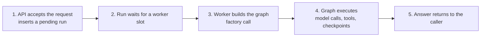
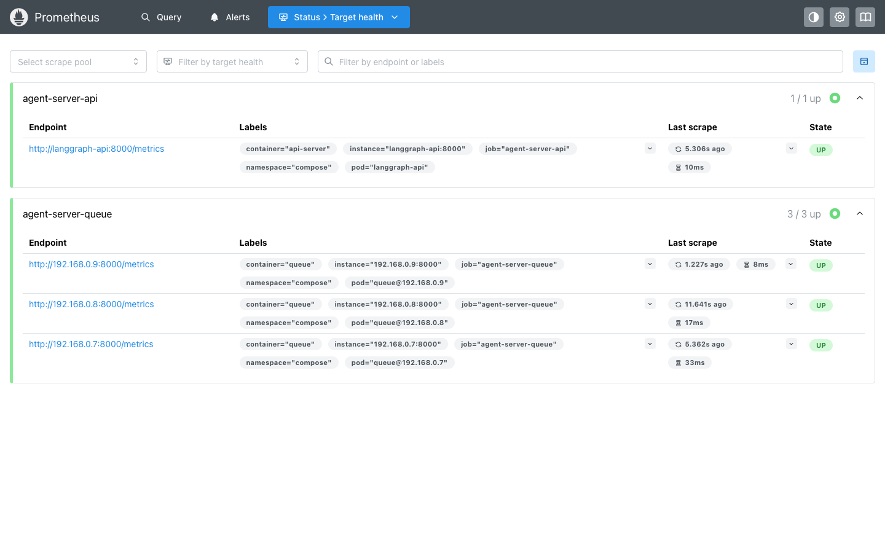
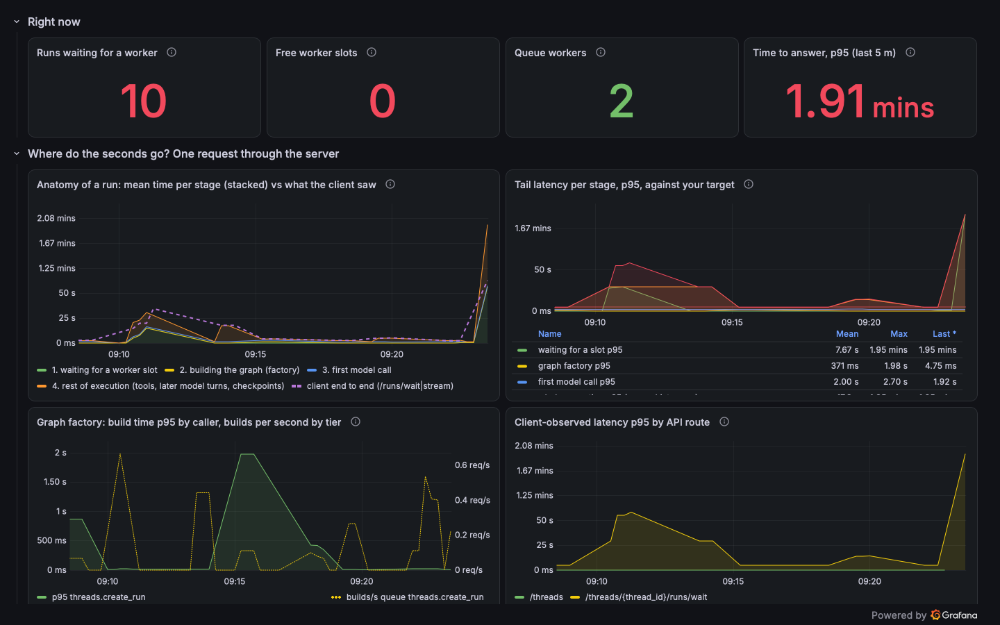

# 10. Performance deep dive: where the seconds go, shown live

## Why this matters

Sooner or later somebody asks the question every Agent Server team eventually asks: "it took a few
seconds, where did they go?" Module 06 gave you the two dials (request capacity and run capacity) and
module 09 gave you the names of the metrics. Neither shows you a single request broken into its
stages, and neither tells you how to find the *one* slow request a user is complaining about. This
module does both, and it does it live: the sample's split stack on Docker Compose with Prometheus
and Grafana next to it, a load generator that reproduces the three classic causes of slowness on
purpose, screenshots of what each one looks like, and the JSON log lines that give the exact
number for the exact request. The last section shows the same signals on Kubernetes.

Everything marked *captured* was run while writing this module, on `langgraph-api` 0.14.2 from the
`langchain/langgraph-api:3.12-wolfi` base image, with one to three worker containers. The captures
come from one working session but not in the order presented, so timestamps do not always increase
from one part to the next. Log lines are in UTC; the Grafana screenshots show the browser's local
time, four hours behind, so 13:24 in a log line is 09:24 on a chart. The wording "a few seconds" is
deliberate: your target is yours; the dashboard's threshold line is a placeholder you set to your
own SLO.

## One request, five stages, and what measures each

A `POST /threads/{id}/runs/wait` call goes through five stages before the caller gets an answer
([the run lifecycle, module 06](./06-runtime-and-tuning.md#the-run-lifecycle-in-five-steps)):



Each stage has a number, but not all of them come from the server:

| Stage | Where the time goes | Metric (milliseconds) | Tier | A bad number means |
| --- | --- | --- | --- | --- |
| 1 | Request handling | `lg_api_http_requests_total{path,status}`, `lg_api_http_requests_latency{path}` | api-server | 5xx or slow non-run routes: the API tier, Postgres or Redis, not the agent |
| 2 | Waiting for a slot | `lg_api_run_queue_wait_time_1st_attempt` | queue | Workers are notified through Redis the moment a run is created, so a wait beyond tens of milliseconds means every slot was busy. It is a capacity problem, not a polling delay |
| 3 | Building the graph | **No server metric.** The server logs a warning above 100 ms and an error above 250 ms. The sample records `agent_graph_factory_duration_ms` itself | queue for runs; api-server for schema and state reads | Per-run work in the factory that should happen once per process ([the graph factory](#the-graph-factory)) |
| 4 | Whole execution | `lg_api_run_execution_latency{status}` | queue | Includes 3 and 4a plus tools, later turns and checkpoint writes; rises alone when tools or checkpoints are slow |
| 4a, inside 4 | Model calls | **No server metric.** The sample records `agent_model_call_duration_ms{first}` | queue | Provider latency or rate limiting; retriable failures next to it point at 429s |
| 5 | What the caller experienced | `lg_api_http_requests_latency{path=~".*/runs/(wait\|stream)"}` | api-server | These routes hold the connection for the whole run, so this is the end-to-end number |
| outcome | | `lg_api_run_success_counter_total`, `lg_api_run_failed_retriable_counter_total`, `lg_api_run_failed_after_retry_counter_total`, `lg_api_run_canceled_by_request_counter_total`, `lg_api_run_abandoned_by_shutdown_counter_total` | queue | Failed after retry: the agent errored on every attempt. Abandoned: a pod stopped before its grace period |

Two more groups of metrics tell you *why*: the capacity gauges `lg_api_num_pending_runs` and
`lg_api_num_running_runs` exist only on the **api-server**, while `lg_api_workers_max`,
`lg_api_workers_active` and `lg_api_workers_available` exist only on each **queue** worker
(`workers_max` equals `N_JOBS_PER_WORKER`). The pool gauges `lg_api_pg_pool_*` and
`lg_api_redis_pool_*` are on both. Histograms keep their bare name with `_bucket`, `_sum` and
`_count` suffixes; counters end in `_total`.

Stage 3 is the one teams miss. The server has no metric for it, build time is folded into stage 4,
and if your graph is a factory (module 02 recommended one) it runs on every single run. That is why
the sample's `perf` graph times its own factory and why this module spends a section on it.

**What only tracing shows.** There is no server metric for time to first token. LangSmith tracing
gives it per run for streamed runs (`/runs/stream`; a `/runs/wait` call has no first token), plus
per-node, per-model-call and per-tool durations. Set `LANGSMITH_ENDPOINT`, `LANGSMITH_TRACING` and a
**workspace-scoped** API key on both tiers ([module 09](./09-operations.md#traces-to-your-self-hosted-langsmith)).
An org-scoped key is accepted at startup but every trace batch is rejected with
`LangSmithUserError: This API key is org-scoped and requires workspace specification` unless
`LANGSMITH_WORKSPACE_ID` is also set; the rejections show up as `langsmith.client` warnings in the
queue logs, so check for them once after enabling tracing (a filter for that is in the hands-on).

## Turning the numbers on

### Two environment variables, on both tiers

`GET /metrics` is served on the main HTTP port (8000) by **both** the api-server process and each
queue worker process, without authentication. It always carries the base set (HTTP requests, pool
gauges, pending and running counts, worker slots). Two variables complete it, and a third is optional:

| Variable | Value | Effect |
| --- | --- | --- |
| `EXPOSE_INTERNAL_METRICS_PROMETHEUS` | `true` | Adds the run-lifecycle series: queue wait, execution latency, run outcomes, stream publish latency ([metrics page](https://docs.langchain.com/langsmith/self-hosted-agent-server-metrics)). The default emitting tier already covers everything in this module, so `METRIC_MAX_EMITTING_TIER` can stay unset |
| `LOG_JSON` | `true` | One JSON object per log line with `event`, `level`, `logger`, `timestamp` and the run context (`run_id`, `thread_id`, `assistant_id`, `graph_id`, `run_attempt`). Required for the per-run record below |
| `PROMETHEUS_DISABLE_CREATED_SERIES` | `true` | Optional. A `prometheus_client` setting, not a LangChain one: suppresses the `*_created` companion series of the sample's own histograms ([client_python](https://prometheus.github.io/client_python/instrumenting/)) |

The variables must be identical on the two tiers. On Compose,
[`sample/docker-compose.observability.yml`](../sample/docker-compose.observability.yml) adds them to
both server services; on Kubernetes, [`sample/helm/values-metrics.yaml`](../sample/helm/values-metrics.yaml)
puts them in `extraEnv` under both `apiServer.deployment` and `queue.deployment` through one YAML
anchor, because the chart has no shared environment block.

Two facts save a detour: the separate metrics port (`LSD_PROM_METRICS_PORT`, 9464) mentioned in an
older changelog does not exist in shipped servers, everything is on `/metrics`; and the server's
OpenTelemetry metrics pipeline is private to the server, so agent code cannot add metrics through
`opentelemetry.metrics.get_meter()`. The sample uses `prometheus_client` instead (see
[the graph factory](#the-graph-factory)).

### Scraping both tiers

The queue tier has **no Service** in the chart and no Compose port either, so anything that scrapes
"the API endpoint" sees half the picture: the api-server exposes pending and running counts, never
the worker slots. You need one target per worker process.

On Compose, [`sample/observability/prometheus.yml`](../sample/observability/prometheus.yml) uses two
jobs. The API is one static target. The workers are discovered through Compose's DNS: the bare
service name `langgraph-queue` resolves to one A record per replica, so a `dns_sd_configs` job with
`type: A` finds every worker and follows `--scale` changes at each refresh:

```yaml
  - job_name: agent-server-queue
    metrics_path: /metrics
    dns_sd_configs:
      - names: ["langgraph-queue"]
        type: A
        port: 8000
        refresh_interval: 15s
    relabel_configs:
      - target_label: container
        replacement: queue
      - target_label: namespace
        replacement: compose
      - source_labels: [__address__]
        regex: "([^:]+):.*"
        target_label: pod
        replacement: "queue@$1"
```

The `container`, `namespace` and `pod` labels are set on purpose to match what a PodMonitor produces
on Kubernetes (container name, namespace, pod name). That is what makes the dashboard JSON portable:
every query filters on `container="queue"` or `container="api-server"` and on `namespace="$namespace"`,
and those labels mean the same thing on a laptop and in a cluster. On Kubernetes the equivalent is
[`sample/helm/podmonitor.yaml`](../sample/helm/podmonitor.yaml), which selects the chart's own pod
label `app.kubernetes.io/instance=<release>` and its two named container ports, `api-server` and
`queue`. (Azure Managed Prometheus accepts the same object under `apiVersion: azmonitoring.coreos.com/v1`;
an annotation-based scraper can use `deployment.annotations` on both tiers instead, since the chart
copies them onto the pod template.)

### The dashboard

[`sample/observability/grafana/dashboards/agent-server-lifecycle.json`](../sample/observability/grafana/dashboards/agent-server-lifecycle.json)
is provisioned into the folder "Agent Server" by the Compose overlay and works unchanged against a
Kubernetes Prometheus that scrapes through the PodMonitor. Five rows:

| Row | Panels | Question it answers |
| --- | --- | --- |
| Right now | runs waiting, free slots, queue workers, time to answer p95 | Is anything wrong this minute? |
| Where do the seconds go? | anatomy of a run (mean per stage, stacked, against the client line), tail latency per stage p95, graph factory build time, client latency by route | Which stage dominates? |
| Capacity | queue depth vs worker capacity, slots per worker | Is the queue the bottleneck? |
| Outcomes | run outcomes per second, API requests by status | Are runs and requests succeeding? |
| Health | Postgres pool per process, queued connection requests | Is the server starved before the agent is? |

The queries behind the two panels you will use most:

```promql
# tail latency per stage, p95 in ms (one panel, one line each)
histogram_quantile(0.95, sum by (le) (rate(lg_api_run_queue_wait_time_1st_attempt_bucket{container="queue"}[5m])))
histogram_quantile(0.95, sum by (le) (rate(agent_graph_factory_duration_ms_bucket{container="queue", access_context="threads.create_run"}[5m])))
histogram_quantile(0.95, sum by (le) (rate(agent_model_call_duration_ms_bucket{container="queue", first="true"}[5m])))
histogram_quantile(0.95, sum by (le) (rate(lg_api_run_execution_latency_bucket{container="queue"}[5m])))
histogram_quantile(0.95, sum by (le) (rate(lg_api_http_requests_latency_bucket{container="api-server", path=~".*/runs/(wait|stream)"}[5m])))

# capacity: free slots across all workers, and the backlog
sum(lg_api_workers_available{container="queue"})
sum(lg_api_num_pending_runs{container="api-server"})
```

## Hands-on, part 1: the stack, both tiers scraped

Build the sample image (module 07's pipeline script, which regenerates the Dockerfile from
`langgraph.json` so the new `perf` graph is included) and start the split stack with the overlay.
Copy [`sample/my-agent/.env.example`](../sample/my-agent/.env.example) to `sample/.env` and fill it in
(module 02, step 5): Compose reads the `.env` next to the first Compose file, not the one inside
`my-agent/`. From that file or from your shell it takes `LANGSMITH_API_KEY`,
`LANGGRAPH_CLOUD_LICENSE_KEY`, `MODEL`, `OPENAI_API_KEY` and, for a self-hosted LangSmith,
`LANGSMITH_ENDPOINT`:

```bash
cd sample
IMAGE_TAG=dev ./pipeline/build.sh
docker compose -f docker-compose.split.yml -f docker-compose.observability.yml \
  -p agent-server-perf up -d --scale langgraph-queue=2
curl -s localhost:8124/ok
```

Captured, once the API had run its migrations and all containers were healthy (uptime column trimmed):

```
$ docker compose -p agent-server-perf ps --format 'table {{.Service}}\t{{.Status}}'
SERVICE              STATUS
grafana              Up
langgraph-api        Up (healthy)
langgraph-postgres   Up (healthy)
langgraph-queue      Up (healthy)
langgraph-queue      Up (healthy)
langgraph-redis      Up (healthy)
prometheus           Up

$ curl -s localhost:8124/info | jq -c '{version, langgraph_py_version}'
{"version":"0.14.2","langgraph_py_version":"1.2.12"}

$ curl -s localhost:8124/metrics | grep -E '^lg_api_(workers|num_pending|num_running)' | sed 's/{[^}]*}//'
lg_api_num_pending_runs 0.0
lg_api_num_running_runs 0.0
```

The API tier reports pending and running counts and **no** `lg_api_workers_*` series at all: it has
`N_JOBS_PER_WORKER=0`. The same request inside a worker container (the workers have no host port, so
go through `docker compose exec`) shows the other half. This one was captured later in the session,
after 51 runs, which is why the two `_count` lines are not zero:

```
$ docker compose -p agent-server-perf exec -T --index 1 langgraph-queue \
    python -c 'import urllib.request; print(urllib.request.urlopen("http://localhost:8000/metrics").read().decode())' \
  | grep -E '^(lg_api_workers|lg_api_run_queue_wait_time_1st_attempt_count|agent_graph_factory_duration_ms_count)' | sed 's/{[^}]*}//'
lg_api_run_queue_wait_time_1st_attempt_count 51.0
lg_api_workers_max 10.0
lg_api_workers_active 0.0
lg_api_workers_available 10.0
agent_graph_factory_duration_ms_count 51.0
```

Prometheus sees all of it. Its target page lists one static API target and one discovered target
per worker, each carrying the `container`, `namespace` and `pod` labels the dashboard filters on
(captured after part 3, when a third worker had been added):



Grafana is at `http://localhost:3000` (anonymous read-only access, folder "Agent Server"). Every
Grafana screenshot below was taken at 1440×900 in kiosk mode with the time picker hidden
(`?kiosk&_dash.hideTimePicker=true&_dash.hideVariables=true&_dash.hideLinks=true&from=now-15m&to=now`).

## Hands-on, part 2: a baseline you can read three ways

[`sample/loadgen.py`](../sample/loadgen.py) creates threads and runs against the `perf` assistant
and reports client-side latency. Five concurrent chat turns are enough for a baseline (run it from
the `sample` folder, where part 1 left you):

```bash
uv run --project my-agent python loadgen.py --runs 5 --concurrency 5 -v
```

Captured:

```
chat: 5 runs, concurrency 5, wait → http://localhost:8124 assistant=perf
  run 1:   2.49s  thread=01a0c947-8b87-...  'The current time is 2026-09-22T13:21:45+00:00, and the worker answering is 42b0779ed34b.'
  run 3:   2.49s  thread=01a0c947-8b93-...  'The current UTC time is 2026-09-22T13:21:45, and the worker answering is worker 42b0779ed3'
  run 2:   2.57s  thread=01a0c947-8b8f-...  'The current UTC time is 2026-09-22T13:21:45 and the worker answering is 42b0779ed34b.'
  run 4:   2.63s  thread=01a0c947-8b92-...  'It is 2026-09-22T13:21:45+00:00 UTC, and the worker answering is 42b0779ed34b.'
  run 0:   2.87s  thread=01a0c947-8b8a-...  'The current UTC time is 2026-09-22T13:21:45 and the worker answering is 42b0779ed34b.'
done in 2.9s: 5/5 ok, 0 failed, 1.74 runs/s
latency  p50 2.57s  p95 2.82s  max 2.87s
```

That is reading number one: what the client saw. Reading number two is the **per-run record** every
worker writes when a run finishes. With `LOG_JSON=true` it is one JSON line whose fields split the
client's seconds into the stages:

| Field | Meaning |
| --- | --- |
| `event` | `Background run succeeded` or `Background run failed…` |
| `run_wait_time_ms` | run created → picked up by a worker (stage 2) |
| `run_exec_ms` | picked up → finished (stages 3 and 4) |
| `run_completed_in_ms` | measured from the moment the HTTP request arrived: the true end to end |
| `run_id`, `thread_id`, `assistant_id`, `graph_id`, `run_attempt` | join keys; `run_attempt > 1` means a retry happened |

`docker compose logs` plus `jq` is enough to read it; no log stack is required. `fromjson?` skips
the few non-JSON start-up lines:

```bash
docker compose -p agent-server-perf logs langgraph-queue --no-log-prefix --since 15m \
  | jq -Rc 'fromjson? | select((.event // "") | startswith("Background run"))
            | {t: .timestamp, event, thread_id, attempt: .run_attempt,
               wait_ms: .run_wait_time_ms, exec_ms: .run_exec_ms, total_ms: .run_completed_in_ms}'
```

Captured, the five runs above:

```
{"t":"2026-09-22T13:21:46.770742Z","event":"Background run succeeded","thread_id":"01a0c947-8b87-...","attempt":1,"wait_ms":44,"exec_ms":2359,"total_ms":2409}
{"t":"2026-09-22T13:21:46.772954Z","event":"Background run succeeded","thread_id":"01a0c947-8b93-...","attempt":1,"wait_ms":41,"exec_ms":2365,"total_ms":2412}
{"t":"2026-09-22T13:21:46.855485Z","event":"Background run succeeded","thread_id":"01a0c947-8b8f-...","attempt":1,"wait_ms":42,"exec_ms":2449,"total_ms":2496}
{"t":"2026-09-22T13:21:46.913427Z","event":"Background run succeeded","thread_id":"01a0c947-8b92-...","attempt":1,"wait_ms":47,"exec_ms":2498,"total_ms":2552}
{"t":"2026-09-22T13:21:47.151013Z","event":"Background run succeeded","thread_id":"01a0c947-8b8a-...","attempt":1,"wait_ms":19,"exec_ms":2767,"total_ms":2792}
```

So a "2.5-second" chat turn is 20 to 50 ms of waiting for a slot and 2.4 to 2.8 s of execution, and
the client's number is within 100 ms of `run_completed_in_ms`. Where inside execution? The sample's
factory logs its own line, `graph_factory_built`, with the build time. Keep the log prefix this time
to see which container built it; the `sed` turns Compose's `container-name | ` prefix into a tab so
that `jq` can split the container name off the JSON:

```bash
docker compose -p agent-server-perf logs langgraph-queue --since 15m \
  | sed -E 's/^([^|]+)\| /\1\t/' \
  | jq -Rc 'split("\t") | (.[0]|gsub("^ +| +$";"")) as $c | (.[1]|fromjson?)
            | select(.event == "graph_factory_built") | {t: .timestamp, container: $c, build_ms: .duration_ms, access_context}'
```

Captured:

```
{"t":"2026-09-22T13:21:44.404357Z","container":"langgraph-queue-1","build_ms":16.5,"access_context":"threads.create_run"}
{"t":"2026-09-22T13:21:44.409699Z","container":"langgraph-queue-1","build_ms":1.6,"access_context":"threads.create_run"}
{"t":"2026-09-22T13:21:44.411324Z","container":"langgraph-queue-1","build_ms":1.2,"access_context":"threads.create_run"}
{"t":"2026-09-22T13:21:44.414127Z","container":"langgraph-queue-1","build_ms":1.5,"access_context":"threads.create_run"}
{"t":"2026-09-22T13:21:44.422653Z","container":"langgraph-queue-1","build_ms":2.3,"access_context":"threads.create_run"}
```

Single-digit milliseconds: a warm factory is negligible, and the rest of execution is the model
(two calls per turn here, one to decide on the `worker_id` tool and one to phrase the answer). Reading
number three is the dashboard, which turns the same histograms into the stacked "anatomy" view; the
overview screenshot at the end of part 4 shows it after all the scenarios.

## Hands-on, part 3: saturate the queue, then add a worker

Module 06 says run capacity is `workers × N_JOBS_PER_WORKER`. Two workers at the Compose file's
`N_JOBS_PER_WORKER=10` give 20 slots. Send 30 runs that each hold a slot for a minute (the `io`
scenario makes the agent call its `wait_for` tool, which sleeps without using CPU; the tool clamps at
60 s):

```bash
uv run --project my-agent python loadgen.py --scenario io --seconds 60 --runs 30 --concurrency 30
```

Twenty runs start at once and ten must wait for the first slot to free up. Captured about 80 s in,
the "Right now" row says exactly that, and the time-to-answer tile has jumped from seconds to
minutes:



The instant values behind the tiles, from the Prometheus API at the same moment:

```
free slots 0, active 20, pending 10, running 20
```

When the burst is over, the per-run records show the split precisely. Percentiles computed from the
log lines (this is what the coarse histogram buckets cannot give you):

```bash
docker compose -p agent-server-perf logs langgraph-queue --no-log-prefix --since 5m \
  | jq -Rs '[split("\n")[] | fromjson? | select((.event // "") | startswith("Background run"))]
            | {runs: length,
               wait_ms:  ([.[].run_wait_time_ms]    | sort | {p50: .[(length*0.5|floor)], p95: .[(length*0.95|floor)], max: .[-1]}),
               exec_ms:  ([.[].run_exec_ms]         | sort | {p50: .[(length*0.5|floor)], p95: .[(length*0.95|floor)], max: .[-1]}),
               total_ms: ([.[].run_completed_in_ms] | sort | {p50: .[(length*0.5|floor)], p95: .[(length*0.95|floor)], max: .[-1]})}'
```

Captured:

```
{"runs":30,
 "wait_ms":  {"p50":639,   "p95":62733,  "max":62733},
 "exec_ms":  {"p50":62292, "p95":62820,  "max":62876},
 "total_ms": {"p50":62944, "p95":124784, "max":125096}}
```

Execution is the same for every run (about 62 s: the 60 s sleep plus two model calls). Waiting is
bimodal: 20 runs were picked up within 0.7 s, 10 waited 62 to 63 s for a slot, and those 10 took
twice as long end to end. The ten slowest runs, which is how you would find the users who
complained:

```bash
docker compose -p agent-server-perf logs langgraph-queue --no-log-prefix --since 5m \
  | jq -Rs '[split("\n")[] | fromjson? | select((.event // "") | startswith("Background run"))]
            | sort_by(.run_completed_in_ms) | reverse | .[:10][]
            | {t: .timestamp, thread_id, wait_ms: .run_wait_time_ms, exec_ms: .run_exec_ms, total_ms: .run_completed_in_ms}' -c
```

```
{"t":"2026-09-22T13:24:15.972734Z","thread_id":"01a0c947-f310-...","wait_ms":62733,"exec_ms":62355,"total_ms":125096}
{"t":"2026-09-22T13:24:15.662267Z","thread_id":"01a0c947-f302-...","wait_ms":62521,"exec_ms":62257,"total_ms":124784}
{"t":"2026-09-22T13:24:15.577450Z","thread_id":"01a0c947-f302-...","wait_ms":62733,"exec_ms":61960,"total_ms":124700}
...
```

A run whose `wait_ms` is large while `exec_ms` is normal waited for a slot. The lever is capacity:
more slots per worker (IO-bound agents like this one tolerate a high `N_JOBS_PER_WORKER`) or more
workers. Add a worker and send the identical burst:

```bash
docker compose -f docker-compose.split.yml -f docker-compose.observability.yml \
  -p agent-server-perf up -d --scale langgraph-queue=3 --no-recreate
uv run --project my-agent python loadgen.py --scenario io --seconds 60 --runs 30 --concurrency 30
```

Captured, the same percentile query afterwards:

```
{"runs":30,
 "wait_ms":  {"p50":51,    "p95":609,   "max":615},
 "exec_ms":  {"p50":62253, "p95":62659, "max":62967},
 "total_ms": {"p50":62409, "p95":63071, "max":63206}}
```

Thirty slots, thirty runs, nobody waits, and the client's p95 halves from 125 s to 63 s while
execution did not move at all. The capacity panel shows both bursts and the step in capacity between
them. The dashed capacity line also moves earlier in the window: those are the restart and the
re-scaling of parts 5 and 6, which were captured before this burst:


Two things this exercise teaches about the gauges. First, the server refreshes `lg_api_workers_*`
and `lg_api_num_pending_runs` from an internal collector **once a minute** (its "Worker stats" log
line lands at the same second every minute). A burst shorter than that can leave no trace in the
gauges at all: an earlier 35-second version of this burst was completely invisible to them while the
queue-wait histogram still recorded a p95 of 27 s. Gauges are for sustained conditions and alerting;
histograms and the per-run records see every run. Second, `wait_ms` of a few hundred milliseconds
right after a scale-out is normal: the fresh worker's first pickup pays for its first, cold graph
build (part 5).

## Hands-on, part 4: the slow factory

The `perf` factory accepts `factory_delay_ms` in `config.configurable` and sleeps that long, but only
while executing a run (schema reads on the API tier stay fast). It stands in for a factory that does
per-run work: loading tools, connecting to an MCP server, fetching a prompt, constructing a cloud
credential. Send five runs with a 1.5 s delay:

```bash
uv run --project my-agent python loadgen.py --runs 5 --concurrency 5 --configurable factory_delay_ms=1500 -v
```

Captured: `latency p50 4.31s p95 4.41s max 4.43s`, up from 2.57 s in the baseline. The client sees
a slow agent; nothing in the server's own histograms says why, because build time is inside
`lg_api_run_execution_latency`. Two things do say why. The server logs every slow graph load:

```bash
docker compose -p agent-server-perf logs langgraph-queue --no-log-prefix --since 5m \
  | jq -Rc 'fromjson? | select(.elapsed_ms != null) | {t: .timestamp, level, elapsed_ms, graph_id, run_id, msg: (.event|.[0:110])}'
```

```
{"t":"2026-09-22T13:26:46.755569Z","level":"error","elapsed_ms":1516.38,"graph_id":"perf","run_id":"01a0c94c-22d7-...","msg":"Slow graph load. Accessing graph 'perf' took 1516.38ms. Move expensive initialization (API clients, DB connections, model loading) from graph factory if you are seeing API slowness."}
```

and the sample's own histogram puts the build on the dashboard, p95 by access context on the left
axis and builds per second on the right:


The per-thread timeline is the most convincing view. Everything the workers logged about one
conversation, in time order, with both the run record and the build lines. Two log shapes share the
stream (the Python server and the sample log `timestamp` and `event`; the Go runtime component that
manages run and thread status logs `time` and `_msg`), so the query reads both:

```bash
T=01a0c94c-22bf-7641-b65c-d86b82baca96      # from the client's output or the run creation response
docker compose -p agent-server-perf logs langgraph-queue --no-log-prefix --since 5m \
  | jq -Rc --arg t $T 'fromjson? | select(.thread_id == $t)
            | {t: (.timestamp // .time), level, event: ((.event // ._msg // "") | .[0:80]),
               wait_ms: .run_wait_time_ms, exec_ms: .run_exec_ms, total_ms: .run_completed_in_ms, build_ms: .duration_ms, elapsed_ms}' | sort
```

Captured (the model client's own `HTTP Request` lines are the OpenAI SDK logging its calls; the
endpoint is elided):

```
{"t":"2026-09-22T13:26:45.229043Z","level":"info","event":"Dequeued run for background worker", ...}
{"t":"2026-09-22T13:26:45.233507Z","level":"info","event":"Starting background run", ...}
{"t":"2026-09-22T13:26:46.755286Z","level":"info","event":"graph_factory_built", ..., "build_ms":1516.0}
{"t":"2026-09-22T13:26:46.755569Z","level":"error","event":"Slow graph load. Accessing graph 'perf' took 1516.38ms. Move expensive initializ", ..., "elapsed_ms":1516.38}
{"t":"2026-09-22T13:26:47.942286Z","level":"info","event":"HTTP Request: POST https://<model endpoint>/v1/chat/completions", ...}
{"t":"2026-09-22T13:26:49.066022Z","level":"info","event":"HTTP Request: POST https://<model endpoint>/v1/chat/completions", ...}
{"t":"2026-09-22T13:26:49.079875Z","level":"info","event":"Background run succeeded","wait_ms":16,"exec_ms":3848,"total_ms":3873, ...}
{"t":"2026-09-22T13:26:49.081697254Z","level":"INFO","event":"Successfully set joint status", ...}
```

Read top to bottom: picked up 16 ms after creation, 1.5 s building the graph (the sample's number and
the server's number agree to the millisecond), 1.2 s until the first model call returned, a second
model call, done at 3.87 s. Without the two build lines, this looks like a slow model. On the
dashboard the same story is the yellow "graph factory" line in the tail-latency panel and the 2 s
spike in the factory panel above. In the stacked anatomy panel the 1.5 s build is a hairline once
the axis has stretched to fit the two-minute bursts, which is a lesson in itself: a stage that
dominates one *request* can vanish in a chart dominated by another *scenario*. Both panels over the
whole session:


A note on reading p95 lines. A histogram only counts how many observations fell between fixed
bucket edges, and `histogram_quantile` draws a straight line inside the bucket that holds the 95th
percentile. The server's edges are coarse (10, 100, 500, 1000, 5000, 15000, 30000, 60000, 120000,
300000 ms and up, the same for queue wait, execution and HTTP latency), and two consequences are
visible in the screenshot. Whole execution reads "2 minutes" because the 62 s runs sit in the 60 s to
120 s bucket. The client line spikes to almost 5 minutes because the slowest requests took 125 s,
just inside the 120 s to 300 s bucket, so the line is drawn near that bucket's top; no request took
five minutes. The sample's histograms have finer edges but behave the same way: the first-model-call
line reads 2 s while the timeline above showed 1.2 s, because the calls fell in the 1 s to 2 s
bucket. Use the panels to see *which* stage moved and when; use the per-run records for the exact
number.

## Hands-on, part 5: cold versus warm

Restart the workers and send two rounds of three runs:

```bash
docker compose -p agent-server-perf restart langgraph-queue
uv run --project my-agent python loadgen.py --runs 3 --concurrency 3
uv run --project my-agent python loadgen.py --runs 3 --concurrency 3
```

Captured with the three `jq` programs from parts 2 and 4, on an earlier pass of the session when
three workers were running (hence the earlier timestamps): the factory lines per container, then the
server's slow-graph lines, then the per-run totals:

```
{"t":"2026-09-22T13:17:31.709880Z","container":"langgraph-queue-3","build_ms":328.9}
{"t":"2026-09-22T13:17:31.717763Z","container":"langgraph-queue-2","build_ms":340.2}
{"t":"2026-09-22T13:17:31.719279Z","container":"langgraph-queue-1","build_ms":350.9}
{"t":"2026-09-22T13:17:35.011126Z","container":"langgraph-queue-3","build_ms":3.8}
{"t":"2026-09-22T13:17:35.012293Z","container":"langgraph-queue-1","build_ms":6.9}
{"t":"2026-09-22T13:17:35.018924Z","container":"langgraph-queue-3","build_ms":6.3}

{"t":"2026-09-22T13:17:31.709997Z","level":"error","elapsed_ms":330.2}
{"t":"2026-09-22T13:17:31.719433Z","level":"error","elapsed_ms":351.87}
{"t":"2026-09-22T13:17:31.717919Z","level":"error","elapsed_ms":341.39}

{"t":"2026-09-22T13:17:34.138129Z","wait_ms":13,"exec_ms":2770,"total_ms":2788}     # round 1
{"t":"2026-09-22T13:17:34.439510Z","wait_ms":12,"exec_ms":3079,"total_ms":3099}
{"t":"2026-09-22T13:17:34.712948Z","wait_ms":22,"exec_ms":3336,"total_ms":3363}
{"t":"2026-09-22T13:17:37.159344Z","wait_ms":5,"exec_ms":2155,"total_ms":2165}      # round 2
{"t":"2026-09-22T13:17:37.254517Z","wait_ms":7,"exec_ms":2248,"total_ms":2259}
{"t":"2026-09-22T13:17:37.607652Z","wait_ms":12,"exec_ms":2596,"total_ms":2612}
```

The first build in each fresh process took 330 to 350 ms, enough to trip the server's error
threshold on every one of the three workers, and the first run on each worker was half a second
slower end to end. The very first build of the session, in a container that had never imported the
model client, took 572 ms (not shown). From the second call on, builds take single-digit milliseconds: that is a
*warm* factory. The imports, the tool objects and the model client's module-level state are paid for
once per process, and the factory only assembles them. The operational consequences: on Kubernetes,
every scale-out or rollout puts cold pods on the hot path (expect one slow-graph line per fresh pod,
and keep `minReplicas` above one so a burst does not land entirely on cold pods); in the factory,
anything that can be built at import time should be, so that the cold cost is paid at start-up,
before the readiness probe passes, rather than on the first user's request.

## Hands-on, part 6: blocking code

Module 03 and module 06 insist on asynchronous graph code. The `perf` graph has a deliberately
synchronous, CPU-bound tool (`crunch_numbers`, a naive Fibonacci) to show why. Scale to one worker
so all runs share one event loop, then compare six concurrent CPU-bound runs with six concurrent
IO-bound runs:

```bash
docker compose -f docker-compose.split.yml -f docker-compose.observability.yml \
  -p agent-server-perf up -d --scale langgraph-queue=1 --no-recreate
uv run --project my-agent python loadgen.py --scenario cpu --n 34 --runs 6 --concurrency 6
uv run --project my-agent python loadgen.py --scenario io --seconds 3 --runs 6 --concurrency 6
```

Captured `run_exec_ms`, in order of completion:

```
cpu (fib(34) ≈ 0.45 s of pure Python each):   4110  4367  4361  4459  4574  4994
io  (a 3 s asyncio.sleep each):               5095  5167  5148  5362  5375  5594
```

Both scenarios have two model calls (about 2.3 s). The six sleeps overlapped perfectly: 3 s of sleep
plus the model calls, all six finishing together. The six CPU-bound runs did not: each one's
execution grew by roughly the sum of the *other* runs' CPU time, because a synchronous tool holds
the worker's event loop and every other run on that worker, including their in-flight model
responses, waits for it. The signature to look for in production: execution latency high, worker
CPU at its limit, and `workers_active` well below `workers_max`, so the slots are not the constraint,
the one Python thread is. The fix is in the code (`asyncio.to_thread` for CPU work,
async drivers and clients), not in the knobs; more slots on that worker make it worse, and
`BG_JOB_ISOLATED_LOOPS` is a stopgap, not a fix ([module 06](./06-runtime-and-tuning.md#keep-graph-code-asynchronous)).

The overview of the whole session, captured with three workers:


Scale back to two workers (`--scale langgraph-queue=2`) before repeating any part.

## Diagnosis: the stage that dominates, and the lever

| Dominant stage | Meaning | Levers |
| --- | --- | --- |
| Waiting for a slot | Not enough run slots for the arrival rate | `N_JOBS_PER_WORKER` (slots per worker; also the KEDA target per replica), queue replicas or KEDA on pending runs. One running run per thread. IO-bound agents tolerate a high slot count; CPU-bound agents do not |
| Building the graph | The factory does per-run work | [The graph factory](#the-graph-factory) below |
| First model call | The provider | 429s: the OpenAI client retries with back-off (six attempts in the sample, about 35 s) before the server sees a failure, so a rate-limited run looks like a 35-second run that then fails after retry. Check quota, model choice and per-run client construction |
| Execution high, few slots active, worker CPU at its limit | Blocking code on the event loop | Part 6: `asyncio.to_thread`, async drivers, lower `N_JOBS_PER_WORKER` |
| Execution high with many small steps | Checkpoint writes | Every node writes a checkpoint; large state means slow steps and Postgres pool pressure. Trim state, watch `lg_api_pg_pool_*` |
| Client time high, every stage small | API tier or datastores | 5xx rate, `lg_api_pg_pool_requests_queued_total`, Redis; `LANGGRAPH_POSTGRES_POOL_MAX_SIZE`, Postgres sizing |
| Runs abandoned on deploys or scale-in | Pod stopped before runs drained | Queue `terminationGracePeriodSeconds` above `BG_JOB_SHUTDOWN_GRACE_PERIOD_SECS` ([module 09](./09-operations.md#rollouts-and-graceful-shutdown)) |

Reference numbers from this module's stack (`gpt-4.1-mini` behind an OpenAI-compatible endpoint,
three tools, two model calls per turn): queue wait 20 to 50 ms when a slot is free, warm graph build
1 to 7 ms, cold build 330 to 570 ms, first model call about 1.2 s, a whole chat turn 2.4 to 2.8 s.
Your numbers will differ; the method does not. Baseline with a handful of realistic requests, change
one thing, replay the same requests, compare the per-stage numbers. A deliberate cause should move
exactly the stage it belongs to: the factory delay moved build, execution and client time by the same
1.5 s while queue wait stayed flat; the burst moved queue wait alone.

## The graph factory

### How the server calls it

If `langgraph.json` points at a function rather than a compiled graph, the server treats it as a
factory. At start-up it classifies the function by its **type annotations**: no parameters, one
parameter annotated `RunnableConfig`, or two parameters `config: RunnableConfig` and
`runtime: ServerRuntime` (from `langgraph_sdk.runtime`; `langgraph-api` 0.7.31 and `langgraph-sdk`
0.3.5 or newer). Both `def` and `async def` work
([rebuild graph at runtime](https://docs.langchain.com/langsmith/graph-rebuild)).

Then it calls the factory on **every** `get_graph()`, and it memoizes nothing:

- once per run, on the queue worker that executes it: `runtime.access_context == "threads.create_run"`,
  `runtime.execution_runtime` is set;
- for every schema and state read on the API tier (`assistants.read`, `threads.read`, `threads.update`,
  which includes the Studio graph view), with `execution_runtime` unset.

Three consequences. The returned graph must have the **same topology** in every context, because the
API tier's schema reads describe the graph the worker will run: fall back to defaults when a
configurable is missing or invalid, never drop a node. A **synchronous** factory body runs inline on
the event loop and blocks every other run on that worker while it executes: make it `async def`.
And because it runs per run, **anything that is not a function of the run's configuration belongs at
module scope**.

### What the sample does

[`sample/my-agent/src/my_agent/perf.py`](../sample/my-agent/src/my_agent/perf.py) is the factory this
module measured. The shape to copy:

```python
# module scope: built once per process
@tool
async def wait_for(seconds: int) -> str: ...        # clamped to 60 s
@tool
def crunch_numbers(n: int) -> str: ...              # clamped to fib(34); synchronous on purpose
@tool
def worker_id() -> str: ...
TOOLS = {"wait_for": wait_for, "crunch_numbers": crunch_numbers, "worker_id": worker_id}
SYSTEM_PROMPT = "..."

def _knobs(config: RunnableConfig) -> Knobs:
    # everything in config["configurable"] is caller-supplied: pattern-check the model string,
    # keep only known tool names (empty or invalid means all of them, so the topology never changes),
    # clamp factory_delay_ms to 0..5000
    ...

async def make_perf_agent(config: RunnableConfig, runtime: ServerRuntime):
    t0 = time.perf_counter()
    knobs = _knobs(config)
    executing = getattr(runtime, "execution_runtime", None) is not None
    if executing and knobs.factory_delay_ms:
        await asyncio.sleep(knobs.factory_delay_ms / 1000)   # the demo knob; awaited, execution only
    graph = create_agent(
        model=init_chat_model(knobs.model, max_retries=6),   # credentials from the environment only
        tools=[TOOLS[name] for name in knobs.tools],
        system_prompt=SYSTEM_PROMPT,
        middleware=[TimedModelCall()],
        name="perf",
    )
    elapsed_ms = (time.perf_counter() - t0) * 1000
    GRAPH_FACTORY_DURATION_MS.labels(graph_id=..., access_context=str(runtime.access_context)).observe(elapsed_ms)
    log.info("graph_factory_built", duration_ms=round(elapsed_ms, 1), access_context=..., executing=executing, ...)
    return graph
```

[`telemetry.py`](../sample/my-agent/src/my_agent/telemetry.py) holds the two histograms and the
middleware. `GET /metrics` on both tiers is `prometheus_client.generate_latest()` over the
process-global default registry, so a `Histogram` registered in your module is scraped next to the
server's own families with no exporter and no extra port. `TimedModelCall` is a `create_agent`
middleware that wraps every model call (`wrap_model_call` and `awrap_model_call`) and records it in
`agent_model_call_duration_ms` with `first="true"` when the last message is the human's, that is,
the first model turn of a run. The worker binds `run_id`, `thread_id`, `assistant_id` and `graph_id`
into the logging context **before** it calls the factory, so the `graph_factory_built` line carries
them automatically; that is what made the per-thread query in part 4 show `build_ms` right next to
`wait_ms` and `exec_ms`.

Three things to notice about what the timing tells you. `access_context` separates the two callers,
so you can alert on build time where it hurts (`threads.create_run`) and ignore Studio's schema
reads. `executing` is what gates the demo delay, and it is the right gate for any real per-run work:
the API tier's schema read must never pay for it. And the two numbers, the sample's `duration_ms` and
the server's `elapsed_ms`, agree to within a millisecond, which is your evidence that the server's
slow-graph line is measuring the same thing you are.

### Optimizations, in order of payoff

1. **Hoist everything config-independent to module scope.** Cloud credentials and token providers,
   HTTP clients, database pools, tool registries, embeddings, vector-store clients. A credential
   created inside the factory means a token exchange per run; a client created per run means a new
   connection pool and TLS handshake per run.
2. **Share one HTTP client across model instances.** `ChatOpenAI` and its Azure sibling accept
   `http_client` and `http_async_client`; pass one module-level `httpx.AsyncClient` so per-run model
   objects reuse connections.
3. **Cache compiled graphs when the configuration space is small.** Key on the tuple of configurables
   that change the graph (model, tool subset, prompt) and return the cached compiled graph. Build cost
   then moves to the first request per key. Do not cache anything that holds per-run state.
4. **Warm the first build.** Part 5 showed 330 to 570 ms cold against single-digit warm. Build the
   default graph once at import time, or keep `minReplicas` above one so scale-outs do not put cold
   pods on the hot path.
5. **No network I/O in the factory.** Prompts, tool definitions and tenant settings belong in a cache
   with a TTL, refreshed outside the request path. If it cannot be avoided, it must be awaited, never
   blocking.
6. **Validate and clamp configurables.** Everything in `config["configurable"]` is caller-supplied.
   Allowlist tool names, pattern-check model names, bound numeric knobs, cap prompt length, never log
   prompt text. (`_knobs` in the sample does exactly this, and its unit tests in
   [`tests/test_perf.py`](../sample/my-agent/tests/test_perf.py) pin the behaviour.)
7. **Keep model construction cheap and everything else shared.** Creating a `ChatOpenAI` object per
   run is fine (it is a thin wrapper) once the client, credentials and tools behind it are shared.

The server's own signal for all of this is the log line from part 4: a warning above 100 ms, an error
above 250 ms, fields `elapsed_ms`, `graph_id` and, when executing, `run_id`. Expect one per fresh
process (the cold build); a steady stream of them is a factory doing per-run work. An alert on the
sample's build p95 above 500 ms on `threads.create_run` catches regressions before users do
([`prometheusrule.yaml`](../sample/helm/prometheusrule.yaml) has it).

## The same signals on Kubernetes

Nothing above depends on Compose except the scrape config. On a chart install (module 07), three
files replace it:

- [`sample/helm/values-metrics.yaml`](../sample/helm/values-metrics.yaml): the two variables on both
  tiers, layered on `values-dev.yaml` and `values-split.yaml`. Rendered with `helm template`, both
  Deployments carry `LOG_JSON=true`, `EXPOSE_INTERNAL_METRICS_PROMETHEUS=true` and
  `PROMETHEUS_DISABLE_CREATED_SERIES=true`, the API with `N_JOBS_PER_WORKER=0` and the queue with `10`.
- [`sample/helm/podmonitor.yaml`](../sample/helm/podmonitor.yaml): scrapes ports `api-server` and
  `queue` on every pod with `app.kubernetes.io/instance: agent-server`. Prometheus Operator or Azure
  Managed Prometheus; for an annotation-based scraper, put `prometheus.io/scrape: "true"`,
  `prometheus.io/port: "8000"` and `prometheus.io/path: /metrics` in `deployment.annotations` of both
  tiers instead.
- [`sample/helm/prometheusrule.yaml`](../sample/helm/prometheusrule.yaml): the first five alerts, one
  per row of the diagnosis table: every slot busy with runs waiting, queue-wait p95 above 5 s,
  factory p95 above 500 ms, runs failing after retry or abandoned at shutdown, Postgres pool requests
  queueing. They match the "suggested first alerts" in module 09.

```bash
helm upgrade -i agent-server langchain/langgraph-cloud --version 0.3.4 -n agent-server \
  -f helm/values-dev.yaml -f helm/values-split.yaml -f helm/values-metrics.yaml
kubectl -n agent-server apply -f helm/podmonitor.yaml -f helm/prometheusrule.yaml
```

Point Grafana at the cluster's Prometheus and import the same dashboard JSON; the `namespace`
variable lists the namespaces where `lg_api_workers_max` is scraped. With KEDA on the queue tier
([module 07](./07-standalone-helm-deploy.md#autoscaling-hpa-or-keda)), the capacity line on the
"Queue depth vs worker capacity" panel steps up on its own when pending runs exceed
`N_JOBS_PER_WORKER` per replica.

The per-run record is read the same way, with `kubectl logs` in place of `docker compose logs`.
Queue pods carry the chart labels `app.kubernetes.io/instance=<release>` and
`app.kubernetes.io/component=<fullname>-queue`, where the full name is `<release>-langgraph-cloud`
unless you set `fullnameOverride`, so one selector covers every replica. `--tail=-1` lifts the
10-line default that applies when selecting by label:

```bash
NS=agent-server; Q="app.kubernetes.io/component=agent-server-langgraph-cloud-queue"

# one line per finished run
kubectl -n $NS logs -l $Q --since=1h --tail=-1 \
  | jq -Rc 'fromjson? | select((.event // "") | startswith("Background run"))
            | {t: .timestamp, event, thread_id, attempt: .run_attempt,
               wait_ms: .run_wait_time_ms, exec_ms: .run_exec_ms, total_ms: .run_completed_in_ms}'

# exact percentiles, the ten slowest, one thread's timeline, the slow-graph lines: the same jq
# programs as the Compose sections, with the kubectl command in front

# after enabling tracing: no output means every trace batch was accepted
kubectl -n $NS logs -l $Q --since=30m --tail=-1 \
  | jq -Rc 'fromjson? | select(.logger == "langsmith.client") | {t: .timestamp, level, event: (.event|.[0:120])}'
```

Captured on a split-mode install of chart 0.3.4 (one queue pod with `N_JOBS_PER_WORKER=3`, scraped
through the PodMonitor, tracing on) after eight chat turns, three slow-factory turns and six
concurrent 12-second IO-bound runs. That install ran a graph named `agent` with the same factory
instrumentation, so its slow-graph lines say `graph_id: agent` where the Compose stack said `perf`:

```
$ kubectl -n $NS logs -l $Q --since=30m --tail=-1 | jq -Rc '... startswith("Background run") ...'
{"t":"2026-09-22T12:50:27.102398Z","event":"Background run succeeded","thread_id":"01a0c92a-df43-...","attempt":1,"wait_ms":22,"exec_ms":1809,"total_ms":1839}
{"t":"2026-09-22T12:50:28.955096Z","event":"Background run succeeded","thread_id":"01a0c92a-df47-...","attempt":1,"wait_ms":1848,"exec_ms":1831,"total_ms":3685}
{"t":"2026-09-22T12:50:34.518789Z","event":"Background run succeeded","thread_id":"01a0c92a-f6ea-...","attempt":1,"wait_ms":20,"exec_ms":3178,"total_ms":3207}
{"t":"2026-09-22T12:50:49.250840Z","event":"Background run succeeded","thread_id":"01a0c92b-0779-...","attempt":1,"wait_ms":50,"exec_ms":13652,"total_ms":13707}
{"t":"2026-09-22T12:51:03.157670Z","event":"Background run succeeded","thread_id":"01a0c92b-077a-...","attempt":1,"wait_ms":13722,"exec_ms":13883,"total_ms":27610}
...

$ ... | jq -Rs '[...] | sort | {runs: length, p50: .[(length*0.5|floor)], p95: .[(length*0.95|floor)], max: .[-1]}'
{"runs":17,"p50":3352,"p95":31824,"max":31824}

$ ... | jq -Rc 'fromjson? | select(.elapsed_ms != null) | {t: .timestamp, level, elapsed_ms, graph_id, run_id}'
{"t":"2026-09-22T12:50:32.839767Z","level":"error","elapsed_ms":1507.1,"graph_id":"agent","run_id":"01a0c92a-f710-..."}
{"t":"2026-09-22T12:50:32.849999Z","level":"error","elapsed_ms":1508.33,"graph_id":"agent","run_id":"01a0c92a-f70f-..."}
{"t":"2026-09-22T12:50:32.858084Z","level":"error","elapsed_ms":1514.7,"graph_id":"agent","run_id":"01a0c92a-f710-..."}

$ ... | jq -Rc 'fromjson? | select(.logger == "langsmith.client") ...'
(no output)
```

The same three patterns as on Compose, on a smaller pod: four concurrent chat turns on three slots
gave the fourth one 1.8 s of `wait_ms`; the slow-factory runs produced the server's error line at
1.5 s; six 12-second runs on three slots gave three of them 13.7 s of waiting, and the tracing check
came back empty because the key was workspace-scoped. The per-thread timeline of the slowest run
shows the same shape as part 4: dequeued, started, `graph_factory_built` at 6.2 ms, two model calls,
`Background run succeeded` with `wait_ms 13794, exec_ms 18024, total_ms 31824`, then the Go runtime's
`Successfully set joint status`.

## Tear down

```bash
docker compose -f docker-compose.split.yml -f docker-compose.observability.yml -p agent-server-perf down -v
```

## Checkpoint

You can name the metric for each of the five stages and say which tier it lives on; you can turn the
run-lifecycle metrics on with two variables and explain why both tiers must be scraped; given a
`thread_id`, you can pull that run's queue wait, build time and execution time out of the logs with
one command; you can recognise saturation, a slow factory and a cold build from their per-run
records without a dashboard; and you can explain why a graph factory must be asynchronous, cheap and
topology-stable, and where the server tells you when it is not.

## Gotchas

- The capacity gauges (`lg_api_workers_*`, `lg_api_num_pending_runs`, `lg_api_num_running_runs`)
  are refreshed by the server once a minute. A burst shorter than that may not show in them at all;
  the histograms and the per-run records always see it.
- `/metrics` on the API Service never shows worker slots in split mode. Scrape every worker pod or
  container.
- The server's latency histograms have coarse buckets. Read the dashboard for *which* stage, the
  per-run record for *how much*.
- Build time is inside `lg_api_run_execution_latency`. Without your own histogram or the slow-graph
  log line, a slow factory looks like a slow model.
- Compose gives your shell's variables precedence over `sample/.env`. If a shell exports
  `LANGSMITH_ENDPOINT` or `OPENAI_API_KEY`, the containers get those, not the file's; unset them or
  run `env -u VAR docker compose …`.
- Never pass an empty `LANGSMITH_ENDPOINT`: the SDK rejects it at start-up. The overlay defaults it to
  the public endpoint; set it to your self-hosted URL (no trailing slash) when you use one.
- With only a license key and no LangSmith key, set `LANGSMITH_TRACING=false` on both tiers, or every
  run logs tracing failures.
- On Docker Swarm the bare service name resolves to a single virtual IP; the DNS job would need
  `tasks.langgraph-queue`. Plain Compose returns one A record per replica.
- The Compose Grafana allows anonymous read-only access and binds to `127.0.0.1`. It is a local demo
  setting, not a template for a shared Grafana.
- Two log shapes share the stream: the Python server and your agent write `timestamp` and `event`;
  the Go runtime component writes `time` and `_msg`. Queries that read both use
  `(.timestamp // .time)` and `(.event // ._msg)`.
- The dashboard's threshold lines are placeholders. Set them to your own target; do not quote them
  as anyone's promise.
- Grafana draws the browser's local time; the server logs UTC. When you line a chart up with a log
  line, mind the offset (the screenshots here are four hours behind the log lines), or set the
  dashboard's time zone to UTC.

## References

- Rebuild graph at runtime (factory signatures, `ServerRuntime`, access contexts): https://docs.langchain.com/langsmith/graph-rebuild
- Self-hosted Agent Server metrics (`EXPOSE_INTERNAL_METRICS_PROMETHEUS`, metric tables, tiers): https://docs.langchain.com/langsmith/self-hosted-agent-server-metrics
- Configure Agent Server for scale (`N_JOBS_PER_WORKER` by assistant profile): https://docs.langchain.com/langsmith/agent-server-scale#tune-n_jobs_per_worker-based-on-assistant-characteristics
- Self-hosted environment variables (`LOG_JSON`, `BG_JOB_SHUTDOWN_GRACE_PERIOD_SECS`): https://docs.langchain.com/langsmith/env-var-self-hosted#log_json
- Agent Server run lifecycle and task queue: https://docs.langchain.com/langsmith/agent-server#run-execution-lifecycle
- `prometheus_client` instrumenting (histograms, `PROMETHEUS_DISABLE_CREATED_SERIES`): https://prometheus.github.io/client_python/instrumenting/
- Prometheus configuration, `dns_sd_config`: https://prometheus.io/docs/prometheus/latest/configuration/configuration/#dns_sd_config
- Docker Compose networking (service names resolve to every replica): https://docs.docker.com/compose/how-tos/networking/
- Docker Compose, merging Compose files: https://docs.docker.com/compose/how-tos/multiple-compose-files/merge/
- Grafana provisioning (datasources and dashboards): https://grafana.com/docs/grafana/latest/administration/provisioning/
- Grafana anonymous authentication: https://grafana.com/docs/grafana/latest/setup-grafana/configure-access/configure-authentication/anonymous-auth/
- Helm chart templates (container ports named `api-server` and `queue`; `deployment.annotations` on the pod template): https://github.com/langchain-ai/helm/tree/main/charts/langgraph-cloud/templates
